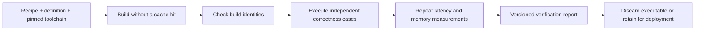

# Performance tuning workbench and kernel recipes

[Path to 1.0](v1.md) · [Schedule discovery guide](../guides/schedule-search.md) · [Benchmark program](v1-benchmarks.md)

Planning baseline: **2026-10-05**. Status: proposed features, not an implemented
profiler, recipe schema, visual application, or agent controller. The goal is one
reliable tuning workflow usable interactively by humans and programmatically by
AI agents: inspect, propose, build, validate, measure, compare, retain, and replay.

## Shared interface for humans and agents

Build on the bounded runner and profile work in V1-08/V1-09. Use one typed Python
API and versioned result format; text, visual views and future CLI adapters render
the same evidence. Agents should not need to parse tables or screenshots to get
metrics, failures, candidate sources or selected schedules. Humans should be able
to inspect every trial and reproduce an agent-selected result.

| Surface | Proposed behavior |
|---|---|
| Python workflow | Caller-supplied factory/reference, search or refinement candidates, constraints and measurement protocol |
| Machine reports | JSON summary plus append-only JSONL trial/event logs, stable statuses, units, provenance and artifact references |
| Text view | Live progress/stage, best valid result, ranked trials, latency/memory changes, errors, budget use, selected recipe and replay result |
| Visual view | Live or post-run progress, search/refinement trajectory, timelines, allocations, latency distributions and latency/memory Pareto frontier |
| Export/integration | CSV for analysis and trace export with explicit host/device clock domains; optional native profiler integration |

No new command or import is defined by this plan. Freeze the initial schemas and
minimum Python interface before publishing syntax. Keep optional visualization
and profiler dependencies outside the minimal runtime installation. Reports should
be readable without the producer compiler environment or an external service.

## Live progress and retained trajectories

Provide **both live observation and a complete post-run view** for BEAM search
and AI refinement. A terminal progress bar gives a compact current status; a
local visual report shows the trajectory. Both consume the same recorded events,
so a headless run still produces evidence that can be inspected after completion
or interruption. The visualization is optional; event capture is part of the
shared runner/report contract.

Progress should show elapsed time, configured budgets, completed/in-flight trials,
current stage and candidate, passed/rejected/failed counts, best valid latency,
memory, and improvement over the fixed baseline. Track proposal/legality counts
separately from trials that enter compilation. Display the active stage as
proposing, compiling, validating, measuring, finalist verification, or cleanup;
provide a last-update timestamp during long calls without inventing stage percent.

Use explicit denominators: `completed trials / configured trial budget` measures
budget consumption, not the fraction of all possible kernels explored. Show time
budget consumption separately. If the legal space or stopping point is unknown,
use an indeterminate bar with counts and elapsed time. Exhaustion or early stopping
can finish below the configured budget; show the terminal state and reason instead
of inflating the count to 100%. A deadline can be reached while a trial is still
finishing. Mark ETA as an estimate only when representative durations exist;
otherwise omit it. Finishing search is separate from verifying the selected winner.

Retain three complementary trajectory views:

- **Optimization curve:** per-candidate latency/memory and best valid result so
  far against trial number and elapsed wall time. Show measurement dispersion,
  baseline, failed/rejected trials and independently verified finalist results.
- **Search lineage:** seed, family, schedule changes, actual proposal parent(s),
  retained/pruned candidates and restarts where the proposer exposes them. A
  score-ranked list alone is not a BEAM trajectory. Capture lineage at proposal
  time rather than inferring it from similar configurations afterward.
- **Agent refinement lineage:** candidate parent/source diff, concise proposal
  rationale, changed knobs/implementation, validation outcome, metrics and
  accept/reject decision. Mark branching and rollback to earlier candidates.

Each event has a schema version, run ID, ordered sequence, timestamp, candidate
ID, parent IDs where known, stage/status, and relevant metrics with units.
Record source/schedule identity, failure reason and beam/restart metadata where
available. Unsupported lineage fields remain explicitly unavailable; the existing
search API does not currently emit a full proposal graph. The event interface and
proposer instrumentation are development work, not existing capabilities.

Flush events at stage/trial boundaries and throttle view refresh independently
of measurement. Keep progress rendering and heavy tracing outside timed regions;
verify finalists without those observer costs. Future machine-output modes keep
JSON/JSONL clean, using a separate progress stream or disabling interactive bars
in noninteractive environments. A view can reconnect or rebuild from the retained
log without restarting the optimization; replaying the view does not itself resume
an interrupted search. Preserve the last valid event and explicit incomplete status
if a run stops before its final report.

Post-run reports include the full trajectory, selected recipe, budget use, stop
reason, failed trials, best-result history and final verification status. Clearly
label an observed best candidate as provisional until independent verification
passes; a polished progress display must not imply correctness or convergence.

## Profiling contract

Measure build, load, allocation, input transfer, launch, completed execution,
output transfer and full-operation latency with explicit boundaries. Separate
CPU submission from GPU execution and completed host-visible latency. Report
warmup, samples, repetitions, synchronization, eager/graph mode and timing source.
Timeline events carry stage, executable/candidate identity, stream/queue where
available, clock domain and correlation identifiers. A host timestamp must not
be rendered as an observed GPU start/end time.

Memory reports distinguish Tensor-owned live/peak buffers, declared workspace,
allocator reserved bytes where observable, and process/device memory measured by
an external tool. Track allocate/free lifetimes and bytes, plus transfer counts.
Do not claim Tensor's allocation ledger captures compiler caches, driver overhead,
other libraries or all VRAM. Missing metrics are unavailable, not zero. Memory
instrumentation and peak tracking are new work; existing workload-specific owned
byte counts are not a general profiler.

Provide capability discovery and graceful partial reports for CUDA, WebGPU and
CPU. Integrate optional CUDA NVTX ranges and external tracing rather than trying
to replace all hardware counters. NVIDIA's
[Nsight Systems analysis guide](https://docs.nvidia.com/nsight-systems/AnalysisGuide/index.html)
describes CUDA API/kernel/memory-operation reports, and its
[user guide](https://docs.nvidia.com/nsight-systems/UserGuide/index.html)
describes memory tracing and NVTX integration. Record tool versions and capture
options. Profiling can perturb execution; qualify finalists again without heavy
instrumentation under the declared benchmark protocol.

## AI kernel refinement loop

Two modes use the same trial lifecycle:

- **Schedule refinement:** select legal knobs/families for a fixed factory using
  BEAM search or another proposer. Source and mathematical contract stay fixed.
- **Implementation refinement:** propose a versioned factory/source change, then
  validate against the independently retained operation/reference contract.
  Schedule knobs cannot describe arbitrary code changes; the resulting recipe
  must reference the changed implementation or a complete declarative definition.

The controller supplies an immutable evaluation case set and tolerances, latency
and memory goals, legal transformations, and compile/trial/time budgets. An agent
receives reports and can propose a candidate; it cannot make a wrong candidate
pass by editing the reference, reducing coverage or relaxing the acceptance gate.
Retain each proposal's source diff/hash, parent, rationale, measurements and
failure stage. Isolate trials in reproducible directories/processes, clean up
resources, and preserve a known-good baseline for rollback.

Reject illegal, compile-failed, incorrect, nonfinite or over-memory candidates
before ranking. Rank valid candidates by the declared objective, or retain a
latency/memory Pareto set instead of hiding a memory increase behind a speedup.
Keep search/cold-start costs visible. Use independent finalist evaluation and
held-out correctness cases before promotion; a faster kernel must also pass its
complete-operation check. Record cancellation and budget boundaries honestly:
a between-trial deadline does not interrupt an in-progress compiler or GPU call.
Automatic promotion into an application is a separate opt-in workflow.

## Reconstruct from a recipe without retaining compiled artifacts

**Yes, when the implementation and producer toolchain remain available.** BEAM
search discovers a configuration; replay passes that configuration directly into
the factory. The search trajectory, losers and compiled winner do not need to be
retained to reconstruct that winner. Retain the search report separately for
auditability. A hash is an identity check, not a way to recover missing source.

The current `ScheduleProfile` already stores selectors and schedule knobs, and
the guide shows feeding selected settings into an export and building again.
It does not automatically reconstruct, verify or benchmark a kernel. Its SHA256
identifies profile JSON, not the executable. A complete portable recipe requires
an additional versioned contract and source/dependency closure.

| Recipe component | Required information |
|---|---|
| Operation | Versioned semantics, shapes/dtypes/layouts, scalar values, outputs, masks/state and launch specialization |
| Implementation | Factory symbol plus retrievable immutable source/package identity and dependency hashes, or a complete versioned declarative kernel representation |
| Schedule | Family, all selected knobs and factory defaults made explicit; conditional branch/transform choices affecting generated code |
| Producer | Tensor/frontend/lowering/compiler versions and hashes, headers, compile flags, numerical policies and target features |
| Verification cases | Regenerable seeded inputs or content-addressed fixtures, independent reference/version, error metric, tolerances and required checks |
| Performance record | Exact metric/protocol, device/driver context, latency distribution, memory observations and declared acceptance policy |
| Identities | Canonical recipe hash, generated-source/IR hash and explicitly scoped executable-image hash where available |

Replaying requires the producer compiler and reconstructible definition. It is
not compiler-free deployment: the existing `.tbin`/module path remains appropriate
for consumers that only execute. Recipe-only storage can discard compiled output
after validation, but replay still generates an executable transiently. Neither
the schedule nor compiler can be discarded unless obtainable from pinned sources.
Self-contained recipes must include their declarative definition; source-referencing
recipes must preserve access to the referenced source closure.

## Verification policies

1. **Build identity:** hash the declared payload scope, such as a CUDA cubin,
   generated WGSL or generated source/IR. Record artifact/manifest identity
   separately. Whole archives may differ because of packaging metadata; do not
   equate their hash with the native code hash. For WebGPU, WGSL identity does
   not establish identity of the driver-generated native shader. Exact binary
   rebuilds require a demonstrated reproducible toolchain/environment; pinning
   versions alone is not proof of byte-for-byte determinism.
2. **Numerical correctness:** execute all recorded cases against their reference
   with specified absolute/relative tolerances, finite-value rules, state/gradient
   checks and boundary cases. Timing or a binary hash cannot replace this gate.
3. **Performance qualification:** compare independent repeated measurements to
   the recorded distribution and declared latency/memory regression policy under
   a matching environment. Exact old speed is not expected. Record device/driver,
   clocks/power, timing mode and noise; a changed environment produces new
   qualification evidence rather than inheriting the old performance claim.

Support two explicit modes: **strict identity replay** requires matching declared
hashes and rejects any mismatch; **requalification** permits a changed build only
as a new recorded identity that passes numerical and performance gates. Never
silently fall back from strict mode or overwrite the original evidence. Report
source unavailable, unsupported target, build mismatch, incorrect, performance
regression, environment mismatch, and insufficient timing evidence distinctly.

In the current builder, compiled-image cache reuse is part of normal builds.
Plan an explicit cache-bypass option for verification; an isolated empty cache
can establish a fresh-build experiment today. Returning the original cached
image and matching its hash does not demonstrate reconstructibility. Prove fresh
reconstruction twice in separate empty-cache producer environments, then execute
and measure. Cross-toolchain or cross-device replay is requalification unless its
strict reproducibility contract has separately been demonstrated.

## Delivery stages

| Item | Scope | Acceptance |
|---|---|---|
| TUNE-01 | Shared reports and latency/memory measurement boundaries | Machine/text views agree; known event/allocation lifetimes and partial capabilities are represented accurately |
| TUNE-02 | Recipe schema, source closure, fresh rebuild and verification policies | Selected BEAM winner rebuilds without a cache hit; strict mismatches fail and requalification preserves original evidence |
| TUNE-03 | Local visual reports and optional profiler/trace integrations | Same raw report renders an inspectable trial history/timeline; unavailable device metrics remain explicit |
| TUNE-04 | Agent proposal/refinement controller | Bounded trials retain source lineage; wrong/over-memory proposals cannot win; selected result independently replays |
| TUNE-05 | Live progress and retained search/refinement trajectories | Terminal and visual views agree with event logs; headless/interrupted runs remain inspectable; budget progress, lineage and winner verification are represented accurately |

TUNE-01/02 complement the 1.0 discovery/report/profile contracts. Proposed first
delivery is the minimal Python and text/JSON workflow; track its exact release
scope with M1/M3. TUNE-03/04 are additional features built on that foundation,
with their release placement decided separately. They do not make a rich visual
application or autonomous agent mandatory for core 1.0. BENCH-01/08 can reuse the
same manifests/reports; benchmark runs must still qualify the exact candidate.
TUNE-05's event records, simple terminal progress and post-run text history fit
the minimal runner scope. Rich live trajectory visualization builds on TUNE-03;
agent-specific lineage builds on TUNE-04. Treat observer replay separately from
future search checkpoint/resumption.
