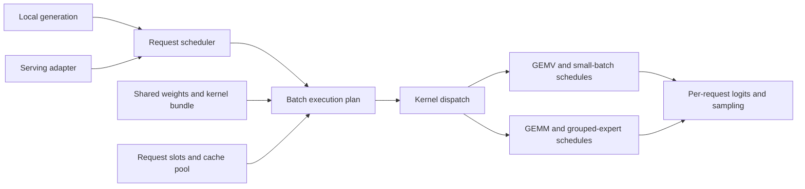

# One Tensor LLM engine for latency and throughput

[Path to 1.0](v1.md) · [Benchmark program](v1-benchmarks.md) · [Tensor LLM](../../packages/tensor-llm/README.md)

Planning baseline: **2026-10-09**. Status: staged package extension. Shared
model resources and independent LFM2 request handles are implemented as the
first LLM-02 increment. Native Qwen3.5 batching, chunked prefill and a fixed
cohort HTTP server are experimental implementations; numerical qualification,
paged caches, continuous scheduling and the broader model matrix remain open.
Extend `packages/tensor-llm` into one inference engine that pursues both
llama.cpp-like batch-1 latency and vLLM-like batch throughput. These are measured
goals, not promises of parity or wrappers around those runtimes.

The engine stays in the optional package. Core Tensor remains the kernel
workbench and artifact/runtime toolchain described by
[ADR 0006](../adr/0006-prototyping-surface-not-tensor-library.md). This plan
specifies the engine portion of BENCH-03/04 and reuses BENCH-09's quantization
work; it does not create a second inference package or change core 1.0 gates.

## Starting point

The retained [L40S C8 replay](../research/qwen35-native-l40s.md) measures
735.3 output tok/s with MTP plus output lookup. The
[first physical H200 port](../research/qwen35-native-h200.md) measures
588.2 tok/s AR and 911.5 tok/s MTP plus output lookup at the same 32K/16K load.
Both speculative profiles fail numerical qualification. These measurements
do not close LLM-05/06/07 or establish an H200 peak or Netra comparison.
Resolve verification/serial and canonical-model quality before selecting
faster Hopper profiles; profile prefill separately because its first-token
latency dominates the initial H200 finite replay.

`tensor_llm.lfm2.model.LFM2` now owns shared checkpoint metadata, device weights,
kernels and executor workspaces, plus a backward-compatible default request.
`new_request` adds independent convolution/KV state, position/control, logits
and bound plans/graphs under an explicit handle limit. Calls execute serially
on the owner's thread/stream. Its prefill `rows` still describe consecutive
tokens of one sequence; they are not independent batch lanes. Separate `LFM2`
instances still duplicate weights; shared handles are the foundation for LLM-03.

The optimized CUDA path already supplies packed projections, tensor-core prefill,
decode GEMV, selected fusions, grouped attention, and GPU greedy sampling.
Preserve their qualified behavior while separating model resources from request
state. Existing WebGPU single-sequence profiles remain the migration reference;
CUDA is the first batching/serving implementation target. Additional WebGPU
capacity and throughput claims require separate implementation and hardware runs.

## Shared engine, specialized execution

One model instance owns immutable weights, loaded artifacts and model metadata.
Each request owns token position, cache references, convolution/recurrent state,
sampling/stop policy and completion status. Workspaces and graph buckets belong
to the executor. Local generation and serving call the same request lifecycle
and step executor. A singleton runs immediately without an artificial batching
wait; serving policies choose admission and prefill/decode budgets under load.
Expose latency/throughput objectives as scheduling configuration within the same
engine, with their limits and selected kernel profiles visible in run reports.

The initial lifecycle covers admission, prompt chunks, decode, completion,
cancellation, reset and release. Define ownership, stream ordering and supported
concurrency before exposing a shared model publicly. Request metadata contains
slot IDs, token offsets, sequence lengths, positions and cache mappings. Reuse
slots only after their GPU work completes; stale handles must not address a new
request's state. Every admitted request has an explicit context/memory budget.

Kernel selection follows the operation's actual shape, dtype, layout, phase and
device. Batch-1 prompt prefill can use GEMM; one-token decode can use GEMV.
Batched decode uses GEMM where measurements justify it. MoE dispatch also
depends on tokens routed to each expert, not only total request batch size.
Keep shared mathematical contracts and explicit algorithm families with
shape-specific schedules. Thresholds come from qualified profiles, with a
documented default or capability failure when no profile matches.

Weights remain in the declared GGUF or FP8 representation. Any prepared alternate
layout or dequantized copy is explicit, bounded and counted in resident memory;
each execution path must not create its own full model copy. The shared design
permits different storage formats and model adapters without equating their
numerics or promising arbitrary GGUF/model support.

## Batched state and execution contracts

Independent requests need actual batched kernels, not a Python loop over the
existing single-sequence runner. Pack projection inputs across requests and
emit each request's required logits. The current last-row-only LM head cannot
stand in for a batched output head. Attention reads only that request's valid
prefix, uses its positions for RoPE/causality, and supports heterogeneous lengths.
Packed prefill needs sequence boundaries for every convolution tap and independent
final recurrent states. Padding and inactive graph lanes never update live state.

Start with bounded per-slot contiguous caches to qualify batched math, then add
a shared paged KV pool through the same request/cache interface. Kernel variants
for contiguous or paged layouts are execution choices within the same engine.
Convolution and GDN/Titans-like recurrent state use slot-indexed state tables;
page sharing alone is insufficient to share a hybrid model's prefix. Prefix
reuse remains disabled until both KV and recurrent-state continuation semantics
are proven. New slots must not expose prior request contents.

Graph replay retains stable buffers, with positions, active masks and mappings
updated through device metadata. Bound graph/workspace buckets by a declared
memory budget; count all retained buckets rather than only an isolated exact-batch
capture. Eager execution covers unsupported buckets through the same executor.
Declare transitions between paths and verify that they preserve request state.

The serving adapter transports requests and streams outputs; model execution,
cache management and scheduling stay in the engine. Continuous batching can
admit new requests as others finish. Chunked prefill uses token and memory
budgets so long prompts cannot indefinitely block decode. Define fairness,
backpressure, cancellation, errors and resource reclamation. Start with ordinary
autoregressive generation; speculative decoding is a later optional algorithm
inside the same engine, with separate quality and performance evidence.

The pinned Qwen3.5-35B-A3B-FP8 checkpoint includes a single full-attention/MoE
MTP layer, BF16 fusion projection and input norms. Its 853,668,480 weight bytes
are already downloaded; it shares the target embedding and vocabulary head.
The official [Qwen model card](https://huggingface.co/Qwen/Qwen3.5-35B-A3B)
documents both NEXTN and `qwen3_next_mtp` serving configurations. Native MTP is
an optional path inside `tensor-llm`, retaining official FP8 expert weights.
Pure autoregressive controls and MTP results must retain distinct labels.

Implement the MTP path in stages: validate/load native draft weights and
measure one-token agreement and cost; initialize shifted-token/target-hidden
draft KV during chunked prefill; verify a short token chain together using the
target; then commit only the accepted prefix independently for every slot.
Verification must save/select or recompute the FP32 GDN recurrent and
convolution states at the accepted boundary. Rewinding KV positions alone
does not undo a rejected recurrent update. Start with greedy verification and
compare against serial target outputs, including zero/all/partial acceptance,
different accepted lengths across slots, inactive slots and context limits.
Sampled decoding requires its own exact acceptance/correction algorithm.

Retain proposal count, accepted-prefix histogram, accepted tokens per target
verification, draft/verification/rollback time, extra memory, full replay
throughput and target-equivalence/quality results. The measured 336.8 tok/s C8
AR replay would need about 1.78 times the full-replay throughput to reach 600.
If its roughly 37-second prefill remained fixed, decode would need about
1.95 times the observed rate; draft and rollback costs increase this burden.
MTP agreement on a short prefix alone cannot establish that speedup or the
32K-input/16K-output stress target.

The native package now implements batched greedy verification and per-slot
accepted-prefix selection using FP32 recurrent/convolution snapshots. It repairs
the private MTP cache from verified target states. Split-context attention and
small-chunk projection candidates were measured at the same saved 32K prefix;
one-, three- and seven-proposal profiles retain their full loop costs. Optional
bounded output-history proposals are a separately labeled hybrid mode. The
L40S experiment remains subject to complete-model numerical qualification,
matched client timing and repeated acceptance runs; see the
[measured native report](../research/qwen35-native-l40s.md).

## Staged implementation and acceptance

| Item | Change | Exit evidence |
|---|---|---|
| LLM-01 — Baseline and contracts | Pin existing LFM2 checkpoints/bundles and vLLM, SGLang and llama.cpp baseline adapters; define matched cases and resource/request/step boundaries | Retained batch-1 eager/graph results, baseline capability audit and explicit unsupported cells, installed consumer run, state/reset checks, numerical tolerances and timing protocol |
| LLM-02 — Shared model resources | Separate immutable model/artifact ownership, request state and execution plans; retain `LFM2.forward`, `reset` and `generate` as single-request compatibility entry points | Two interleaved requests share one weight allocation while matching independent references; closing/resetting one does not damage the other; batch-1 regression gate passes |
| LLM-03 — True LFM2 batching | Add slot-indexed convolution/cache operations, heterogeneous positions, batched decode projections/output/sampling and packed prefill | Outputs and final state match independent single-request runs across unequal lengths, tails and chunk boundaries; demonstrate shared batched launches and completed batch timing |
| LLM-04 — Cache pool and continuous scheduling | Add paged KV, bounded graph/workspace buckets, admission/token budgets, request completion/cancellation and a serving adapter | Mixed prefill/decode traces pass isolation and reuse checks; memory exhaustion yields bounded queueing or explicit errors; client latency, throughput and goodput are retained |
| LLM-05 — Qwen model adapters | Implement BENCH-03's checkpoint scales/FP8 representation, GDN/attention state and dense/MoE kernels inside the same model/request executor | Layer and complete-model logits/quality checks, real weights, memory preflight, state continuity and batch-1/batched execution for both requested checkpoints |
| LLM-06 — Search and dispatch | Expose measured GEMV/GEMM, attention/state and grouped-expert schedule spaces, device/shape selectors and fresh-process replay | Native/reference, Tensor fixed and Tensor searched ablations; rejected trials retained; complete generation verifies any selected performance gain |
| LLM-07 — Unified engine comparisons | Run BENCH-04/09 against vLLM, SGLang and llama.cpp with one Tensor package/model executor across singleton, batch and serving workloads, plus compiler-free consumers | Every baseline has a result or explicit disposition per case; matched correctness/quality, latency-throughput curves, full resident-memory accounting, raw manifests, reference versions and unsupported/OOM cells |

Implement LLM-01/02 first on the existing LFM2 path, followed by LLM-03 and
LLM-04. LLM-05's operator/loading work can proceed after the shared contracts
are defined; its batched and serving acceptance depends on the corresponding
engine stages. LLM-06 runs throughout kernel development, rather than waiting
until the engine is complete. LLM-07 follows the accepted model/execution paths.
BENCH-09 adds its full pinned quantization inventory to this same engine.

Atma can supply a matched baseline and design experience for packed prefill,
slot-indexed state and graph replay. Port a profiled operation to a TileLang
factory and search its explicit schedules; do not assume Tensor can rewrite an
existing Triton engine automatically. Such a pilot does not require a separate
Atma serving engine or establish that Atma checkpoints run in `tensor-llm`.

## Performance and comparison gates

Evaluate both objectives independently; a batch gain cannot hide a batch-1
regression. Freeze noise-aware regression limits and any shipping improvement
threshold against LLM-01's repeated measurements before choosing winners.

| Workload | Required measurement |
|---|---|
| One request | Prompt prefill/TTFT, completed decode step and inter-token latency, output tok/s, memory and startup/build cost |
| Offline batches | Equal and heterogeneous prompt/context/output lengths; aggregate prefill/output tok/s, per-request latency, active batch and peak memory |
| Serving | Fixed concurrency and arrival traces; client TTFT/inter-token/end-to-end percentiles, errors, output throughput and goodput under declared latency targets |
| Long context | Add 32K-input/16K-output as a stress case alongside short/mixed cases; report cache/state growth, admitted batch, actual completed tokens and OOM dispositions |

Keep the requested Qwen L40S/H100 hardware matrix. The long-context case is
subject to actual checkpoint limits and memory preflight on each device; report
an unsupported or OOM cell rather than silently shortening it, changing precision
or adding offloading. Any H200 replication is a separately specified additional
case. Client concurrency is not necessarily the resident GPU batch size.

**Required baselines: vLLM, SGLang and llama.cpp.** Include all three in the
case/result matrix for batch-1, offline batch sweeps and serving workloads; do
not reserve one engine for only its expected strongest regime. Pin releases or
commits, build flags, configurations and entry points for each. Every baseline
gets a measured result or an explicit disposition and reason for every case;
unsupported model, format or serving paths remain visible rather than omitted.

Use identical GGUF files for supported Tensor/llama.cpp comparisons and identical
checkpoint weights/scales for supported Tensor/vLLM/SGLang comparisons. Audit
each engine's actual model, format and execution support before measurement.
Cross-format comparisons require explicit conversion/numerical qualification;
do not treat GGUF and FP8 safetensors as identical weights. All comparisons
follow [the benchmark protocol](v1-benchmarks.md#llm-inference-protocol), including
sampling, cache precision, stop policy and the timing boundary. Start with matched
autoregressive controls; speculative configurations are labeled separately.

Expose GPU execution and complete host/client execution separately, including
scheduling, metadata/packing, output heads, sampling and required transfers.
Check realistic checkpoint logits/quality as well as randomized operator cases;
zero-weight stress fixtures remain separately labeled. Retain the fixed Tensor
schedule to distinguish compiler/porting changes from search gains. Qualification
must show complete-generation improvement, not only a hot isolated kernel win.

## First L40S throughput target

Prioritize the measured Qwen3.5-35B-A3B-FP8 workload on one L40S: exactly
32,000 input and 16,000 output tokens per request, greedy autoregressive
generation, BF16 KV and FP32 recurrent state, with prefix reuse, speculation
and CPU/RAM offloading disabled. The [retained baseline](../research/llm-serving-l40s-stress.md)
reached 215.4 output tok/s for vLLM and 216.9 for SGLang at concurrency 4.
These are single-repetition finite replays, not established throughput ceilings.
The converted llama.cpp arm remains exploratory until numerical qualification.

The user also authorizes a separately labeled **FP8 KV profile with quality
checks** for this target. Use E4M3 cache vectors with two FP32 block-128 scales
per head/token, retaining FP32 recurrent state and the same native FP8 weights.
Keep BF16 reference measurements separate. Qualification must check cache
encoding against an independent quantizer, attention against dequantized
references, slot isolation, and matched teacher-forced whole-model logits.
The existing model quality gate remains required; passing cache kernel tests
alone does not qualify model output. Record every failed quality check.

| Gate | Required evidence |
|---|---|
| First throughput win | Tensor beats the faster matched native-FP8 baseline at concurrency 4 under a repeated, shared timing protocol; batch-1 regression gate also passes |
| Eight resident requests | Eight independent 48,000-token contexts complete without eviction, offloading or duplicated weights; explicitly identify BF16 or the authorized FP8 KV profile and report actual active decode batch, cache capacity and peak resident memory |
| Concurrency-8 comparison | Rerun vLLM, SGLang and llama.cpp with capacity configured for eight requests; Tensor beats the faster qualified baseline at the same concurrency, or records the remaining gap |
| Stretch target | At least **600 aggregate output tok/s at concurrency 8**, measured at the client over complete finite replays including prefill and fill/drain; numerical and batch-1 gates still pass |

There is no measured concurrency-8 reference yet. The previous workload contains
only four requests and all servers were configured for four resident requests;
raising client concurrency alone cannot qualify eight-way execution. First run
an eight-request capacity qualification. For the acceptance sweep, freeze a new
shared workload with at least 16 requests per point, concurrency 1/2/4/8, at least
three measured repetitions and an identical explicit warmup/reset policy across
engines. Retain every repetition and failure; use the repeated median for the
600 tok/s gate and publish dispersion. Rerun the concurrency-4 references under
that protocol rather than comparing warmed Tensor against the old cold replay.
Separate steady-state decode diagnostics from the complete-replay target.

Memory is a capacity constraint before it is a tuning parameter. The pinned
checkpoint's logical BF16 KV plus FP32 SSM state requires **7.793 GiB at eight
48,000-token contexts**, excluding convolution state, padding, graphs and
workspaces. Adding vLLM's measured 33.38 GiB weight allocation gives about
41.17 GiB before those costs, versus approximately 45 GiB available on this
device. This suggests a possible fit, not proof that current engine allocations
fit: vLLM's retained 7.24 GiB cache budget is smaller than the eight-request
logical requirement. Qualify bounded cache/state allocation and shared
workspaces; count all graph buckets and prepared weight layouts. Leave explicit
headroom for peak execution allocations. Unsupported/OOM remains a valid
reported disposition rather than silently queuing eight clients as four slots.

At eight active autoregressive requests, 600 output tok/s allows at most
**13.33 ms per decode step** before prefill and other overhead. SGLang's measured
concurrency-4 mean TPOT was 18.09 ms. Holding that latency constant while doubling
batch size would suggest roughly 440 decode tok/s; doubling the measured finite
replay throughput would give about 434 tok/s. Neither is a concurrency-8
prediction. Reaching 600 requires at least about a 26% step-latency reduction
relative to that concurrency-4 observation while processing twice as many
requests, plus enough margin for the complete-replay costs. Treat 600 as a
stretch engineering objective, not an expected benefit of batching or search.

### Bounded kernel and scheduler search

Reuse the existing producer-side `ScheduleSearch` beam exploration with family
retention and deterministic restarts. It explores explicit configurations;
callers still supply kernel families, legality, compilation, correctness checks,
timing and budgets. It does not implement Qwen support or discover an arbitrary
new execution algorithm. Complete LLM-02/03 and the relevant LLM-05 model work
to establish a correct batched executor before claiming this target.

Profile complete generation first, separating projections/expert routing,
attention, recurrent updates, output/sampling, launches and host scheduling.
Search the measured bottlenecks with separate spaces:

- **Kernel schedules:** tiles, warps, layouts, reductions, permitted fusions and
  explicit GEMV/small-batch/GEMM or grouped-expert families. Qualify batch sizes
  1/2/4/8, context buckets spanning 32K–48K, and observed per-expert token counts;
  request batch size alone is insufficient for MoE dispatch.
- **Request scheduler policies:** prefill chunk/token budgets, admission limits,
  decode priority and bounded graph buckets. Score complete workloads with
  latency/fairness and resident-memory constraints; do not score these policies
  solely on isolated GPU kernel time.

Tune kernels with a fixed scheduler, then scheduler policies with a fixed kernel
bundle, then verify the combination. Retain fixed/fixed, searched/fixed,
fixed/searched and searched/searched ablations, trial budgets and rejected
trials. Shorter development fixtures may screen candidates but cannot qualify
the 32K/16K goal. Replay winners in a fresh process on held-out request seeds at
the full target lengths; preserve numerical tolerances, request isolation and
batch-1 latency. Publish the selected profile and complete-generation gain.

## Relationship to the v1 milestones

The first LLM-02 implementation preserves `LFM2.forward`, `reset` and `generate`
and adds shared independent handles. It includes request capacity, owner-thread
and stale-handle checks, isolated reset/close, cleanup after failed allocation or
graph capture, and shared/private buffer accounting. Existing bundles require
an explicit producer rebuild; implementation fingerprint rejection remains in
force. [CUDA qualification](../research/llm-shared-requests-l40s.md) covers synthetic
mixed encodings, a pinned 230M checkpoint and installed compiler-free replay,
including a pageable-copy ordering regression. Full supported-checkpoint regression limits and physical WebGPU
qualification remain open, as do true batching and bounded graph/cache pools.

The independent [baseline serving harness](../guides/llm-serving-benchmarks.md)
is implemented under `benchmarks/llm_serving`. It freezes one request workload
for all three baselines and retains latency/throughput curves, telemetry and
failed cells. Synthetic protocol tests and a
[real Qwen3-0.6B L40S pilot](../research/llm-serving-l40s-pilot.md) qualify all
three adapters. The [bounded 35B L40S stress test](../research/llm-serving-l40s-stress.md)
retains native FP8 vLLM/SGLang and converted-GGUF llama.cpp measurements at
32K/16K and concurrency 1, 2 and 4. LLM-01 remains open for broader baseline
coverage, numerical model gates and Tensor's resource/request contracts.

Begin the LFM2 pilot now, using a workload-scoped BENCH-01 harness and the
existing search API. Establish the relevant V1-01 ownership/stream contracts and
V1-07 discovery semantics while implementing it. Extract reusable trial reports,
budgets and winner replay through V1-08/09 as the pilot becomes repeatable;
completing every M1–M5 item is not a prerequisite to start engine development.

The current bundle checks include implementation source fingerprints. Refactoring
must preserve their rejection behavior and require explicit rebuilds or a
validated, versioned migration under V1-05. New batch/cache/precision capabilities
need declared bundle coverage and clear rejection by incompatible consumers,
following V1-03/04. Compiler-free consumption remains an acceptance gate.

Core release acceptance still follows M1–M5. The optional engine retains its own
maturity/support labels. CPU/GPU expert composition and SSD offloading remain
post-1.0 additions under BENCH-10; resident GPU MoE execution in BENCH-03 is part
of this engine plan. Remaining roadmap items do not themselves perform model
downloads, releases or package API changes.
