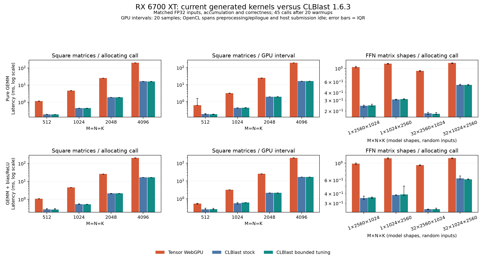

# CLBlast versus generated WebGPU GEMM on RX 6700 XT

The current **generic WebGPU GEMM schedule has substantial headroom**.
Matched FP32 4096³ GEMM completes in **203.042 ms for Tensor versus
16.353 ms for CLBlast (12.42×)**. The gap persists
with preallocated outputs and with the bias/ReLU epilogue included. These
measurements answer how the generic compiler schedule compares with a mature
linear algebra library on this GPU; they do not measure whole-model throughput
or the separate LFM2 packed/subgroup/register-scheduled kernels.

## Environment and scope

Measured on **2026-10-01**, on the same Ryzen 5 5600 / RX 6700 XT Windows 11
machine used in [latency scaling](latency-scaling.md). Tensor uses wgpu 0.29.0 /
wgpu-native 27.0.2.0 with Vulkan and the AMD 26.6.2 shader compiler. OpenCL
reports AMD-APP 3652.0 / PAL,LC and the GPU name `gfx1031`. This machine exposes
one OpenCL GPU, corresponding to the physical RX 6700 XT Vulkan adapter.

[CLBlast 1.6.3](https://github.com/CNugteren/CLBlast/tree/2a081972b20911ddf76a6b40df717c7d0c181268)
was built locally from the unmodified pinned release, with Visual Studio 18
BuildTools / MSVC 19.51 and Release x64 settings. Khronos OpenCL headers and
loader sources are separately pinned. The loader build provides the import
library; CLBlast actually loads the installed system `OpenCL.dll` and AMD
vendor driver. PyOpenCL 2026.1.4 uses its bundled ICD loader to access the same
vendor driver; opaque buffers/queues interoperate and pass numerical checks.
The producer uses the installed compiler stack. The clean consumer contains
Tensor, NumPy 2.5.3, wgpu and PyOpenCL, with no Torch, TileLang, TVM or Triton.
A small C++ probe exposes CLBlast's device-selected parameter maps for evidence.

There are **32 profiles per sweep**: eight M×N×K shapes, pure GEMM and linear
GEMM+bias/ReLU, each in FP32 and FP16. The square shapes are 512³–4096³.
The rectangular shapes use the actual LFM2.5-230M FFN gate/down dimensions,
2560×1024 and 1024×2560, at 1 or 32 query rows. Their inputs are seeded random
arrays, rather than GGUF weights or complete model activations.

Both backends compute row-major `A[M,K] @ B[N,K].T`, with alpha=1 and beta=0.
The linear profile adds the same column bias and ReLU. Tensor fuses this;
CLBlast uses an additional cached OpenCL epilogue kernel, included in all its
linear timings. Any CLBlast internal transpose/pad/copy work is also included.

## Timing and correctness

Completed-call medians retain **45 individual samples after 20 warmups**.
Allocating calls include output creation, submission and completion, with
output release outside the timer. A separate preallocated run reuses the
output buffer and includes submission/completion. Provider order alternates
across cases, and GPU jobs run sequentially. CPU references use six OpenBLAS
threads outside timing. Upload/download, correctness, cold pipeline compilation
and tuning are excluded. Both full sweeps record identical input hashes.

All **16 matched FP32 profiles pass `atol=0.002, rtol=0.02`** for both providers
in both sweeps. All 32 Tensor profiles pass. Tensor output hashes match bitwise
across the stock/selected sweeps. All samples, errors, input/output hashes,
runtime/compiler source hashes and artifact hashes are retained.

Twenty additional timestamp samples are retained for each provider/profile.
WebGPU timestamps bracket one dispatch in a compute pass, using the previously
verified Vulkan **10 ns timestampPeriod**. OpenCL completes a start barrier
before submitting GEMM, then records an end barrier after the complete routine
and any epilogue. This prevents an observed AMD asynchronous-marker timestamp
from starting after some of the intended work. The resulting OpenCL interval
**includes GPU idle during host submission/start-wait return**, so it is a
conservative device timeline span, not isolated kernel execution or a sum of
all kernel-event durations. These profiling boundaries are outside the
ordinary completed-call sampling path. Timestamp instrumentation and clock
state can perturb small workloads; completed-call timing is the primary result.

## Matched FP32 results

The Tensor column comes from the final selected-settings sweep. Stock CLBlast
is a separate complete sweep of the same inputs/shapes; its Tensor observations
are also retained. All values below are allocating-call medians.

**Pure GEMM:**

| M×N×K | Tensor | CLBlast stock | CLBlast selected | Tensor / selected |
|---|---:|---:|---:|---:|
| 512×512×512 | 1.157 ms | 0.192 ms | 0.191 ms | 6.04× |
| 1024×1024×1024 | 4.727 ms | 0.447 ms | 0.443 ms | 10.68× |
| 2048×2048×2048 | 25.442 ms | 1.910 ms | 1.911 ms | 13.32× |
| 4096×4096×4096 | 203.042 ms | 16.388 ms | 16.353 ms | 12.42× |
| 1×2560×1024 | 1.053 ms | 0.243 ms | 0.248 ms | 4.25× |
| 1×1024×2560 | 1.191 ms | 0.311 ms | 0.313 ms | 3.80× |
| 32×2560×1024 | 0.914 ms | 0.184 ms | 0.180 ms | 5.08× |
| 32×1024×2560 | 1.225 ms | 0.537 ms | 0.537 ms | 2.28× |

**GEMM + bias/ReLU:**

| M×N×K | Tensor | CLBlast stock | CLBlast selected | Tensor / selected |
|---|---:|---:|---:|---:|
| 512×512×512 | 1.075 ms | 0.275 ms | 0.271 ms | 3.96× |
| 1024×1024×1024 | 4.559 ms | 0.534 ms | 0.527 ms | 8.65× |
| 2048×2048×2048 | 25.610 ms | 2.122 ms | 2.137 ms | 11.98× |
| 4096×4096×4096 | 203.862 ms | 16.792 ms | 16.750 ms | 12.17× |
| 1×2560×1024 | 0.983 ms | 0.350 ms | 0.356 ms | 2.76× |
| 1×1024×2560 | 1.154 ms | 0.384 ms | 0.390 ms | 2.96× |
| 32×2560×1024 | 0.943 ms | 0.250 ms | 0.251 ms | 3.76× |
| 32×1024×2560 | 1.164 ms | 0.630 ms | 0.615 ms | 1.89× |

The largest pure GEMM remains **197.164 versus 16.369 ms**
with preallocated outputs. Its instrumented device intervals are
**197.032 versus 16.334 ms**. Allocation and the Python
entry points therefore do not account for the large-shape gap. Exact small
latencies vary between sweeps; the raw distributions and IQRs expose that
variation rather than treating every change as a tuning gain.



[SVG figure](data/clblast-rx6700xt.svg).
[Stock observations](data/clblast-rx6700xt-stock.json).
[Selected-settings observations](data/clblast-rx6700xt-tuned.json).
[Validated summary](data/clblast-rx6700xt-summary.json).
[Full suite fingerprints](data/clblast-rx6700xt-suite.json).

## CLBlast tuning

CLBlast already selects RX 6700 XT-specific defaults. The parameter probe
confirms FP32 indirect `Xgemm` tiles of **128×128, K=32**, vector widths 4,
and private accumulators. This is a substantive baseline without local tuning.

The additional search tests **75 full routine configurations**: 25 at each
of 512³, 4096³ and 32×2560×1024. It includes the actual device defaults and
a bounded spread of complete stock AMD `Xgemm`/`XgemmDirect` configurations,
forcing each direct/indirect strategy through `GemmRoutine`. Each candidate
must pass the reference gate; selection uses seven completed preallocated
calls after three warmups and excludes its first compile/correctness call.
All 75 candidates pass. The selected configurations then run through the
separate full sweep, with different seeded data where applicable and fresh
45-sample measurements. This is **a bounded search, not exhaustive autotuning**.

It found no consistent large additional gain over the device's stock settings.
The 4096³ candidate uses the stock indirect kernel parameters and forces that
strategy; the rectangular anchor selects the unchanged stock configuration.
The smaller direct candidate's short selection-time advantage is modest and
not consistently reproduced across all timing modes. CLBlast's much faster
baseline is not dependent on a large local search.

[All tuning candidates, correctness and selected configurations](data/clblast-rx6700xt-tuning.json).

## Precision boundary

Tensor accumulates both FP32 and FP16 input GEMMs in **FP32**. CLBlast's stock
HGEMM defines its private accumulators as `half`, so its FP16 arithmetic
contract differs. **All 16 CLBlast FP16 profiles fail this benchmark's existing
elementwise tolerance**, in both sweeps. For pure square GEMM, relative RMS
error against the reference grows from approximately 0.332% at 512³ to 0.933%
at 4096³; cancellation-sensitive entries cause many elementwise failures.
Those timings remain in the raw data with `clblast_precision_failed` and
`precision_matched=false`. They are excluded from the figure, headline ratios
and matched FP32 summary. This is a precision difference, not a claim that
CLBlast's documented half-precision routine is incorrectly implemented.

The earlier 108.726 ms Tensor result in latency scaling used **FP16 storage
and FP32 accumulation**. It should not be substituted for this report's FP32
Tensor timing or compared directly with HGEMM as though precision matched.

## Compiler implications

The largest FP32 allocating call achieves approximately
**0.677 TFLOP/s for Tensor versus 8.404 TFLOP/s
for CLBlast**, counting useful `2*M*N*K` operations. Against the same advertised
13.21 TFLOP/s FP32 denominator as latency scaling, that is
**5.12% versus 63.62%**.
These are completed-call useful-work rates, not occupancy, hardware-busy
percentages, measured effective-clock utilization or an absolute performance ceiling.

The [actual generated 4096³ WGSL](data/clblast-rx6700xt-tensor4096.wgsl) uses
32×32 output tiles, K=16, 128 threads and 8 KiB of workgroup storage. Its 2×2
private microtile is loaded from the workgroup `cc` array and written back
**inside every K tile**, rather than kept private across the complete K loop.
The source has 256 K iterations with two barriers each and 16,384 output tiles.
CLBlast's indirect stock kernel keeps private output accumulators across K,
uses larger tiles, explicit vector types and unrolling; its 128×128 output
tiles require 1,024 output workgroups at this shape. Its shared A/B staging
requires approximately 32 KiB, within this Vulkan adapter's reported limit.
OpenCL exposes 64 KiB local memory, also recorded, so some other OpenCL
configurations may use resources unavailable through this WebGPU adapter.

The next compiler targets supported by this inspection are:

- Hoist generic GEMM accumulator lifetimes across the complete K loop and fuse
  the final bias/ReLU store, avoiding per-tile shared accumulator round trips.
- Select larger output/register tiles and K staging, with coalesced/vectorized
  loads and shared layouts that suit the actual device.
- Use shape-dependent direct/indirect schedules, including a GEMV-oriented
  path for one-row profiles, and tune with held-out correctness/timing checks.

These are hypotheses for the next optimization pass, not measured ablations
assigning a particular fraction of the gap to one feature. OpenCL and Vulkan
use different driver/compiler paths, buffer semantics and host wrappers.
This comparison establishes substantial headroom on the same GPU; it does not
prove that every CLBlast optimization transfers unchanged to WGSL. The
specialized LFM2 prefill schedule already retains accumulators across K and
has a different precision/layout contract, so these generic GEMM ratios do
not predict an equivalent whole-model speedup.

CLBlast source references:
[GEMM design](https://github.com/CNugteren/CLBlast/blob/2a081972b20911ddf76a6b40df717c7d0c181268/doc/details_gemm.md),
[private accumulator lifetime](https://github.com/CNugteren/CLBlast/blob/2a081972b20911ddf76a6b40df717c7d0c181268/src/kernels/level3/xgemm_part3.opencl),
[arithmetic types](https://github.com/CNugteren/CLBlast/blob/2a081972b20911ddf76a6b40df717c7d0c181268/src/kernels/common.opencl),
[device defaults](https://github.com/CNugteren/CLBlast/blob/2a081972b20911ddf76a6b40df717c7d0c181268/src/database/kernels/xgemm/xgemm_32.hpp).

## Reproduce on this machine

Use a fresh suite directory. The pinned source build uses this machine's
installed Visual Studio 18 tools and CMake; no driver installation is required.
The pure Tensor wheel below is the clean fallback wheel from the
[native submission report](lfm2-230m-native-submission.md).

```powershell
& benchmarks/inference/build_clblast.ps1
.venv/Scripts/python.exe benchmarks/inference/clblast_comparison.py --build build/clblast-comparison-suite
uv venv build/clblast-consumer --python 3.12
uv pip install --python build/clblast-consumer/Scripts/python.exe build/lfm2-230m-native-fallback-wheels/tensor_workspace-0.1.0-py3-none-any.whl numpy==2.5.3 wgpu==0.29.0 pyopencl==2026.1.4
$env:OPENBLAS_NUM_THREADS = '6'
build/clblast-consumer/Scripts/python.exe -I benchmarks/inference/clblast_comparison.py --consume build/clblast-comparison-suite --library build/clblast-build/Release/clblast.dll --probe build/clblast-probe-build/Release/tensor_clblast_probe.dll --timestamp-period-ns 10 --out build/clblast-comparison-stock.json
build/clblast-consumer/Scripts/python.exe -I benchmarks/inference/clblast_comparison.py --tune build/clblast-source --library build/clblast-build/Release/clblast.dll --probe build/clblast-probe-build/Release/tensor_clblast_probe.dll --out build/clblast-comparison-tuning.json
build/clblast-consumer/Scripts/python.exe -I benchmarks/inference/clblast_comparison.py --consume build/clblast-comparison-suite --library build/clblast-build/Release/clblast.dll --probe build/clblast-probe-build/Release/tensor_clblast_probe.dll --tuning build/clblast-comparison-tuning.json --timestamp-period-ns 10 --out build/clblast-comparison-tuned.json
build/clblast-consumer/Scripts/python.exe -I benchmarks/inference/clblast_summary.py build/clblast-comparison-stock.json build/clblast-comparison-tuned.json build/clblast-comparison-tuning.json --out build/clblast-comparison-summary.json
uv run --no-project --python 3.12 --with matplotlib==3.11.2 --with numpy==2.5.3 python scripts/plots/plot_clblast_comparison.py build/clblast-comparison-stock.json build/clblast-comparison-tuned.json --out build/clblast-comparison
```

[Build and loader provenance](data/clblast-rx6700xt-build.json).
[Evidence verification](data/clblast-rx6700xt-verification.json).
[Benchmark source](../../benchmarks/inference/clblast_comparison.py).
[Summary validator](../../benchmarks/inference/clblast_summary.py).
[Pinned build script](../../benchmarks/inference/build_clblast.ps1).
