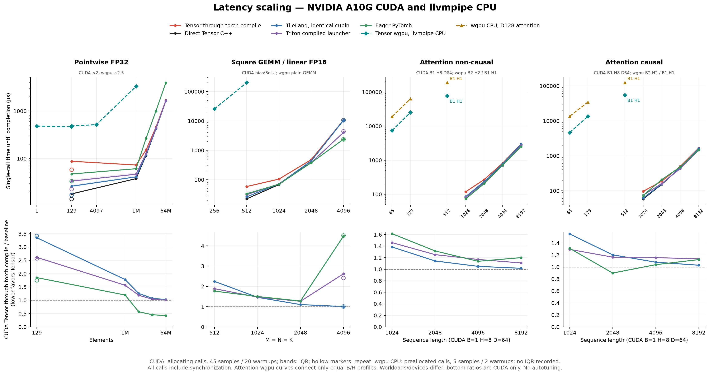

# Larger-shape latency scaling

The outer `torch.compile` wrapper becomes a smaller fraction of latency as
GPU work grows. It does not explain every large-shape performance gap.
At 64M pointwise elements, Tensor through `torch.compile` is only **1.03×
slower than direct matched TileLang**. At GEMM 4096³, that ratio is 1.00×,
but both execute a kernel that is much slower than Triton and eager PyTorch.

Measured on 2026-09-30 with the same A10G, C++ executor and pinned compiler
environment as the [direct comparison](direct-backend-comparison.md).
All 17 scaling profiles passed numerical checks. A separate repeat of the
small pointwise anchor and largest GEMM confirmed the GEMM slowdown.

The [WebGPU baseline](#webgpu-wgpu-baseline) adds Tensor's native wgpu
provider on the same host's **llvmpipe CPU software adapter**. Physical
AMD/Apple GPU measurements remain pending. Its workload and timing differences
are labeled in the main tables and figure. The figure's top panels include
both devices; its bottom ratios cover CUDA providers only.



[SVG figure](data/latency-scaling.svg).
[Full raw observations, targeted repeat and fingerprints](data/latency-scaling.json).
[WebGPU raw observations](data/webgpu-software.json).
[Scaling benchmark](../../tools/scaling_backend_benchmark.py).
[Plot exporter](../../tools/plot_latency_scaling.py).

| Baseline | Execution device | Output allocation | Completed-call samples / warmups |
|---|---|---|---|
| Tensor through torch.compile | NVIDIA A10G, CUDA | Inside each call | 45 / 20 |
| Matched native TileLang | NVIDIA A10G, CUDA | Inside each call | 45 / 20 |
| Native Triton | NVIDIA A10G, CUDA | Inside each call | 45 / 20 |
| Eager PyTorch | NVIDIA A10G, CUDA | Inside each call | 45 / 20 |
| Tensor WebGPU (wgpu) | llvmpipe, CPU software Vulkan | Preallocated | 5 / 2 |

## Individual-call latency

All values are milliseconds. The CUDA columns report **one warm allocating
call followed by stream synchronization**. Their median uses 45 individual
observations with rotating provider order. Synchronization overhead is included
for every provider. This measures time until the output is ready, rather than
the amortized completed batches reported in the earlier comparison.

The **wgpu CPU** column uses preallocated outputs and five completed calls
after two warmups. It executes on llvmpipe, rather than the A10G.
**— means no measurement for that workload**, not zero time or lack of backend
support. Rows retain distinct operations and attention shapes where necessary;
the Tensor / TileLang ratios always use the CUDA columns.

TileLang here uses native TVM-FFI allocation/launch with Tensor's identical
cubin. Triton uses its compiled-kernel runner. The raw data also retains ordinary
NVCC TileLang, warmed Triton JIT, direct Tensor and default Inductor results.

| FP32 pointwise elements | Tensor through torch.compile | Matched TileLang | Triton | Eager PyTorch | wgpu CPU | Tensor / TileLang |
|---|---:|---:|---:|---:|---:|---:|
| 1 | — | — | — | — | 0.483 | — |
| 127 | — | — | — | — | 0.468 | — |
| 128 | — | — | — | — | 0.479 | — |
| 129 | 0.088 | 0.026 | 0.034 | 0.047 | 0.487 | 3.35× |
| 4097 | — | — | — | — | 0.517 | — |
| 1M | 0.073 | 0.041 | 0.047 | 0.061 | 3.305 | 1.78× |
| 4M | 0.151 | 0.120 | 0.127 | 0.265 | — | 1.26× |
| 16M | 0.457 | 0.426 | 0.440 | 1.002 | — | 1.07× |
| 64M | 1.683 | 1.640 | 1.664 | 3.951 | — | 1.03× |

CUDA computes `relu(a*2+b)`; wgpu computes the symbolic affine profile
`relu(a*2.5+b)`. Shared element counts do not establish a matched-workload
speedup because the scalar binding, device and allocation protocols differ.

Here M means 2²⁰ elements. The first pointwise anchor varied between runs:
the targeted repeat measured 0.058 ms for Tensor and 0.017 ms for matched
TileLang, with a similar 3.41× ratio. Its change reflects timing variation,
rather than a claim that 1M elements are intrinsically faster than 129.
Both observations are retained and the repeat appears as hollow plot markers.

| FP16 M×N×K | Operation | Tensor through torch.compile | Matched TileLang | Triton | Eager PyTorch | wgpu CPU | Tensor / TileLang |
|---|---|---:|---:|---:|---:|---:|---:|
| 33×65×37 | GEMM | — | — | — | — | 1.057 | — |
| 33×65×37 | GEMM + bias + ReLU | — | — | — | — | 0.967 | — |
| 256×256×256 | GEMM | — | — | — | — | 25.743 | — |
| 512×512×512 | GEMM | — | — | — | — | 201.058 | — |
| 512×512×512 | GEMM + bias + ReLU | 0.059 | 0.026 | 0.031 | 0.033 | — | 2.24× |
| 1024×1024×1024 | GEMM + bias + ReLU | 0.105 | 0.072 | 0.071 | 0.070 | — | 1.46× |
| 2048×2048×2048 | GEMM + bias + ReLU | 0.482 | 0.438 | 0.382 | 0.378 | — | 1.10× |
| 4096×4096×4096 | GEMM + bias + ReLU | 10.633 | 10.587 | 4.059 | 2.375 | — | 1.00× |

The square wgpu profiles are plain GEMM; the CUDA square profiles include
bias/ReLU. The figure shows square profiles and labels this operation
difference explicitly; the two non-square profiles appear only in the table.

At 4096, full Tensor calls are still **2.62× slower than Triton** and
**4.48× slower than eager PyTorch** in the main sweep. The repeat measured
10.607, 10.549, 4.400 and 2.353 ms respectively. This is a persistent GPU
kernel gap despite ordinary run-to-run variation, especially in Triton's
measurement. None of these implementations is autotuned by this benchmark.

| FP16 attention, B/H/S/D | Mode | Tensor through torch.compile | Matched TileLang | Triton | Eager PyTorch | wgpu CPU | Tensor / TileLang |
|---|---|---:|---:|---:|---:|---:|---:|
| 2/2/65/64 | Non-causal | — | — | — | — | 7.429 | — |
| 2/2/129/64 | Non-causal | — | — | — | — | 25.192 | — |
| 1/1/512/64 | Non-causal | — | — | — | — | 76.703 | — |
| 2/2/65/128 | Non-causal | — | — | — | — | 19.001 | — |
| 2/2/129/128 | Non-causal | — | — | — | — | 62.953 | — |
| 1/1/512/128 | Non-causal | — | — | — | — | 188.799 | — |
| 1/8/1024/64 | Non-causal | 0.118 | 0.085 | 0.081 | 0.073 | — | 1.39× |
| 1/8/2048/64 | Non-causal | 0.270 | 0.236 | 0.215 | 0.205 | — | 1.14× |
| 1/8/4096/64 | Non-causal | 0.817 | 0.778 | 0.699 | 0.718 | — | 1.05× |
| 1/8/8192/64 | Non-causal | 2.991 | 2.944 | 2.698 | 2.491 | — | 1.02× |
| 2/2/65/64 | Causal | — | — | — | — | 4.631 | — |
| 2/2/129/64 | Causal | — | — | — | — | 13.507 | — |
| 1/1/512/64 | Causal | — | — | — | — | 54.625 | — |
| 2/2/65/128 | Causal | — | — | — | — | 13.522 | — |
| 2/2/129/128 | Causal | — | — | — | — | 34.528 | — |
| 1/1/512/128 | Causal | — | — | — | — | 124.000 | — |
| 1/8/1024/64 | Causal | 0.097 | 0.062 | 0.075 | 0.074 | — | 1.55× |
| 1/8/2048/64 | Causal | 0.187 | 0.156 | 0.161 | 0.209 | — | 1.20× |
| 1/8/4096/64 | Causal | 0.497 | 0.460 | 0.429 | 0.478 | — | 1.08× |
| 1/8/8192/64 | Causal | 1.668 | 1.620 | 1.467 | 1.484 | — | 1.03× |

The figure plots wgpu D=64 and D=128 separately. Its S=512 markers are
unconnected because B/H changes from 2/2 to 1/1. No wgpu observation shares
the CUDA attention table's B=1/H=8, S=1024–8192 profile.

At S=8192, Tensor's full call is about 11% slower than Triton for non-causal
attention and 14% slower for causal attention. The same-kernel TileLang ratio
is close to parity because it isolates wrapper cost. It cannot establish
competitiveness against a different GPU kernel.

## WebGPU (wgpu) baseline

Measured on 2026-09-30 using wgpu 0.29.0, wgpu-native 27.0.2.0 and Mesa
llvmpipe (LLVM 20.1.2). These tables report **median host submission plus
queue completion**, in milliseconds, from five calls after two warmups.
Inputs and outputs are already allocated; upload/download and cold pipeline
creation are excluded. This is direct Tensor execution without a PyTorch
wrapper. All 33 checks in the [validation suite](phase5-webgpu.md) passed.
[Raw timings, adapter identity and validation results](data/webgpu-software.json).

WebGPU uses 32×32 output tiles and K=16 with FP32 accumulation. The 256/512
profiles are plain GEMM, whereas the CUDA square profiles include bias/ReLU.
Doubling the square dimension increases the recorded WebGPU median about
7.81× for 8× the arithmetic work. This describes software execution, not
hardware GPU scaling; the small-profile medians also have timing variation.

Attention retains streaming online softmax, with query/key tiles of 8×16.
Batch and head counts change
at S=512, so this is not a fixed-batch sequence-length sweep. The CUDA table
uses B=1/H=8, D=64 and S=1024–8192; none of those attention shapes has a
WebGPU measurement here.

No CUDA/WebGPU speedup ratio is reported because these runs use different
execution devices, workloads and allocation protocols. The software adapter's
host-enqueue timing can include CPU execution or queue backpressure; it is
not a measurement of Python wrapper overhead or isolated GPU time. Physical
AMD/Apple results are needed before assessing WebGPU GPU performance.

## Host overhead versus GPU execution

Excluding the noisy 129-element anchor, the main sweep's host submission
difference between `tensor_compile` and `tensor_direct` has a median of
**43 µs**, ranging from 40 to 49 µs. Their serialized-call difference has a
median of 38 µs, ranging from 35 to 80 µs. These are differences between
independently measured medians; they are not an exact additive decomposition
of CPU and GPU work.

For 64M pointwise elements, Tensor's captured GPU time is about 1.62 ms,
so tens of microseconds of wrapper cost have little relative impact. For
the 1M case, about 25 µs of GPU work remains comparable to the wrapper cost.

The GEMM 4096 slowdown remains when host dispatch is removed:

| Captured GPU time, GEMM 4096³ | Main sweep | Targeted repeat |
|---|---:|---:|
| Direct Tensor | 10.536 ms | 10.514 ms |
| Matched TileLang | 10.550 ms | 10.498 ms |
| Triton compiled launcher | 4.034 ms | 4.326 ms |
| Eager PyTorch | 2.363 ms | 2.304 ms |

Direct Tensor GPU time increases about 24.5× from GEMM 2048³ to 4096³, while
the arithmetic work increases 8×. Identical-cubin TileLang reproduces the
behavior. This points to poor scaling of the fixed kernel schedule; this
benchmark does not identify the precise memory or instruction bottleneck.
Improving only the outer wrapper cannot resolve this gap.

## Method and reproduction

The sweep uses seed 42, contiguous inputs, inference mode and a non-default
stream. FP32 pointwise remains `relu(a*2+b)`, FP16 linear retains bias/ReLU,
and FP16 BHSD attention uses default PyTorch SDPA as its numerical/baseline
reference. Shape growth changes no tile sizes or tuning policy.

All allocating and fixed-output direct graphs are checked against eager;
matched TileLang outputs are bitwise equal to Tensor. Both `torch.compile`
Tensor and Inductor outputs are checked too. All 34 matched cubin variants
in the main sweep and four in the repeat have verified binary hashes and
matching argument ABI and launch metadata.

Host measurements use nine rotated batches of 20 calls, after 100 warmups
per provider. The completion variant synchronizes once after each batch and
divides elapsed time by 20; it describes amortized throughput. Serialized
measurements warm 20 calls, then synchronize after every one of 45 timed
calls. Output destruction occurs outside each serialized timer. GPU timing
captures ten calls and uses nine CUDA-event samples with warmed graphs.
The small 129-element anchor's GPU event timing has appreciable graph launch
and event overhead with ten-call replay; it is not used to infer intrinsic
microkernel latency. The larger-shape GPU comparisons remove that ambiguity.

No individual run provides an exact CPU/GPU sum. Batched calls overlap host
submission with GPU work, so their overhead becomes almost invisible once
GPU execution dominates. The serialized measurements retain the additional
time a caller pays before one result is ready.

On the same pinned producer environment, with the optional native adapter,
local NVRTC bundle and native TileLang's NVCC toolkit:

```sh
export PYTHONPATH="$PWD/packages/tensor-torch/src"
export TENSOR_NVRTC_HOME="$PWD/build/nvrtc-12.9"
export CUDA_HOME=/path/to/cuda-12.9
python tools/scaling_backend_benchmark.py \
  --cache build/phase4-completion-cache --out build/latency-scaling/full.json

# Repeat selected cases with the same controls.
python tools/scaling_backend_benchmark.py \
  --case pointwise-129 --case gemm-4096-4096-4096 \
  --cache build/phase4-completion-cache --out build/latency-scaling/repeat.json

# Optional plot dependency: matplotlib 3.11.2 in the measured environment.
python tools/plot_latency_scaling.py docs/research/data/latency-scaling.json \
  --webgpu-report docs/research/data/webgpu-software.json \
  --out build/latency-scaling/scaling
```

NVRTC remains Tensor's default compiler and consumer execution remains toolkit
free. These optional research tools add no consumer dependency or backend.

For the WebGPU baseline, build the transfer suite in the producer environment,
then run it in a separate environment with the Tensor wheel's `[webgpu]`
extra installed. The [WebGPU guide](../webgpu.md#build-and-consume) gives the
wheel installation and transfer steps; the consumer needs no TileLang or Torch.

```sh
# Producer: emits the WGSL artifacts and suite manifest without a GPU.
python tools/webgpu_validation.py --build build/webgpu-transfer

# Clean consumer: software-adapter run, matching the five-sample report above.
python tools/webgpu_validation.py --consume build/webgpu-transfer \
  --iters 5 --out build/webgpu-software.json

# Physical AMD/Apple consumer: require hardware for the pending acceptance gate.
python tools/webgpu_validation.py --consume build/webgpu-transfer \
  --require-second-gpu --iters 5 --out build/webgpu-hardware.json
```
