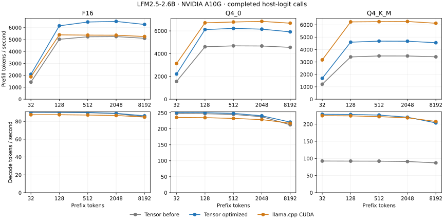

# CUDA prefill and decode: F16, Q4_0 and Q4_K_M

[Research index](README.md) · [Initial Vulkan transfer](lfm2-cuda-vulkan-transfer.md) ·
[Package instructions](../../packages/tensor-llm/README.md)

The opt-in `optimized` CUDA profile now has measured schedules for
LFM2.5-2.6B F16, ordinary Q4_0 and Q4_K_M on NVIDIA A10G. Weights remain packed;
prefill uses FP16 tensor-core operands with FP32 accumulation, and decode uses
FP32 activations and arithmetic. The installed consumer needs only Tensor,
Tensor LLM, NumPy, regex and the NVIDIA driver.

## Completed-forward measurements

### Prefill (tok/s)

| Format | Prefix | Before | Optimized | llama.cpp CUDA | Gain over before | Optimized / native |
|---|---:|---:|---:|---:|---:|---:|
| F16 | 32 | 1,434 | 2,090 | 1,882 | 1.457× | 111.0% |
| F16 | 128 | 5,025 | 6,155 | 5,396 | 1.225× | 114.1% |
| F16 | 512 | 5,235 | 6,473 | 5,373 | 1.237× | 120.5% |
| F16 | 2048 | 5,252 | 6,524 | 5,366 | 1.242× | 121.6% |
| F16 | 8192 | 5,107 | 6,266 | 5,257 | 1.227× | 119.2% |
| Q4_0 | 32 | 1,566 | 2,216 | 3,135 | 1.415× | 70.7% |
| Q4_0 | 128 | 4,606 | 6,118 | 6,710 | 1.328× | 91.2% |
| Q4_0 | 512 | 4,686 | 6,219 | 6,782 | 1.327× | 91.7% |
| Q4_0 | 2048 | 4,676 | 6,154 | 6,838 | 1.316× | 90.0% |
| Q4_0 | 8192 | 4,555 | 5,916 | 6,679 | 1.299× | 88.6% |
| Q4_K_M | 32 | 1,210 | 1,684 | 3,172 | 1.392× | 53.1% |
| Q4_K_M | 128 | 3,408 | 4,597 | 6,232 | 1.349× | 73.8% |
| Q4_K_M | 512 | 3,487 | 4,681 | 6,251 | 1.342× | 74.9% |
| Q4_K_M | 2048 | 3,485 | 4,675 | 6,264 | 1.342× | 74.6% |
| Q4_K_M | 8192 | 3,418 | 4,554 | 6,122 | 1.332× | 74.4% |

### Decode (tok/s)

| Format | Prefix | Before | Optimized | llama.cpp CUDA | Gain over before | Optimized / native |
|---|---:|---:|---:|---:|---:|---:|
| F16 | 32 | 90.1 | 90.5 | 87.5 | 1.004× | 103.4% |
| F16 | 128 | 90.0 | 90.4 | 87.5 | 1.004× | 103.3% |
| F16 | 512 | 89.8 | 90.1 | 87.2 | 1.004× | 103.4% |
| F16 | 2048 | 88.8 | 89.1 | 86.6 | 1.003× | 102.8% |
| F16 | 8192 | 85.0 | 86.2 | 84.9 | 1.015× | 101.6% |
| Q4_0 | 32 | 247.8 | 251.2 | 235.5 | 1.014× | 106.7% |
| Q4_0 | 128 | 247.2 | 250.6 | 234.9 | 1.014× | 106.7% |
| Q4_0 | 512 | 245.0 | 248.3 | 232.6 | 1.013× | 106.8% |
| Q4_0 | 2048 | 237.8 | 240.8 | 228.8 | 1.013× | 105.2% |
| Q4_0 | 8192 | 212.6 | 220.9 | 217.3 | 1.039× | 101.7% |
| Q4_K_M | 32 | 92.4 | 228.9 | 224.8 | 2.477× | 101.9% |
| Q4_K_M | 128 | 92.2 | 228.4 | 224.3 | 2.476× | 101.8% |
| Q4_K_M | 512 | 92.1 | 226.6 | 222.0 | 2.462× | 102.1% |
| Q4_K_M | 2048 | 91.0 | 220.4 | 218.6 | 2.422× | 100.8% |
| Q4_K_M | 8192 | 87.1 | 203.7 | 207.9 | 2.339× | 98.0% |

F16 prefill improves **22–46%**, Q4_0 **30–41%**, and Q4_K_M **33–39%**.
The larger F16 and Q4_0 gains occur at 32 tokens. F16 short-context decode
changes by only 0.3–0.4%, so it is effectively unchanged; its 8K decode gain
is 1.5%. Q4_0 decode improves 1.3–3.9%. The dedicated packed Q4_K decoder
improves Q4_K_M decode **2.34–2.48×** over the previous profile.

F16 prefill runs ahead of this native control. Quantized prefill remains
behind: at 128–8K tokens Q4_0 reaches 89–92% of native throughput, while
Q4_K_M reaches 74–75%. Decode reaches or exceeds the matched native rate
through 2K context for every format. At 8K, Q4_K_M reaches 98.0% of native;
F16 and Q4_0 remain ahead. These ratios apply to the recorded workloads.

Tensor-owned buffers total 5.191 GiB for F16, 1.643 GiB for Q4_0, and
1.718 GiB for Q4_K_M. F16 adds about 1.1 MiB of workspace; the quantized
allocations are unchanged. Counts exclude driver allocations and CUDA Graph
metadata. Decode has 246 launches, compared with 306 for the old F16 plan;
the quantized plans already had 246.



Measured on 2026-10-04, A10G / SM86, driver 595.91.07. Each case prefills one
sequence, then runs 64 forced single-token cached decode calls using identical
token IDs within that checkpoint. Times include submission, completion and
FP32 host logits. Loading, reset, tokenization and sampling are excluded.
The reported rate divides tokens by the median total duration; each runner
has three warmups and five retained samples. These are `forward()` timings,
not timings of GPU greedy generation.

The **before** control is the already optimized CUDA profile at
`4c6872674756454982af8c87c6a1d77b3fc5ef02`, not the default producer profile.
Its package source is frozen separately and checked against that Git revision;
its original manifest fingerprints are retained. Before and after both use
rows 1/32/128, context capacity 8576, packed weights, CUDA Graph replay and the
same precision contract. Their runs rotate sequentially after the native
helper exits. GPU timing jobs do not overlap.

The native control is llama.cpp b11310,
`f872b591121761ac7b2af18283bd99bdc092a63a`, matching the Vulkan campaign. It uses
CUDA with every layer offloaded, Flash Attention, F16 K/V, four CPU threads,
one sequence and batch/ubatch 128. Native rates are freshly measured on each
matching GGUF; the Q4_0 checkpoint here is distinct from QAD Q4_0.

## Selected changes

- **Prefill tiles and loads.** A bounded search selects 34 schedules across
  the checkpoint's 17 distinct projection/encoding combinations at 32 and
  128 rows. Larger K tiles and narrower output tiles reduce staging and
  dequantization cost. Selected loaders unpack two neighboring coefficients
  together into shared FP16 operands, reusing scale/minimum metadata. Other
  shapes retain the existing template.
- **Q4_K decode.** Each lane consumes eight packed coefficients with shared
  group scales and minima. FP32 dot products and activation sums implement
  the affine quantization. Q4_0 and Q6_K retain their packed-word paths, with
  a few measured thread/unroll choices for real projection shapes.
- **F16 decode fusion.** The measured 2048-to-10752 gate/up pair now writes
  SwiGLU directly, removing 60 launches across the 30-layer model. F16 loads
  use half2 conversion into FP32 products. Wider 8/16-value vector loads were
  tested but did not deliver a useful gain and are not selected.
- **Shared long-context attention.** At 4096 cached tokens and above, four
  query heads share staged F16 K/V tiles. Two warps per query head compute
  FP32 online softmax, followed by the existing partial merge. Separate
  short/long CUDA Graphs preserve the short-context schedule without adding
  per-layer dispatch kernels. A single-kernel adaptive variant was correct
  but slower and was rejected.
- **Suffix liveness for every format.** The guarded final attention/conv/conv
  suffix now accepts the measured floating and mixed quantized encodings.
  It stores every final-attention K/V row before cropping to eight query
  rows, preserving both convolution histories and the final output.

These remain per-layer kernels submitted through a CUDA Graph. There is no
global expanded weight cache, persistent megakernel or new runtime compiler
dependency. Attention caches are F16 and convolution history is FP32.
The final-row prefill FFN continues to use FP32 decode arithmetic.

## Correctness and retained evidence

| Format | Maximum relative RMS | Comparisons |
|---|---:|---:|
| F16 | 0.1838% | 22 |
| Q4_0 | 0.1527% | 22 |
| Q4_K_M | 0.1811% | 22 |
| QAD-Q4_0 | 0.0812% | 8 |

Each optimized checkpoint has 22 independent Torch comparisons: prefill and
one cached decode at lengths 1, 32, 127, 128, 129, 384, 512, 2048, 4095, 4096
and 8192. The two 4K boundary cases exercise the graph transition. All logits
are finite, every argmax agrees, and all cosine similarities exceed 0.9999.
The relative RMS gate is 1%. Reset replay and graph/eager outputs are bitwise
equal, including forced decode at long context. GPU and host greedy generation
agree for 16-token short and four-token 4107-token-prompt examples.
The independent reference shares no kernel templates. These checks establish
bounded numerical agreement, rather than a model-quality evaluation.

The existing QAD Q4_0 checkpoint also passes eight full-model comparisons
at 128, 4095, 4096 and 8192, plus both generation checks. Its performance is
not substituted for ordinary Q4_0 in the tables above.

An installed environment containing exactly four distributions replays all
74 saved output arrays bit for bit across the three formats and QAD, and
reproduces both short and long generation. Imports of TileLang, TVM, TVM FFI,
Torch, Triton and wgpu are blocked. No compiler is used by these consumers.

The [package/integration checks](data/lfm2-cuda-formats-tests.json) pass 55 tests
with 72 WebGPU cases skipped;
three further attention checks cover both two-head and four-head K/V sharing,
empty partitions and partial tiles. New projection tests cover paired
prefill loads, padded rows/columns and Q4_K decode output tails. Linux and
Windows CI compile all 34 selected prefill schedules, eight packed epilogue
templates and the grouped attention kernel without a GPU.

Raw evidence:

| Format | Benchmark | Optimized accuracy | Frozen-before accuracy | Installed consumer |
|---|---|---|---|---|
| F16 | [Samples and manifests](data/lfm2-cuda-formats-f16-benchmark.json) | [22 comparisons](data/lfm2-cuda-formats-f16-validation.json) | [18 comparisons](data/lfm2-cuda-formats-f16-before-validation.json) | [Audit](data/lfm2-cuda-formats-f16-consumer.json) |
| Q4_0 | [Samples and manifests](data/lfm2-cuda-formats-q4_0-benchmark.json) | [22 comparisons](data/lfm2-cuda-formats-q4_0-validation.json) | [18 comparisons](data/lfm2-cuda-formats-q4_0-before-validation.json) | [Audit](data/lfm2-cuda-formats-q4_0-consumer.json) |
| Q4_K_M | [Samples and manifests](data/lfm2-cuda-formats-q4_k_m-benchmark.json) | [22 comparisons](data/lfm2-cuda-formats-q4_k_m-validation.json) | [18 comparisons](data/lfm2-cuda-formats-q4_k_m-before-validation.json) | [Audit](data/lfm2-cuda-formats-q4_k_m-consumer.json) |
| QAD Q4_0 | — | [Regression](data/lfm2-cuda-formats-qad-q4_0-validation.json) | — | [Audit](data/lfm2-cuda-formats-qad-q4_0-consumer.json) |

The retained searches include the [prefill tile sweep](data/lfm2-cuda-formats-prefill-search.json),
[paired loaders](data/lfm2-cuda-formats-prefill-pairs-search.json),
[32-row tiles](data/lfm2-cuda-formats-prefill-small-search.json),
[decode schedules](data/lfm2-cuda-formats-decode-search.json),
[wider F16 loads](data/lfm2-cuda-formats-decode-f16-search.json), and
[grouped attention](data/lfm2-cuda-formats-attention-search.json).
Each isolated timing captures 20 consecutive calls and divides event and
completed durations by 20, avoiding Python gaps between tiny kernels.
Projection candidates are gated against independent Torch math; attention
uses NumPy float64 softmax. The search label `before` denotes an unscheduled
generic candidate, not the frozen full-model control. Generated kernel source
hashes are retained and checked against the saved producer source files.

## Reproduction

Checkpoints are pinned to LiquidAI/LFM2.5-2.6B-GGUF revision
`e7caca5d835a3901a8e0d63e94009429bafafdfc`; sizes and SHA256 hashes are verified
by [download.py](../../benchmarks/lfm2/download.py). Use the prepared Python
3.12 producer environment; `--no-sync` preserves separately installed Torch.
The producer uses TileLang 0.1.14, TVM FFI 0.1.12 and NVRTC 12.9; the independent
reference uses Torch 2.14.0. NumPy is 2.5.3 and regex is 2026.9.29.

```sh
uv run --no-sync python tools/bootstrap_nvrtc.py --out build/nvrtc-12.9
export TENSOR_NVRTC_HOME="$PWD/build/nvrtc-12.9"
uv run --no-sync python benchmarks/lfm2/download.py --formats F16 Q4_0 Q4_K_M
root=build/lfm2-cuda-formats
mkdir -p "$root"
git worktree add --detach "$root/before-src" 4c6872674756454982af8c87c6a1d77b3fc5ef02
cp -R "$root/before-src/packages/tensor-llm/src/tensor_llm" "$root/tensor_llm_before"
for fmt in F16 Q4_0 Q4_K_M; do
  model="build/lfm2-models/LFM2.5-2.6B-$fmt.gguf"
  PYTHONPATH="$PWD/$root/before-src/packages/tensor-llm/src:$PWD/$root/before-src/src" \
    uv run --no-sync python "$root/before-src/benchmarks/lfm2/producer.py" \
    --model "$model" --out "$root/$fmt-before" --context 8448 --target sm_86 \
    --cuda-profile optimized --prefill-chunks 32 128
  uv run --no-sync python benchmarks/lfm2/producer.py \
    --model "$model" --out "$root/$fmt-optimized" --context 8448 --target sm_86 \
    --cuda-profile optimized --prefill-chunks 32 128
  uv run --no-sync python benchmarks/lfm2/cuda_transfer.py validate \
    --model "$model" --bundle "$root/$fmt-optimized" --out "$root/$fmt-validation"
done
uv run --no-sync python benchmarks/lfm2/cuda_formats.py validate-before \
  --depths 1 32 127 128 129 384 512 2048 8192
```

Build the native helper separately with a CUDA toolkit, CMake, Ninja and a
C++ compiler; its CUBLAS dependency belongs to the llama.cpp reference build.
Set `LD_LIBRARY_PATH` for a helper linked against a local toolkit:

```sh
uv run --no-sync python benchmarks/lfm2/build_reference.py \
  --out build/lfm2-cuda-transfer/native-b11310 --cuda-root build/llama-cuda-toolkit \
  --arch 86 --jobs 2 --commit f872b591121761ac7b2af18283bd99bdc092a63a
LD_LIBRARY_PATH="$PWD/build/llama-cuda-toolkit/lib64${LD_LIBRARY_PATH:+:$LD_LIBRARY_PATH}" \
  uv run --no-sync python benchmarks/lfm2/cuda_formats.py compare
```

Build both wheels and install them in a fresh environment to repeat the audit:

```sh
uv build --wheel --out-dir "$root/wheels"
uv build --wheel packages/tensor-llm --out-dir "$root/wheels"
uv venv --python 3.12 "$root/consumer"
uv pip install --python "$root/consumer/bin/python" "$root"/wheels/*.whl
for fmt in F16 Q4_0 Q4_K_M; do
  "$root/consumer/bin/python" benchmarks/lfm2/cuda_transfer_consumer.py \
    --model "build/lfm2-models/LFM2.5-2.6B-$fmt.gguf" \
    --bundle "$root/$fmt-optimized" --reference "$root/$fmt-validation" \
    --out "$root/$fmt-consumer.json"
done
```

Rebuild bundles after implementation changes. Source fingerprints bind each
bundle to its matching runtime; the frozen-before manifests must not be
rewritten to claim the current implementation. These measurements establish
the recorded 2.6B profiles on A10G; other GPU architectures and model shapes
require their own correctness and performance checks.
