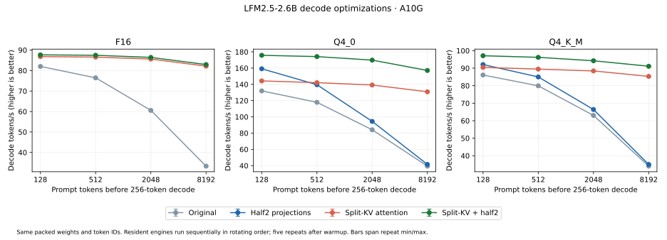

# Packed-weight prefetch and split-KV decode experiment

This follows the [FP16 projection experiment](lfm2-fp16-decode.md) on the same
pinned LFM2.5-2.6B checkpoints and A10G. Two independent changes are tested:
loading compressed projection weights ahead of use, and replacing the serial
cached-attention scan with a partitioned warp-based scan. The experimental
`OptimizedLFM2` runner overlays AOT bundles; the installed production engine and
its precision default are unchanged.

## Packed weight loading

The tested shared-memory pipeline uses two packed buffers, each holding four
output rows × 512 input columns. CUDA `__pipeline_memcpy_async` fetches the next
tile while the current tile is decoded and consumed. Q4_0/Q4_K use aligned
16-byte transfers, Q6_K aligned four-byte transfers. Expanded weights are never
written to global memory; GGML scales and values are decoded on-chip and passed
to the same FP16-product/FP32-accumulation `half2` operation as before. A
synchronous packed-staging control uses the same tile and layout. F16 and
profiles with K not divisible by 512 retain the prior kernel.

A second candidate keeps the existing `half2` kernel and adds L2 prefetch hints
for packed blocks four/eight/sixteen 64-column iterations ahead. Cache residency
is a hint rather than a correctness requirement. Prefetching does not perform
unpacking itself.

Four actual checkpoint matrices are measured against an independent Torch
reference, with random FP32 activations (seed 101), CUDA Graph replay and CUDA
events. Transfers/reference computation are outside timing. Each candidate gets
five warmups and seven samples of 30 replays. This is an isolated projection
measurement, not a full-model bandwidth profile.

| Matrix | Half2 | Synchronous staging | Async staging | Best L2 hint |
|---|---:|---:|---:|---:|
| Q4_0 FFN gate | 36.80 µs | 49.63 µs | 45.23 µs | 46.25 µs (prefetch4) |
| Q4_K FFN gate | 76.22 µs | 92.47 µs | 88.75 µs | 104.00 µs (prefetch4) |
| Q6_K output | 542.41 µs | 1116.50 µs | 947.68 µs | 823.36 µs (prefetch4) |
| Q6_K FFN down | 61.47 µs | 119.43 µs | 83.73 µs | 96.94 µs (prefetch8) |

All candidates pass a relative RMS gate of 0.1% for their own FP16 product
contract. Neither asynchronous packed staging nor the tested L2 hints beat the
existing `half2` projection on these matrices. Asynchronous copies improve over
synchronous staging, but that does not recover the cost relative to the original
kernel. These results reject these implementations for this decode schedule;
they do not rule out other load layouts, pipeline sizes or kernels with more
weight reuse. The full-model candidates retain the existing projection kernels.
The [raw projection record](data/lfm2-decode-projection-micro.json) retains errors,
artifact hashes, and all timing samples.

## Partitioned cached attention

Splitting the original large-fragment attention kernel across blocks gives only
modest gains: at 8,192 cached tokens, four partitions take roughly 2.00 ms versus
2.23 ms for the serial kernel. Simply adding blocks does not address all the
work within each block. That [control is retained](data/lfm2-decode-attention-partition-control.json).

The winning candidate changes both the partitioning and work inside a block:

- One block per query head and KV partition; four warps per block.
- Each warp scans every fourth token in its partition, keeps the 64-channel
  query in registers, and computes dot products with warp shuffles.
- An online FP32 softmax maintains each warp's maximum, denominator and weighted
  value sum. The four warp results combine into one unnormalized partition.
- A second kernel merges partitions with maximum correction before dividing by
  the combined denominator. Empty partitions write zero sums and `-inf` maxima.

Sixteen partitions are selected from a sweep of 4/8/16/32. The partition size is
computed from the live cache length. The head dimension is 64; caches remain
FP16 and accumulation remains FP32. Query heads still read their respective GQA
cache independently; explicit shared loading across four query heads is not
implemented. Prefill uses the existing tensor-core attention kernel.

| Cached tokens | Serial attention | Warp split-16, including merge | Ratio |
|---|---:|---:|---:|
| 128 | 42.70 µs | 5.12 µs | 8.34× |
| 512 | 146.30 µs | 7.65 µs | 19.13× |
| 2,048 | 565.04 µs | 16.59 µs | 34.06× |
| 8,192 | 2230.48 µs | 88.88 µs | 25.09× |

Random independent Torch checks cover live lengths
1/64/65/128/129/512/2,048/8,192/8,193, including empty partitions and incomplete
tiles. Relative RMS must stay below `1e-5`; all tested partition counts pass.
Timings include both the partial and merge kernel and follow the same CUDA
Graph/event protocol as projections. The
[raw attention record](data/lfm2-decode-attention-micro.json) retains the sweep.

LFM2's hybrid allocation remains intact: 22 convolution layers have only two
previous FP32 vectors each (352 KiB total), and only eight layers have FP16 K/V
caches (16 KiB per context position across the model; these runs reserve
8,576 positions). Split attention adds one shared
**132 KiB** partial buffer per engine, reused across all eight attention layers;
it does not add KV caches for convolution layers. Decode launches increase from
359 to 367. The split-KV change leaves prefill kernels unchanged; the combined
variant retains the prior `half2` final-output projection during prefill.

## Full-model checks and ablation

Each format has two separately checked variants: split-KV with original FP32
projection arithmetic, and split-KV with the earlier `half2` projection arithmetic.
Both run the original 23-step fixture, including natural-language continuation,
127/128/129/512/2,048/8,192-token cache boundaries and a reset. The independent
eager Torch reference follows each variant's projection contract and imports no
Tensor templates/runtime. The native llama.cpp logits are the original pinned
reference fixture on the identical checkpoint and tokens.

All **138 steps** pass finite logits, independent relative RMS below 1%,
independent cosine above 0.9999, relative RMS below 1% against the original
engine, and bitwise-identical reset checks. Maximum relative RMS is
**0.340%** against the independent reference and **0.218%**
against the original engine. Argmax agreement is 138/138
with the independent reference, 138/138 with the original
engine, and 138/138 with native llama.cpp. This fixture bounds
numerical drift; it does not establish equivalent perplexity or general quality.

| Format | Variant | Maximum RMS vs independent reference | Maximum RMS vs original |
|---|---|---:|---:|
| F16 | Split-KV | 0.138% | 0.003% |
| F16 | Split-KV + half2 | 0.316% | 0.159% |
| Q4_0 | Split-KV | 0.137% | 0.025% |
| Q4_0 | Split-KV + half2 | 0.340% | 0.218% |
| Q4_K_M | Split-KV | 0.145% | 0.008% |
| Q4_K_M | Split-KV + half2 | 0.239% | 0.184% |

Validation reports: [F16 split16](data/lfm2-f16-split16-validation.json), [F16 half2-split16](data/lfm2-f16-half2-split16-validation.json), [Q4_0 split16](data/lfm2-q4_0-split16-validation.json), [Q4_0 half2-split16](data/lfm2-q4_0-half2-split16-validation.json), [Q4_K_M split16](data/lfm2-q4_k_m-split16-validation.json), [Q4_K_M half2-split16](data/lfm2-q4_k_m-half2-split16-validation.json).

Decode throughput in tokens/s (higher is better):

| Format | Prompt tokens | Original | Half2 alone | Split-KV alone | Split-KV + half2 | Combined/original |
|---|---:|---:|---:|---:|---:|---:|
| F16 | 128 | 82.0 | — | 86.8 | 87.7 | 1.07× |
| F16 | 512 | 76.4 | — | 86.6 | 87.5 | 1.14× |
| F16 | 2,048 | 60.6 | — | 85.6 | 86.4 | 1.43× |
| F16 | 8,192 | 33.3 | — | 82.2 | 82.9 | 2.49× |
| Q4_0 | 128 | 132.0 | 159.2 | 144.2 | 175.8 | 1.33× |
| Q4_0 | 512 | 117.9 | 139.6 | 142.1 | 174.2 | 1.48× |
| Q4_0 | 2,048 | 84.1 | 94.4 | 139.2 | 169.8 | 2.02× |
| Q4_0 | 8,192 | 39.4 | 41.5 | 130.8 | 157.1 | 3.99× |
| Q4_K_M | 128 | 86.1 | 92.1 | 90.4 | 97.1 | 1.13× |
| Q4_K_M | 512 | 79.9 | 85.0 | 89.5 | 96.2 | 1.20× |
| Q4_K_M | 2,048 | 63.0 | 66.4 | 88.4 | 94.2 | 1.50× |
| Q4_K_M | 8,192 | 34.1 | 35.0 | 85.3 | 91.1 | 2.68× |



All variants use the same packed GGUF weights, token IDs, FP16 K/V caches,
128-token prompt chunks, CUDA graphs and host-visible last-token logits. The
resident engines run sequentially with rotating order, one excluded warmup and
five repeats of 256 forced decode tokens at each depth. Loading, reset,
tokenization and sampling are excluded. Quantized formats include four fresh
controls: original, `half2` alone, split-KV alone, and their combination. F16 uses
three resident engines (original and the two split variants) to stay within GPU
memory; its `half2`-only result is retained in the earlier experiment rather than
presented as a fresh control here.

For Q4_0, combined decode latency falls from **25.40 to
6.37 ms/token** at 8K. The short-to-long context increase
falls from 17.82 ms to 0.68 ms.
Split-KV alone supplies most of the long-context improvement; `half2` contributes
the additional fixed projection gain. The packed-load schedules are rejected
and are not part of the winning combination.

Raw full-model reports: [F16](data/lfm2-f16-decode-optimization-benchmark.json), [Q4_0](data/lfm2-q4_0-decode-optimization-benchmark.json), [Q4_K_M](data/lfm2-q4_k_m-decode-optimization-benchmark.json).

### Fresh llama.cpp CUDA comparison

The combined candidate is additionally remeasured against the pinned native
helper in a separate matched API run, with the same checkpoint, token IDs,
chunk size, five repeats, host-visible logits, full GPU offload, CUDA graphs,
flash attention and FP16 caches. These results are independent of the resident
engine ablation above; native timings are refreshed rather than reused from
the earlier report.

| Format | Prompt tokens | Tensor combined (ms/token) | llama.cpp CUDA (ms/token) | Tensor/native throughput |
|---|---:|---:|---:|---:|
| F16 | 128 | 11.402 | 11.438 | 1.003× |
| F16 | 512 | 11.439 | 11.445 | 1.000× |
| F16 | 2,048 | 11.558 | 11.515 | 0.996× |
| F16 | 8,192 | 12.052 | 11.751 | 0.975× |
| Q4_0 | 128 | 5.671 | 4.250 | 0.749× |
| Q4_0 | 512 | 5.721 | 4.252 | 0.743× |
| Q4_0 | 2,048 | 5.847 | 4.323 | 0.739× |
| Q4_0 | 8,192 | 6.351 | 4.561 | 0.718× |
| Q4_K_M | 128 | 10.365 | 4.455 | 0.430× |
| Q4_K_M | 512 | 10.399 | 4.458 | 0.429× |
| Q4_K_M | 2,048 | 10.528 | 4.529 | 0.430× |
| Q4_K_M | 8,192 | 11.048 | 4.767 | 0.432× |

At 8K, combined Tensor throughput is 97.5% of native for F16, 71.8% for Q4_0
and 43.2% for Q4_K_M. F16 is near parity across the measured depths. Quantized
projections remain a substantial performance gap after fixing attention scaling;
these timings alone do not attribute that gap to memory traffic or unpacking
instructions.

Raw native-comparison reports: [F16](data/lfm2-f16-split16-llama-comparison.json), [Q4_0](data/lfm2-q4_0-split16-llama-comparison.json), [Q4_K_M](data/lfm2-q4_k_m-split16-llama-comparison.json).

The affected GPU suite passes **38 tests with zero skips**. All six full-model
variants also pass the isolated four-distribution consumer: each replays its
23-step saved Tensor fixture bitwise and generates the sample answer to EOS.
Consumer reports: [F16 split16](data/lfm2-f16-split16-consumer.json), [F16 half2-split16](data/lfm2-f16-half2-split16-consumer.json), [Q4_0 split16](data/lfm2-q4_0-split16-consumer.json), [Q4_0 half2-split16](data/lfm2-q4_0-half2-split16-consumer.json), [Q4_K_M split16](data/lfm2-q4_k_m-split16-consumer.json), [Q4_K_M half2-split16](data/lfm2-q4_k_m-half2-split16-consumer.json).
The [acceptance record](data/lfm2-decode-acceptance.json) retains commands, source
provenance, counts and hardware. Linux and Windows
[NVRTC compilation](https://github.com/kreasof-ai/tensor/actions/runs/36800156500)
passes for `c664769`; the [CI record](data/lfm2-decode-ci.json) retains each
job and step, including the earlier successful NVRTC/module transfer checks.

## Reproduce

Use the pinned [model and baseline bundle setup](../../packages/tensor-llm/README.md)
and the prior [`half2` bundles](lfm2-fp16-decode.md). Producer/reference runs need
Torch; the experimental consumer still uses four installed distributions only.

```sh
export TENSOR_NVRTC_HOME="$PWD/build/nvrtc-12.9"
uv run --no-sync python benchmarks/lfm2/decode_benchmark.py attention \
  --out build/lfm2-decode-warp-attention-micro
uv run --no-sync python benchmarks/lfm2/decode_benchmark.py projection \
  --out build/lfm2-decode-projection-micro
uv run --no-sync python benchmarks/lfm2/decode_optimization.py \
  --base build/lfm2-q4_0 --out build/lfm2-q4_0-split16 --splits 16
uv run --no-sync python benchmarks/lfm2/decode_optimization.py \
  --base build/lfm2-q4_0-half2 --out build/lfm2-q4_0-half2-split16 --splits 16
uv run --no-sync python benchmarks/lfm2/decode_benchmark.py validate \
  --model build/lfm2-models/LFM2.5-2.6B-Q4_0.gguf \
  --plan build/lfm2-q4_0-half2-split16 --fixture build/lfm2-q4_0-validation-final \
  --out build/lfm2-q4_0-half2-split16-validation
uv run --no-sync python benchmarks/lfm2/decode_benchmark.py bench \
  --model build/lfm2-models/LFM2.5-2.6B-Q4_0.gguf \
  --plan original=build/lfm2-q4_0 --plan half2=build/lfm2-q4_0-half2 \
  --plan split_fp32=build/lfm2-q4_0-split16 \
  --plan split_half2=build/lfm2-q4_0-half2-split16 \
  --out build/lfm2-q4_0-decode-optimization-benchmark
build/lfm2-consumer/bin/python benchmarks/lfm2/decode_consumer.py \
  --model build/lfm2-models/LFM2.5-2.6B-Q4_0.gguf \
  --bundle build/lfm2-q4_0-half2-split16 \
  --reference build/lfm2-q4_0-half2-split16-validation \
  --out build/lfm2-q4_0-half2-split16-consumer.json
LD_LIBRARY_PATH="$PWD/build/llama-cuda-toolkit/lib64" \
  uv run --no-sync python benchmarks/lfm2/decode_benchmark.py compare \
  --model build/lfm2-models/LFM2.5-2.6B-Q4_0.gguf \
  --bundle build/lfm2-q4_0-half2-split16 --reference build/lfm2-reference \
  --out build/lfm2-q4_0-split16-llama-comparison
```

Repeat validation for the split-only bundle and for F16/Q4_K_M. The experimental
runner is required to submit the extra attention partial/merge kernels. The
ordinary `LFM2` runner does not select them from this experimental metadata.
Rejected packed-load candidates can be compiled with `--projection pipeline`
or `--projection staged_sync`; those flags change all single-token projections,
including the final output projection during prefill, to the `half2` contract.
CI additionally compiles both load schedules and the L2 hint for all three
quantized encodings on Linux/Windows without a GPU.
