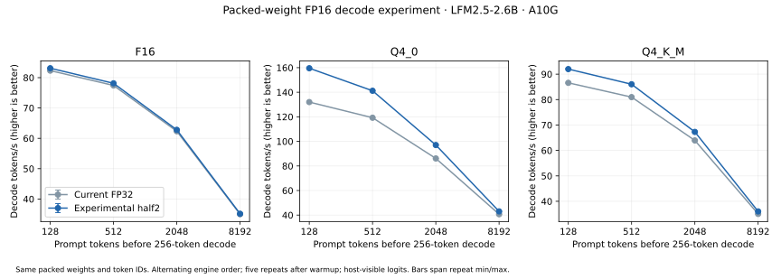

# Packed-weight FP16 decode experiment

This experiment tests whether FP16 computation improves the first
[LFM2 GGUF engine](lfm2-inference.md) while keeping its quantized weights packed
in device memory. It overlays single-token projection kernels in experimental
AOT bundles; the production runtime, kernel templates and precision default are
unchanged. This does not pre-dequantize the whole model into a larger FP16 copy.

## Candidates

All candidates accept the existing FP32 activation buffers and packed GGML
weights and write FP32 outputs. FP16 conversion happens inside the CUDA kernel.
Prefill projections, attention, convolution, normalization, caches and graph
submission remain the same. The final output projection uses a single-token
kernel even during prefill, so it also takes the candidate precision.

| Candidate | Operand/product precision | Accumulation/schedule |
|---|---|---|
| Current FP32 | FP32 decoded weights and activations, FP32 products | FP32; four output rows per block, 32 lanes per row |
| `fp16_cast` | Operands rounded to FP16, converted back for FP32 multiplication | Existing FP32 scalar GEMV schedule |
| `fp16_half2` | Two FP16 operands/products per packed `half2` operation | FP32 pair sums/accumulation; two adjacent K values per lane |
| `fp16_mma32` | FP16 operands in a tensor-core GEMM | FP32 accumulation; one useful query row padded to M=32 |

`half2` rounds each product to FP16 before FP32 accumulation. This is a different
precision contract from the tensor-core candidate and current FP32 path. Its
speedup also reflects pair processing and a shorter serial K loop, so it cannot
be attributed to changing the dtype alone. The padded tensor-core schedule is a
specific tested candidate; it does not settle whether a different tensor-core
GEMV implementation could work better.

## Isolated kernel measurements

Tests use the actual checkpoint matrices: Q4_0 and Q4_K FFN gate projections
(shape 10,752 × 2,048), and the Q6_K tied embedding/output projection
(128,000 × 2,048). Inputs are FP32 normal samples with seed 101. CUDA Graph replay
and CUDA events measure seven samples of 30 launches after five warmups.
Transfers and reference computation are outside timing. Different candidates
run sequentially on the A10G. Each is checked against independent Torch operators
for its own product precision, with a relative RMS error limit of 0.1%.

| Encoding/matrix | FP32 | FP16 cast | FP16 half2 | FP16 tensor-core M=32 |
|---|---:|---:|---:|---:|
| Q4_0 FFN gate | 47.68 µs | 47.92 µs | **36.86 µs** | 74.14 µs |
| Q4_K FFN gate | 79.49 µs | 81.89 µs | **76.80 µs** | 97.48 µs |
| Q6_K output | 787.97 µs | 852.51 µs | **542.31 µs** | 1,668.95 µs |

The scalar cast variant offers no improvement. `half2` reduces latency by about
23% for the Q4_0 gate and 31% for Q6_K output, with only a small Q4_K gate gain.
The padded tensor-core kernel is slower on these shapes. These isolated replay
measurements do not establish the complete model's speed: they have different
cache behavior from traversal of the entire model. Raw samples, precision
metrics and artifact checksums are [retained](data/lfm2-fp16-micro.json).

## Full-model precision checks

The winning isolated candidate, `half2`, is checked on F16, Q4_0 and Q4_K_M.
Each runs the original 23-step fixture: a natural-language chat prefix with
forced continuation, prefixes of 127/128/129/512/2,048/8,192 tokens followed by
cached decode, and a reset to the original prefix. An independent eager reference
rounds operands and products to FP16 for single-token projections and accumulates
in FP32. FP16 tensor-core prefill and all other operations retain their existing
reference definitions. The reference does not import Tensor's templates/runtime.

All 69 steps pass finite-logit, independent relative RMS below 1%, independent
cosine above 0.9999, relative RMS below 1% against the current FP32 engine, and
bitwise-identical reset checks. Maximum relative RMS is **0.410%** against the
independent reference and **0.223%** against the current engine. All 23 argmax
predictions agree with the independent reference, current engine and native
llama.cpp for each format. This bounds this fixture's numerical drift; it does
not establish general model quality or equivalent perplexity.

Reports: [F16](data/lfm2-f16-half2-validation.json),
[Q4_0](data/lfm2-q4_0-half2-validation.json),
[Q4_K_M](data/lfm2-q4_k_m-half2-validation.json).

## Alternating full-model benchmark

Two resident engines share one device session and run sequentially in alternating
order. Both use the identical GGUF and token IDs, CUDA graphs, FP16 caches,
128-token prefill chunks and 256 forced one-token decode steps. Each prompt depth
gets one excluded warmup and five repeats per engine. Every call finishes with
last-token FP32 logits on the host. Loading, reset, tokenization and sampling are
excluded. Both engines allocate exactly the same Tensor buffer bytes and launch
359 kernels per decode; packed storage is preserved. These are fresh paired
measurements, rather than ratios against earlier timing runs.

| Format | Prompt tokens | Current FP32 (tok/s) | FP16 half2 (tok/s) | Throughput ratio |
|---|---:|---:|---:|---:|
| F16 | 128 | 82.3 | 83.1 | 1.010× |
| F16 | 512 | 77.4 | 78.1 | 1.009× |
| F16 | 2,048 | 62.3 | 62.8 | 1.008× |
| F16 | 8,192 | 35.0 | 35.2 | 1.004× |
| Q4_0 | 128 | 132.0 | 159.6 | 1.209× |
| Q4_0 | 512 | 119.3 | 141.2 | 1.184× |
| Q4_0 | 2,048 | 86.1 | 97.0 | 1.127× |
| Q4_0 | 8,192 | 40.7 | 43.0 | 1.056× |
| Q4_K_M | 128 | 86.6 | 92.0 | 1.062× |
| Q4_K_M | 512 | 81.0 | 86.0 | 1.062× |
| Q4_K_M | 2,048 | 63.9 | 67.3 | 1.052× |
| Q4_K_M | 8,192 | 35.0 | 36.0 | 1.028× |

Raw reports: [F16](data/lfm2-f16-half2-paired.json), [Q4_0](data/lfm2-q4_0-half2-paired.json), [Q4_K_M](data/lfm2-q4_k_m-half2-paired.json).



Q4_0 throughput improves by **20.9%** at 128 prompt tokens and **5.6%** at 8K;
Q4_K_M improves by **6.2%** and **2.8%**. F16 improves by less than 1%.
For Q4_0, `half2` saves about 1.31 ms/token at every tested context: the roughly
17 ms increase from short to long context remains. The experiment improves
packed projections but does not fix the serial cached-attention schedule.
FP16 casts alone provide no speedup, and the tested padded tensor-core GEMV is
slower. `half2` is the useful experimental candidate, with explicit product
rounding and bounded numerical drift; it is not adopted as the production default.

The affected GPU suite passes **34 tests with zero skips**, covering all three
candidate schedules, the independent small-model reference, existing real-model
graph/eager checks and graph resource/capture recovery. Each full-model `half2`
bundle also passes the isolated four-distribution consumer's 23-step fixture and
complete greedy generation to EOS. Consumer reports:
[F16](data/lfm2-f16-half2-consumer.json), [Q4_0](data/lfm2-q4_0-half2-consumer.json),
[Q4_K_M](data/lfm2-q4_k_m-half2-consumer.json).
The [acceptance record](data/lfm2-fp16-acceptance.json) retains test commands,
hardware, timing counts and the precision/default boundary.

## Reproduce

Use the existing [model/bundle setup](../../packages/tensor-llm/README.md). The
producer/reference environment additionally needs Torch 2.14.0. The installed
consumer uses the same core/LLM wheels as the original experiment.

```sh
export TENSOR_NVRTC_HOME="$PWD/build/nvrtc-12.9"
uv run --no-sync python benchmarks/lfm2/fp16_decode.py micro \
  --out build/lfm2-fp16-experiment
uv run --no-sync python benchmarks/lfm2/fp16_decode.py bundle \
  --base build/lfm2-q4_0 --out build/lfm2-q4_0-half2 --mode fp16_half2
uv run --no-sync python benchmarks/lfm2/fp16_decode.py validate \
  --model build/lfm2-models/LFM2.5-2.6B-Q4_0.gguf \
  --plan build/lfm2-q4_0-half2 --fixture build/lfm2-q4_0-validation-final \
  --out build/lfm2-q4_0-half2-validation --mode fp16_half2
uv run --no-sync python benchmarks/lfm2/fp16_decode.py bench \
  --model build/lfm2-models/LFM2.5-2.6B-Q4_0.gguf \
  --base build/lfm2-q4_0 --candidate build/lfm2-q4_0-half2 \
  --out build/lfm2-q4_0-half2-benchmark
build/lfm2-consumer/bin/python benchmarks/lfm2/consumer.py \
  --model build/lfm2-models/LFM2.5-2.6B-Q4_0.gguf \
  --bundle build/lfm2-q4_0-half2 --reference build/lfm2-q4_0-half2-validation \
  --out build/lfm2-q4_0-half2-consumer.json
```

Repeat with F16 and Q4_K_M. The experimental bundle command also supports
`fp16_cast` and `fp16_mma32`. They are kernel controls, without full 30-layer
performance claims in this report. The small two-layer mixed-encoding GPU
contracts cover all three candidate schedules; Linux/Windows CI compiles them
with NVRTC, including the `half2` CUDA prelude.
