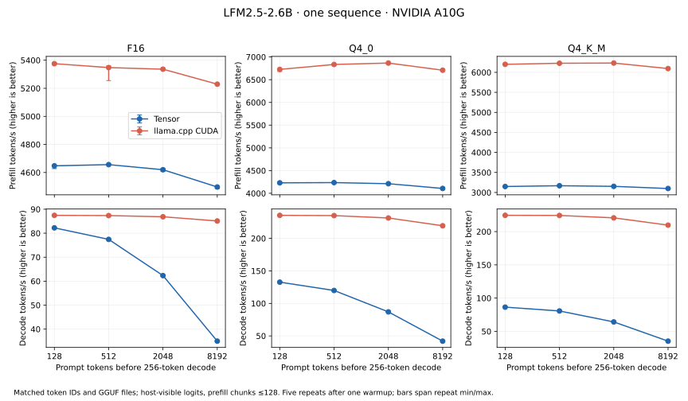

# Standalone LFM2.5-2.6B GGUF inference

Tensor now runs the complete LiquidAI LFM2.5-2.6B forward model from GGUF weights
and NVRTC-produced `.tbin` kernels. The optional `tensor-llm` package implements
GGUF loading, the LFM2 byte BPE tokenizer, packed quantization, hybrid convolution
and attention state, cached decode, and greedy generation. Its consumer installs
Tensor, Tensor LLM, NumPy and regex. No Torch, TileLang, TVM, Triton, GGML,
llama.cpp or CUDA toolkit is required on the consumer.

This first engine supports one sequence, prompt chunks up to 128 tokens, and
one-token decode with a total context limit of 8,448 tokens. It uses a CUDA Graph
with **359 kernel nodes** per decode. It is a complete bounded model execution
plan; a persistent megakernel, general GGUF model coverage, continuous batching,
multi-turn/tool chat and stochastic sampling remain future work.

## Model and baseline

The [LiquidAI GGUF repository](https://huggingface.co/LiquidAI/LFM2.5-2.6B-GGUF/tree/e7caca5d835a3901a8e0d63e94009429bafafdfc)
is pinned to `e7caca5d835a3901a8e0d63e94009429bafafdfc`. Downloads verify each
file's SHA256 and size; see [checkpoint provenance](data/lfm2-models.json).
The model has width 2,048, FFN width 10,752 and 30 layers: 22 gated short
convolution layers and eight GQA attention layers. Attention has 32 query heads,
eight KV heads and head dimension 64, per-head Q/K normalization and NeoX RoPE.
The tied embedding is also the output projection. The final normalization tensor
is named `token_embd_norm.weight`; this model does not apply an embedding norm
at its input. The architecture follows the
[pinned llama.cpp LFM2 implementation](https://github.com/ggml-org/llama.cpp/blob/f7b384c1e5c5b2c5b321a4a7cefea04b15b54cb7/src/models/lfm2.cpp).

| Checkpoint | Matrix/auxiliary encodings | Tensor-owned device bytes | AOT specializations |
|---|---|---:|---:|
| F16 | 167 F16, 99 F32 | 5,564,074,508 | 29 |
| Q4_0 | 166 Q4_0, **one Q6_K**, 99 F32 | 1,754,810,892 | 29 |
| Q4_K_M | 148 Q4_K, 19 Q6_K, 99 F32 | 1,835,371,020 | 33 |

Weights keep their original packed representation in device memory. Projections
and embedding gathers decode values inside Tensor-owned kernels; prefill
projections use tensor-core GEMM. The Q4_0 file's tied embedding/output is Q6_K,
so a Q4_0-only decoder would not execute the actual checkpoint. Quantized block
layouts follow the [GGML reference](https://github.com/ggml-org/llama.cpp/blob/f7b384c1e5c5b2c5b321a4a7cefea04b15b54cb7/ggml/src/ggml-quants.c).

The baseline is llama.cpp CUDA at
`f7b384c1e5c5b2c5b321a4a7cefea04b15b54cb7`, built in Release for SM86,
with native host optimization and cuBLAS 12.9. All model layers are offloaded;
FlashAttention, CUDA graphs and F16 K/V caches are enabled. Four CPU threads
handle host orchestration. The matched C++ helper uses llama.cpp's public model
API and disables per-token debug logging. The baseline still uses its native
optimized kernels and scheduler. Build/library checksums, GPU/driver and package
versions are retained in [environment evidence](data/lfm2-environment.json).

## Correctness

Each checkpoint passes 23 full-model logit checks: a natural-language chat prompt
with nine forced decode steps, fresh prefixes of 127/128/129/512/2,048/8,192
tokens followed by cached decode, and a reset back to the original prompt.
All 23 next-token argmax predictions agree with llama.cpp for each checkpoint.
Five tokenizer cases also agree exactly with the native tokenizer, including
Unicode, whitespace, numbers, literal control strings and parsed control tokens.
Sample rows of every quantized encoding match GGML's CPU block dequantization
exactly. CPU contract tests cover nibble/high-bit packing, signed scales,
container bounds, architecture rejection and literal user control strings.

Tensor's arithmetic differs from llama.cpp for quantized projections. Tensor
uses FP16 inputs/dequantized weights with FP32 accumulation for prefill, and
FP32 inputs/dequantized weights with FP32 accumulation for one-token decode.
Convolution history remains FP32; K/V caches are FP16. llama.cpp's MMQ/MMVQ paths
quantize activations for packed dot products. Their logits are therefore reported
as comparison evidence, with no claim of bitwise equality or equivalent
perplexity. The worst observed llama.cpp logit cosine similarity is about 0.9893
for Q4_0, despite matching argmax on these cases.

An independent eager Torch implementation checks Tensor's own stated precision
contract, without importing its kernel templates or runtime. It computes the
hybrid recurrence, projections, normalization, RoPE and causal cached attention
with independent operators. The maximum relative RMS logit error is **0.145%**
over all three checkpoints and all contexts; every argmax also matches this
reference. Gates require finite logits, relative RMS below 1%, cosine above
0.9999, exact tokenizer/block checks and bitwise-identical reset output.
These checks establish this workload's numerical behavior, rather than a broad
model-quality or convergence claim.

Retained numerical reports:
[F16](data/lfm2-f16-validation.json),
[Q4_0](data/lfm2-q4_0-validation.json),
[Q4_K_M](data/lfm2-q4_k_m-validation.json).
The isolated wheel consumer repeats the full fixture with prohibited compiler
and framework imports and requires exactly four installed distributions. Clean generation
also reaches EOS for all three checkpoints; each answers the test question with
“The capital of France is **Paris**.” These generated texts are demonstrations,
not the performance workload. Retained consumer reports:
[F16](data/lfm2-f16-consumer.json), [Q4_0](data/lfm2-q4_0-consumer.json),
[Q4_K_M](data/lfm2-q4_k_m-consumer.json). Installed wheel sizes and checksums are
recorded [separately](data/lfm2-wheels.json).

The complete CUDA/WebGPU/NN/Torch/LLM regression suite passes **229 tests with
zero skips**. The [acceptance record](data/lfm2-acceptance.json) retains the
enabled profiles, elapsed time and numerical gates.

## Matched A10G performance

Both engines receive the **same GGUF file and token IDs**, use one sequence,
F16 caches, chunks no larger than 128 for prefill, and 256 forced single-token
decode steps. Each timed call completes with last-token FP32 logits available on
the host. Loading, tokenization, sampling/argmax and reset are excluded. Every
case has one excluded warmup and five measured repeats, starting from a fresh
sequence. Runs are sequential on the same A10G, avoiding concurrent GPU work.
Throughput divides token count by median complete API wall time. These timings
include synchronization, submission and transfer; they are not kernel-only
CUDA-event measurements or a comparison of generated text lengths.

| Format | Prompt tokens | Prefill Tensor / llama.cpp (tok/s) | Decode Tensor / llama.cpp (tok/s) | Tensor / llama.cpp decode throughput |
|---|---:|---:|---:|---:|
| F16 | 128 | 4,648 / 5,375 | 82.2 / 87.4 | 0.940× |
| F16 | 512 | 4,656 / 5,348 | 77.4 / 87.3 | 0.886× |
| F16 | 2,048 | 4,620 / 5,336 | 62.3 / 86.9 | 0.718× |
| F16 | 8,192 | 4,497 / 5,229 | 35.0 / 85.1 | 0.411× |
| Q4_0 | 128 | 4,231 / 6,727 | 132.7 / 235.4 | 0.564× |
| Q4_0 | 512 | 4,236 / 6,835 | 119.9 / 235.1 | 0.510× |
| Q4_0 | 2,048 | 4,211 / 6,866 | 86.9 / 231.4 | 0.376× |
| Q4_0 | 8,192 | 4,107 / 6,708 | 41.9 / 219.4 | 0.191× |
| Q4_K_M | 128 | 3,150 / 6,200 | 86.4 / 224.5 | 0.385× |
| Q4_K_M | 512 | 3,169 / 6,227 | 80.6 / 224.3 | 0.360× |
| Q4_K_M | 2,048 | 3,153 / 6,232 | 64.2 / 220.7 | 0.291× |
| Q4_K_M | 8,192 | 3,100 / 6,094 | 35.3 / 209.7 | 0.168× |

Raw reports: [F16](data/lfm2-f16-benchmark.json), [Q4_0](data/lfm2-q4_0-benchmark.json), [Q4_K_M](data/lfm2-q4_k_m-benchmark.json).



The plotted ranges span the five measured repeats. CUDA Graph replay removes
repeated submission of the 359-node model plan, but the kernels themselves still
execute individually. The first implementation has a basic packed-weight GEMV
schedule and one workgroup per query head for cached attention. llama.cpp has
optimized quantized dot products and attention scheduling. The growing decode
gap with context makes parallel attention reductions a concrete next target;
quantized GEMV scheduling and activation quantization need separate evaluation.
A persistent megakernel is not established as necessary by these measurements.
The subsequent [packed-weight FP16 experiment](lfm2-fp16-decode.md) tests scalar
casts, packed `half2` multiplication and a padded tensor-core GEMV, with fresh
alternating full-model timings and independent precision checks. Its `half2`
candidate improves Q4_0 short-context decode by about 21%, while the long-context
attention penalty remains. The original main table records the FP32 default.

The follow-up [decode optimization experiment](lfm2-decode-optimization.md) tests
packed-weight prefetch and partitioned cached attention on the same checkpoints.

## Reproduce

Start with the [package instructions](../../packages/tensor-llm/README.md) to
download checkpoints, produce bundles and install the two wheels in a clean
consumer. In the producer/reference environment, additionally install Torch
2.14.0, CMake, Ninja and a Linux CUDA 12.9 development toolkit including cuBLAS.
The latter toolkit is required only to build the independent llama.cpp baseline.

```sh
# Use the actual installed CUDA development root; includes nvcc and cuBLAS.
export LD_LIBRARY_PATH="$CUDA_HOME/lib64${LD_LIBRARY_PATH:+:$LD_LIBRARY_PATH}"
uv run --no-sync python benchmarks/lfm2/build_reference.py --cuda-root "$CUDA_HOME"

uv run --no-sync python benchmarks/lfm2/validate.py \
  --model build/lfm2-models/LFM2.5-2.6B-Q4_0.gguf --bundle build/lfm2-q4_0 \
  --reference build/lfm2-reference --ggml-library build/llama-cpp/out/bin/libggml-cpu.so \
  --out build/lfm2-q4_0-validation-final

build/lfm2-consumer/bin/python benchmarks/lfm2/consumer.py \
  --model build/lfm2-models/LFM2.5-2.6B-Q4_0.gguf --bundle build/lfm2-q4_0 \
  --reference build/lfm2-q4_0-validation-final --out build/lfm2-q4_0-consumer.json

uv run --no-sync python benchmarks/lfm2/benchmark.py \
  --model build/lfm2-models/LFM2.5-2.6B-Q4_0.gguf --bundle build/lfm2-q4_0 \
  --reference build/lfm2-reference --out build/lfm2-q4_0-benchmark
```

Repeat for F16 and Q4_K_M using their matching bundles. The JSON files preserve
all per-repeat prefill/decode times and every decode step latency. Plotting uses
`scripts/plots/plot_lfm2_inference.py` against the retained reports. Generic
`.tbin`/`.tpack` formats and the runtime ABI are unchanged; the experimental LFM2
plan additionally binds its code fingerprints and artifact checksums.

The [Linux/Windows LFM2 workflow](https://github.com/kreasof-ai/tensor/actions/runs/36791347005)
passes: both hosts compile 31 specializations for a two-layer synthetic
mixed-encoding GGUF with NVRTC, build both wheels and inspect the model in an
isolated four-distribution consumer. The existing
[runtime/module](https://github.com/kreasof-ai/tensor/actions/runs/36791347034),
[WebGPU](https://github.com/kreasof-ai/tensor/actions/runs/36791346992) and
[training](https://github.com/kreasof-ai/tensor/actions/runs/36791347001)
workflows also pass at implementation commit
`a1f40c0795c9bbec0f07e9f5988767eec248748f`.
The [CI record](data/lfm2-ci.json) retains every job and check.
This GPU-free contract check complements the full A10G checkpoint execution;
it is not evidence of full-model GPU performance on Windows or other hardware.
