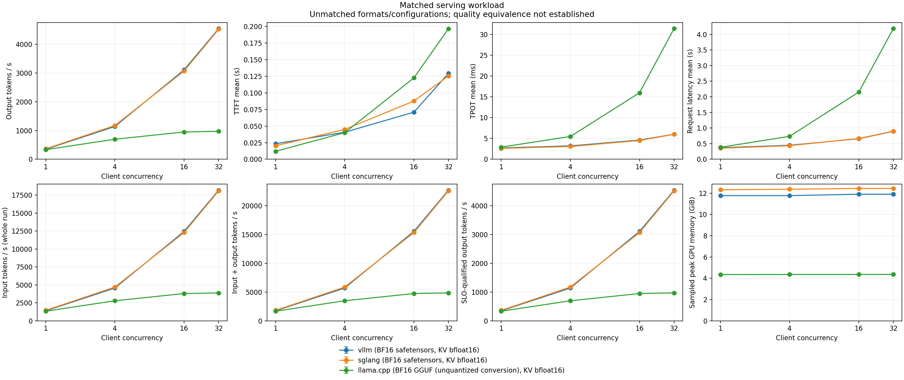

# vLLM, SGLang and llama.cpp serving harness: L40S pilot

[Research](README.md) · [Runbook](../guides/llm-serving-benchmarks.md) · [Raw report](data/llm-serving-l40s-pilot/report.json)

Measured **2026-10-09** on one NVIDIA L40S. All three real engine adapters passed
the same tokenizer probe and completed all 768 measured requests with exact
input/output counts and no failures. This qualifies the baseline harness on a
small model; it does not establish Qwen3.5-35B support, numerical model quality,
peak tuned engine performance, or Netra's 32K/16K stress results.

## Frozen workload and environment

- Model: `Qwen/Qwen3-0.6B`, revision `c1899de289a04d12100db370d81485cdf75e47ca`.
- BF16 safetensors in vLLM/SGLang; unquantized BF16 GGUF conversion in llama.cpp.
  All three use BF16 KV, greedy autoregressive generation, disabled prefix reuse
  and no CPU weight offloading or speculation.
- 64 random ordinary-token prompts per point, each exactly 512 input and 128
  generated tokens, plus one separate warmup before every point. EOS stopping is
  disabled. Client concurrency: 1, 4, 16, 32; one repetition.
- Immutable [workload](data/llm-serving-l40s-pilot/workload.json) SHA-256:
  `d8da6922dd6fca3ee96b199360a69b7a8a644b8778bb47350fd3bcb113bdab89`.
- GPU: L40S, 46,068 MiB as reported by NVML; driver `595.91.07`. The client and
  servers share a Linux host with four available CPU cores. One engine runs at
  a time; unrelated compiler work was stopped before this retained run.
- vLLM `0.17.1`, Torch `2.10.0`; SGLang `0.5.9`, Torch `2.9.1`.
- llama.cpp upstream CUDA 12.8 binary `b11429`, commit `d81235049`.
  [Release provenance](data/llm-serving-l40s-pilot/llama-release.json) retains its
  verified archive SHA-256. Conversion used source commit
  `a518119d30cade6260f7494120863428a3fe8ee5` and `--outtype bf16`.
- Client: Python `3.12.14`, aiohttp `3.14.3`; plots: matplotlib `3.10.9`.

[Server commands](data/llm-serving-l40s-pilot/servers.json),
[vLLM dependency pins](data/llm-serving-l40s-pilot/vllm-environment.txt),
[SGLang dependency pins](data/llm-serving-l40s-pilot/sglang-environment.txt),
[conversion log](data/llm-serving-l40s-pilot/gguf-conversion.log) and
[artifact checksums](data/llm-serving-l40s-pilot/sha256.json) are retained.
Recorded local environment paths need adjustment outside this workspace.

## Results

Output throughput divides completed generated tokens by the full finite replay
duration, including fill and drain. Latencies below are client-observed means;
TTFT includes the new HTTP connection, and TPOT uses generated-token event times.
Loading, graph preparation and warmup are excluded. This run is closed-loop and
has no declared SLO limits, so goodput equals successful output throughput.

| Client concurrency | vLLM output tok/s | SGLang output tok/s | llama.cpp output tok/s |
|---:|---:|---:|---:|
| 1 | 347.2 | 362.8 | 334.1 |
| 4 | 1,140.4 | 1,174.3 | 696.6 |
| 16 | 3,111.0 | 3,071.5 | 948.7 |
| 32 | 4,546.6 | 4,525.1 | 970.9 |

| Concurrency 32 | TTFT mean (ms) | TPOT mean (ms) | Sampled peak GPU memory (GiB) |
|---|---:|---:|---:|
| vLLM | 129.43 | 6.018 | 11.896 |
| SGLang | 125.58 | 6.000 | 12.446 |
| llama.cpp | 196.78 | 31.400 | 4.360 |



[SVG overview](data/llm-serving-l40s-pilot/plots/throughput-latency.svg) ·
[Latency/throughput scatter](data/llm-serving-l40s-pilot/plots/latency-throughput-frontier.svg)

The allocator settings differ deliberately and are visible in the commands:
vLLM/SGLang reserve a 25% GPU memory budget with a 4K model context and 32 resident
requests; llama.cpp reserves 24,576 total context tokens across 32 non-unified
slots, confirmed as 768 tokens per slot. Every 640-token request fits. The lower
llama.cpp memory sample reflects this smaller cache reservation as well as engine
allocation differences; it is not evidence of cache compression or offloading.
Device-wide NVML samples include reserved pools and runtime allocations.

The plots require `--allow-unmatched` because the weight containers differ and
independent numerical conversion/model-quality gates have not run. They retain
that label and suppress a cross-format efficiency frontier. These one-repetition
numbers describe this short synthetic workload and these capacity limits; they
are not a universal ranking. A Tensor serving implementation is not measured.

## Reproduction and retained failure evidence

Follow the [runbook](../guides/llm-serving-benchmarks.md) to install independent
engine environments, fetch the pinned checkpoint and convert it with the pinned
llama.cpp source. Use the retained server manifest after adjusting local paths.
The final CLI run was:

```sh
python -m benchmarks.llm_serving run \
  --servers build/llm-serving/pilot-servers.json \
  --workload build/llm-serving/qwen3-pilot.json \
  --concurrency 1 4 16 32 --telemetry-interval 0.5 \
  --startup-timeout 900 --timeout 120 \
  --out build/llm-serving/qwen3-l40s-pilot
```

The [raw archive](data/llm-serving-l40s-pilot/raw-run.tar.gz) contains `run/` with
the report, immutable workload, startup logs, warmup records, all request and
telemetry JSONL, and generated plots. Extract it to regenerate the figures:

```sh
mkdir -p build/llm-serving-retained
tar -xzf docs/research/data/llm-serving-l40s-pilot/raw-run.tar.gz -C build/llm-serving-retained
python -m benchmarks.llm_serving plot build/llm-serving-retained/run/report.json \
  --latency-stat mean --allow-unmatched --out build/llm-serving-retained/plots
```

The report records client source hashes as well as engine configuration and
hardware snapshots. A preliminary SGLang startup exposed missing JIT tool
discovery; the harness now prepends its executable directory to the child `PATH`.
A preliminary llama.cpp replay exposed pooled-socket disconnects. Those failed
calls and the SGLang startup failure are preserved in the
[preliminary failure archive](data/llm-serving-l40s-pilot/preliminary-failures.tar.gz)
and excluded from this report; no retry repaired them. The final run opens a
fresh connection for every call on every engine and
completed without failures. The final raw archive contains only that final run.

The harness's 27 focused tests cover shared inputs, concurrent HTTP streams,
token counts, arrival queueing, failure/OOM retention, child environment and
process cleanup, comparison matching and plot labels. Local mock results remain
explicitly marked synthetic; the figures here use real GPU inference.
