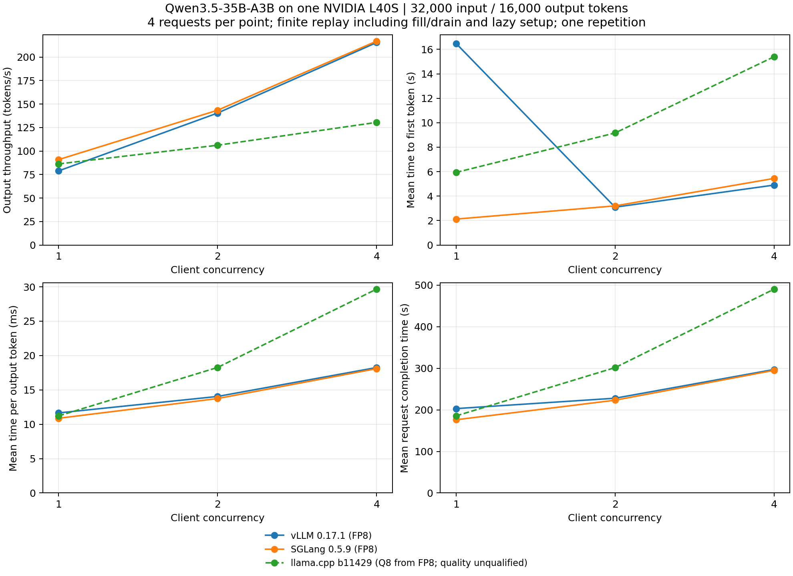

# Qwen3.5-35B-A3B: bounded 32K/16K stress test on L40S

[Research](README.md) · [Runbook](../guides/llm-serving-benchmarks.md) · [Raw report](data/llm-serving-l40s-stress/report.json)

Measured **2026-10-09** on one NVIDIA L40S, using the requested bounded first
pass: **four requests per point at concurrency 1, 2 and 4**, with exactly
**32,000 input and 16,000 generated tokens per request**. All 36 measured requests
completed with exact token counts across the three supported arms; the
identical-FP8 llama.cpp case is retained as unsupported.
These are finite replay measurements, including fill/drain and lazy kernel setup;
they do not measure a steady-state ceiling or establish numerical model quality.

## Workload, hardware and pinned implementations

- Source checkpoint: `Qwen/Qwen3.5-35B-A3B-FP8`, revision
  `9d1823d2dee688a6b25e77009dc727688c44936e`; 37,463,724,680 safetensor bytes.
  vLLM and SGLang read the same local checkpoint files.
- Greedy autoregressive output with EOS stopping disabled. No speculation,
  prefix reuse, CPU weight offloading or RAM prompt-cache offloading. Prompts
  contain seeded random ordinary token IDs; this is a systems stress workload,
  not a representative semantic corpus or quality evaluation.
- Frozen [workload](data/llm-serving-l40s-stress/workload.json) SHA-256:
  `9c35d0cb07f8e17b0945762570bf130c2e50c84bb2260fb9e1e5de59b53cf3c1`.
  All measured calls pass the shared tokenizer probe and exact prompt/output
  count checks. The probe is not an exhaustive tokenizer-equivalence gate.
- One repetition; no separate client warmup requests. Engine startup and its
  internal preparation are excluded; first-call lazy work stays measured.
  Four requests form four waves at concurrency 1, two at 2, and only one at 4.
- GPU: L40S, NVML reports 46,068 MiB; driver `595.91.07`. Linux host with four
  available logical CPUs, about 30 GiB RAM and no swap. One engine runs at a time.
  The GGUF converter was paused during all vLLM/SGLang measurements and completed
  before llama.cpp inference.
- vLLM `0.17.1`, Torch `2.10.0`; SGLang `0.5.9`, Torch `2.9.1` with the pinned
  CuDNN `9.16.0.29` override required by its startup compatibility check.
- llama.cpp upstream CUDA 12.8 release `b11429`, commit `d81235049`. Conversion
  used source commit `a518119d30cade6260f7494120863428a3fe8ee5` with
  `--outtype bf16 --fp8-as-q8`. The GGUF stores 380 Q8_0, 63 BF16 and 310 F32
  tensors. Its retained MTP layer is ignored by the nonspeculative server.
- GGUF SHA-256:
  `93dbaf526bb7c25017169be907666d8079801b5f2802d9d77c773baef11ae94f`.
  This conversion changes weight quantization. Independent numerical conversion
  and output-quality gates have not run; its curve is an exploratory arm.

[Commands and resolved-capacity declarations](data/llm-serving-l40s-stress/servers.json),
[checkpoint config](data/llm-serving-l40s-stress/model.json),
[GGUF metadata](data/llm-serving-l40s-stress/gguf-metadata.json),
[conversion provenance](data/llm-serving-l40s-stress/gguf.json),
[release provenance](data/llm-serving-l40s-stress/llama-release.json),
[vLLM dependency pins](data/llm-serving-l40s-stress/vllm-environment.txt) and
[SGLang dependency pins](data/llm-serving-l40s-stress/sglang-environment.txt)
are retained. Local environment paths need adjustment on another machine.

## Results

Output throughput is successful generated tokens divided by the entire point
duration. Every measured point generates 64,000 output tokens. TTFT, TPOT and
completion latency are client-observed means. There are no declared SLO limits,
so goodput equals successful output throughput. Input/total rates use the same
whole-point denominator; input throughput is not isolated prefill speed.

| Client concurrency | vLLM FP8 output tok/s | SGLang FP8 output tok/s | llama.cpp converted GGUF output tok/s |
|---:|---:|---:|---:|
| 1 | 78.8 | 90.8 | 86.3 |
| 2 | 140.4 | 143.4 | 106.1 |
| 4 | 215.4 | 216.9 | 130.5 |

The llama.cpp column uses converted Q8/BF16/F32 GGUF weights, unlike native
block-FP8 safetensors. A shared request shape does not establish quality equivalence.

| Concurrency 4 | TTFT mean (s) | TPOT mean (ms) | Completion mean (s) | Sampled peak GPU memory (GiB) |
|---|---:|---:|---:|---:|
| vLLM FP8 | 4.903 | 18.254 | 296.950 | 42.556 |
| SGLang FP8 | 5.448 | 18.092 | 294.940 | 43.540 |
| llama.cpp converted GGUF | 15.401 | 29.669 | 490.080 | 40.147 |



[SVG overview](data/llm-serving-l40s-stress/plots/stress-overview.svg) ·
[All eight metrics](data/llm-serving-l40s-stress/plots/throughput-latency.svg) ·
[Native FP8 comparison](data/llm-serving-l40s-stress/fp8-plots/throughput-latency.svg)

vLLM's first measured request had 60.26 s TTFT; subsequent concurrency-1
requests had about 1.90 s TTFT. That cold setup drives its 16.49 s concurrency-1
mean and the declining first segment of the TTFT curve. No call was dropped
from the measured point. These curves must not be read as warmed single-user
TTFT or as a steady-state throughput frontier. One repetition and four requests
per point do not establish statistically significant engine rankings.

## Memory and actual request concurrency

The [logical memory calculation](data/llm-serving-l40s-stress/memory-plan.json)
uses the pinned checkpoint's 10 full-attention layers, two KV heads of dimension
256, and 30 recurrent layers. At 48,000 tokens, BF16 KV requires **0.916 GiB per
sequence**, while FP32 recurrent SSM state requires **60 MiB per sequence**.
Four sequences therefore need about **3.896 GiB** for those components, excluding
convolution state, padding, allocator overhead, graph storage and workspaces.
This hybrid model's footprint cannot be inferred from total parameter count alone.

vLLM loaded 33.38 GiB of weights and reserved 7.24 GiB for caches; SGLang loaded
34.25 GiB and allocated 6.74 GiB of K/V plus recurrent-state storage. vLLM uses
language-model-only initialization, while SGLang uses its default multimodal
initialization for text requests. Their allocation differences are recorded.

llama.cpp's startup log confirms **42/42 layers on GPU**, a **36,095.99 MiB CUDA
model buffer**, **3,760 MiB BF16 K/V** and **251.25 MiB FP32 recurrent storage**.
The input embedding is explicitly assigned to CUDA. Four non-unified slots each
have **48,128 tokens**, after padding the requested 192,000 total context tokens.
A file-backed host mapping during loading is not CPU weight execution. CPU
sampling/control and host compute buffers still exist.

The manifest caps resident execution at four requests on each engine. vLLM and
SGLang telemetry reaches 1, 2 and 4 running requests at the corresponding points,
with **zero vLLM preemptions and zero SGLang retractions**. llama.cpp's sampled processing counts also reach 1, 2 and 4; its slots report no prompt-token reuse. It does not export the same preemption counter as vLLM.
Completed requests' KV pages can be reclaimed while the GPU pool remains
reserved. This is different from evicting an active request. The native results
show the bounded shape fits without 4-bit KV or RAM offloading; they do not show
that hundreds of full 48K sequences could be simultaneously resident on this GPU.

Lower llama.cpp NVML usage partly reflects its smaller fixed cache reservation;
vLLM/SGLang reserve larger pools. It does not prove a superior compression ratio.
[Telemetry ranges](data/llm-serving-l40s-stress/telemetry-summary.json) retain
sample counts, peak GPU memory, running/queued counts and available counters.
An absent counter is not interpreted as zero.

## Reproduction, coverage and limitations

Use the [runbook](../guides/llm-serving-benchmarks.md), the pinned checkpoint and
retained server manifest. The workload preparation command was:

```sh
python -m benchmarks.llm_serving prepare \
  --tokenizer Qwen/Qwen3.5-35B-A3B-FP8 \
  --revision 9d1823d2dee688a6b25e77009dc727688c44936e \
  --input-lengths 32000 --output-tokens 16000 --requests 4 --warmup 0 \
  --seed 20261009 --out build/llm-serving/32k-16k-bounded.json
```

Run the same file against each supported manifest label, one engine at a time:

```sh
python -m benchmarks.llm_serving run \
  --servers docs/research/data/llm-serving-l40s-stress/servers.json \
  --workload docs/research/data/llm-serving-l40s-stress/workload.json \
  --concurrency 1 2 4 --telemetry-interval 2 \
  --startup-timeout 900 --timeout 7200 --out build/llm-serving/reproduction
```

The [raw archive](data/llm-serving-l40s-stress/raw-run.tar.gz) contains `run/`
with the combined report, component provenance, frozen workload, server logs,
all request/telemetry JSONL and separate empty client-warmup records. The combined
report retains the **unsupported identical-FP8 llama.cpp cell**; that baseline
consumes GGUF and cannot load these safetensors unchanged. Its `incomplete` status
records this coverage gap rather than missing successful measurements. The
[measured client sources](data/llm-serving-l40s-stress/client-source/) match the
source hashes in every component report. Artifact checksums are in
[sha256.json](data/llm-serving-l40s-stress/sha256.json).
The working harness subsequently clarified its progress label to `finished
calls`; the measured source snapshot retains the original label. Timing and
token-count logic are unchanged.

Three SGLang setup attempts are retained in the
[preliminary archive](data/llm-serving-l40s-stress/preliminary-failures.tar.gz):
`--language-only` requiring an encoder service, the CuDNN compatibility guard,
and a strict context-boundary rejection at 48,000. The corrected run removes
the disaggregation flag, pins the dependency override and sets context to
49,152; request lengths remain 32,000/16,000. The archive also retains the
llama.cpp startup interrupted before measurement to enable detailed placement
logging. No failed call was repaired by an automatic retry or precision fallback.

Regenerate the figures after extracting the archive:

```sh
mkdir -p build/llm-serving-retained-stress
tar -xzf docs/research/data/llm-serving-l40s-stress/raw-run.tar.gz \
  -C build/llm-serving-retained-stress
python -m benchmarks.llm_serving plot \
  build/llm-serving-retained-stress/run/report.json \
  --latency-stat mean --allow-unmatched --out build/llm-serving-retained-stress/plots
python docs/research/data/llm-serving-l40s-stress/plot-stress.py \
  build/llm-serving-retained-stress/run/report.json \
  --out build/llm-serving-retained-stress/plots
```

[Netra's article](https://netraruntime.com/blog/netra-runtime-is-up-to-4x-faster-than-vllm)
reports Qwen3.6-35B-A3B on an H200, a sweep through 512 clients and steady-state
measurement. This run uses Qwen3.5, an L40S, three low-concurrency points and finite
replays. It recreates the plot dimensions and long sequence shape; it cannot
verify Netra's speedups, peak ceiling, resident capacity or undisclosed launch
configuration. These are bounded baseline profiles, not tuned peak results.
No Tensor serving engine was measured; compiler/kernel and shared-engine
implementation remain in the [staged plan](../plan/unified-llm-engine.md).
