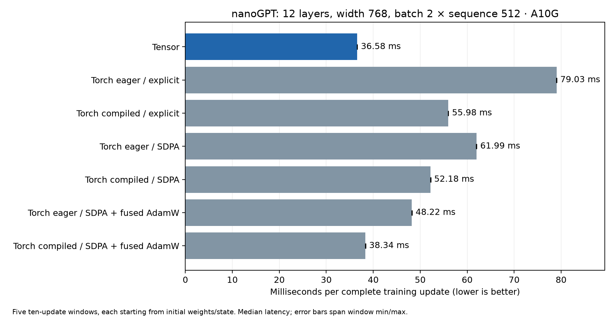

# Phase 6: standalone nanoGPT training

Phase 6 completes the agreed CUDA training profile: **ten complete updates of a
123,980,544-parameter GPT**, using only Tensor and NumPy on the consumer.
Manual backward, clipping and AdamW all execute packaged kernels. On an A10G,
Tensor takes **36.58 ms/update**, versus **38.34 ms/update** for the strongest
measured PyTorch control, compiled forward/backward with native SDPA and fused
AdamW: **1.048× speedup**, or 4.59% less update latency. This is a fixed workload
result, with no adopted universal speed gate.

## Workload and implemented scope

The architecture follows the pinned
[nanoGPT model](https://github.com/karpathy/nanoGPT/blob/3adf61e154c3fe3fca428ad6bc3818b27a3b8291/model.py):
12 layers, 12 heads, width 768, vocabulary 50,304, tied token/output weights,
causal attention, learned positional embeddings, dropout zero and no biases.
Batch 2 × sequence 512 processes 1,024 tokens per update. Data is seeded synthetic
tokens with repeated IDs to exercise scatter accumulation. Ten updates establish
correctness and throughput; they do not measure language-model convergence or a
published nanoGPT speedrun.

Compute uses FP16 inputs/outputs and FP32 GEMM accumulation, normalization and
softmax reductions, master weights, gradient storage and optimizer state. Linear
weight gradients are rounded to FP16 by GEMM then widened into FP32 storage,
matching the explicit Torch reference's master-weight-to-half path. Loss scale
is fixed at 128. AdamW uses learning rate 0.0006, betas (0.9, 0.95), epsilon 1e-8,
matrix decay 0.1, no normalization decay, and global gradient-norm limit 1.
Non-finite gradients fail before optimizer mutation.

The [manual backward API](../manual-backward.md) is public and independent of
Torch. `tensor.nn.NanoGPT` uses it to implement an explicit reverse tape and tied
weight accumulation. Ordinary TileLang/TIRx templates cover embeddings/scatter,
linear forward/input/weight gradients, LayerNorm, GELU, residual branches, causal
attention forward/backward, chunked cross-entropy, clipping and AdamW. The static
plan reuses buffers and validated prepared calls. MLP GEMM/GELU and projection
GEMM/residual epilogues preserve the specified FP16 boundaries and remove 36
launches per update; the resulting plan submits 609 kernels per update.

Attention training is dense and materializes sequence-square intermediates.
FlashAttention backward, standalone autograd, arbitrary user graph fusion,
generic `nn` coverage and WebGPU training remain deferred. Phase 4's Torch adapter
retains its inference-first scope. Supported training configurations are static,
contiguous specializations with the template's divisibility restrictions; this
report validates the full profile and the small diagnostic profile.

## Compilation and tuning

The full bundle contains **54 selected kernel specializations** and a normal
`training.tpack` module closure with source, portable IR and `.tbin` images.
NVRTC is the executable compiler. Producer compilation needs the pinned compiler
packages and local NVRTC/header bundle; GPU execution and tuning require an
NVIDIA driver. Consumers need no toolkit, host compiler or compiler frameworks.
CUDA images retain the existing exact-SM compatibility constraints.

Each of **18 GEMM or fused-GEMM shapes** searches three schedules:
`(32,64,32,2)`, `(64,64,32,2)`, `(32,64,32,1)` for tile M/N/K and pipeline stages.
Candidates must match the default Tensor schedule, including saved GELU
preactivations, before CUDA-event timing. End-to-end Torch validation independently
checks the selected path. The default schedule is therefore a tuning oracle,
not an independent proof for every candidate. Event intervals can include gaps
from host submission. All measurements and selections are retained in the
[producer manifest](data/phase6-nanogpt-producer.json).

Fresh compilation plus tuning took **213.23 s**. The diagnostic bundle compiles
without a GPU and is exercised by Linux/Windows CI. The Tensor harness adapts
[TileLang's existing autotuning approach](https://www.tilelang.com/programming_guides/autotuning.html)
to Tensor's NVRTC artifact/runtime path; it does not introduce another lowering
backend. See [ADR 0016](../adr/0016-manual-training-and-bounded-autotuning.md).

The local producer manifest records the base commit plus source hashes because
the first measured build preceded the implementation commit. Its binding note
records the later runtime integrity-check addition. All 54 selected source files
were verified identical to regeneration from the final templates; the matching
wheel and runtime fingerprints are verified separately. Artifact, module,
fixture and retained evidence hashes connect the actual measured bundle.

## Numerical acceptance

The [full numerical report](data/phase6-nanogpt-validation.json) passes ten updates.
At each step, every parameter gradient is compared with Torch autograd **before**
any reference-gradient replacement. The optimizer check then copies Tensor's
already-checked gradients into Torch and compares all master weights, first
moments and second moments using identical gradients. This isolates optimizer
arithmetic: tiny independently rounded gradients can change signs, which AdamW
can amplify into a learning-rate-scale update. It does not claim strict equality
of independently trained parameter trajectories.

| Comparison across all ten updates | Maximum absolute error | Acceptance atol / rtol |
|---|---:|---:|
| Loss | 0.0000123941 | 0.002 / 0.001 |
| Parameter gradient, unscaled | 0.0000420809 | 0.00003 / 0.03 |
| Master weight, identical gradients | 0.000000119209 | 0.0000002 / 0.00002 |
| Adam first moment, identical gradients | 0.00000000139698 | 0.0000002 / 0.00002 |
| Adam second moment, identical gradients | 0.0000000000109139 | 0.0000000001 / 0.00003 |

The worst parameter-gradient relative L2 error is **0.003449**. Bounds use
`atol + rtol × abs(reference)`, rather than an absolute-only threshold.
Global norm agrees within atol 0.002 / rtol 0.02. The numerical report records
per-parameter errors at every step and samples of the final optimizer state.

A second test lets Tensor and eager explicit Torch train independently. All five
ten-update benchmark windows pass the loss-trajectory comparison, with maximum
loss difference **0.000287223**. This complements the isolated optimizer test.
An installed [clean consumer](data/phase6-clean-consumer.json), containing exactly
`tensor-workspace` and `numpy`, repeats ten updates, checks losses/norms and 64
sampled values per parameter/state field, with compiler/framework imports blocked.

Torch TF32 and FP16 reduced-precision GEMM reductions are disabled in the final
oracle and benchmark. PyTorch documents that reduced-precision reductions can
truncate accumulators and affect FP16 results in its
[numerical accuracy guidance](https://docs.pytorch.org/docs/2.14/notes/numerical_accuracy.html).
Optimized controls still use different reduction/fusion boundaries. Their
independent loss drift is reported below; a benchmark provider's `passed` status
means successful finite execution and timing, not that every control passed the
explicit-reference numerical gate.

## Complete-update performance

Hardware/software: NVIDIA A10G, SM86, driver 595.91.07, Linux x86-64,
Python 3.12.14, Torch 2.14.0+cu130, TileLang 0.1.14, tvm-ffi 0.1.12,
Triton 3.8.0 and NumPy 2.5.3. All implementations use identical initial weights,
token batches, model/objective, scaling and optimizer hyperparameters. Explicit
controls match Tensor's FP16 score/probability boundaries; native SDPA controls
use PyTorch's fused attention semantics. Inductor compiles forward and backward;
the optimizer is the stated PyTorch AdamW implementation.

| Implementation | ms/update | Window min–max, ms | Tokens/s | Baseline time / Tensor time | Max independent loss difference |
|---|---:|---:|---:|---:|---:|
| **Tensor** | **36.576** | 36.546–36.598 | **27,997** | 1.000× | 0 |
| Torch eager, explicit attention | 79.027 | 78.999–79.064 | 12,958 | 2.161× | 0.000287 |
| Torch Inductor, explicit attention | 55.977 | 55.937–55.995 | 18,293 | 1.530× | 0.021550 |
| Torch eager, native SDPA | 61.986 | 61.935–62.027 | 16,520 | 1.695× | 0.106584 |
| Torch Inductor, native SDPA | 52.179 | 52.176–52.225 | 19,625 | 1.427× | 0.004832 |
| Torch eager, native SDPA + fused AdamW | 48.220 | 48.177–48.271 | 21,236 | 1.318× | 0.089027 |
| **Torch Inductor, native SDPA + fused AdamW** | **38.337** | 38.312–38.417 | **26,711** | **1.048×** | 0.014312 |



The statistic is the median of five window means, each containing ten updates.
Two warmup updates precede measurement. Initial weights and empty AdamW state
are restored after warmup and before every window. Timings include forward,
loss, backward, unscale/global clipping, AdamW and stream completion. Upload,
state reset, logging and loss downloads are outside timing. Tensor's required
non-finite gradient check is inside its optimizer/update timing. Raw step times,
losses and methodology are in the [benchmark data](data/phase6-nanogpt-benchmark.json);
the [SVG](data/phase6-nanogpt-latency.svg) and
[plot generator](../../tools/plot_phase6_training.py) support export/reproduction.

Tensor construction plus its first ten updates took **3.327 s**, including
consumer loading/preparation; adding the producer build/tune cost gives
**216.558 s**. The first cold update took 348.75 ms. Imports/process startup are
outside these boundaries. Torch controls run sequentially in the same process
and share warmed framework/compiler caches, even though the benchmark uses a
fresh Inductor cache directory at process start. Their recorded first-ten times
are observations of this sequence, not independent cold-install comparisons.

Tensor owns **4,548,119,496 device bytes (4.236 GiB)** for this plan. Torch reports
allocator peak allocations between 3.28 and 5.42 GiB across controls. These are
different counters: Tensor-owned buffers versus Torch allocator peak, with
different workspace accounting. They do not establish a memory advantage.

## Reproduction and regression

From the pinned producer environment, with `TENSOR_NVRTC_HOME` pointing to the
local NVRTC bundle and headers prepared as in the existing compiler guide:

```sh
uv run --no-sync python tools/phase6_producer.py --out build/nanogpt --target sm_86 --tune
uv run --no-sync python tools/phase6_validate.py --bundle build/nanogpt --out build/validation.json
TORCHINDUCTOR_CACHE_DIR="$PWD/build/inductor-fresh" \
TRITON_CACHE_DIR="$PWD/build/triton-fresh" \
uv run --no-sync python tools/phase6_benchmark.py --bundle build/nanogpt --windows 5 --out build/benchmark.json
uv build --wheel --out-dir build/wheel
uv venv --python 3.12 build/consumer
uv pip install --python build/consumer/bin/python build/wheel/tensor_workspace-0.1.0-py3-none-any.whl
build/consumer/bin/python tools/phase6_consumer.py --bundle build/nanogpt \
  --reference build/validation.json --out build/consumer.json
```

`--no-sync` preserves those separately installed reference dependencies.
Torch and Triton are separate development/reference dependencies, not installed
by the runtime wheel or ordinary compiler dependency group. Use the Windows
consumer executable under `Scripts/python.exe` on Windows. Production consumers
must use a matching runtime wheel and supported NVIDIA device/driver. The
`.github/workflows/phase6-training.yml` producer checks Linux/Windows compilation
of all diagnostic kernels without a GPU and clean installed wheel integrity;
that job does not claim GPU training execution on GitHub runners.

The native regression run enables every CUDA/WebGPU opt-in and the diagnostic
ten-update case: **195 passed, zero skips, in 185.78 s**. Results and source/evidence hashes are retained in the
[verification record](data/phase6-verification.json) and
[JUnit results](data/phase6-regression.xml). The new contracts also reject
invalid manual contexts, gradients and incorrect tuning candidates.
