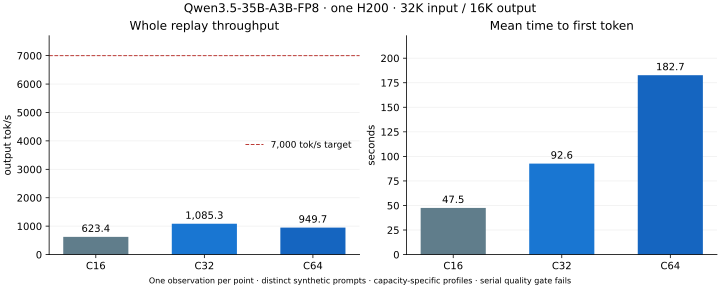
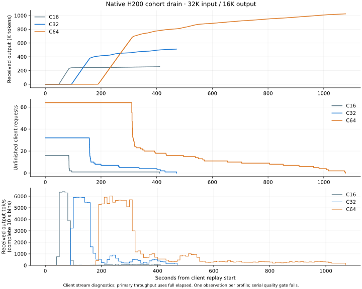

# H200 batch scaling experiment

This experiment extends the native Qwen3.5-35B-A3B-FP8 stress workload to
concurrency 16, 32 and 64 on one Modal H200 in the `akbar2habibullah` workspace.
Each point receives exactly one timed full replay, without warmup or automatic
request retries. All three runs completed with zero failures. None reached
7,000 output tok/s, including the best complete ten-second client interval.
All throughput remains experimental because the serial quality gate fails.

| Concurrency | Output tok/s | Client elapsed s | Mean TTFT s | Completed output tokens | Failures |
|---|---:|---:|---:|---:|---:|
| 16 | 623.368 | 410.672 | 47.477 | 256,000 | 0 |
| 32 | 1,085.342 | 471.741 | 92.634 | 512,000 | 0 |
| 64 | 949.705 | 1,078.230 | 182.676 | 1,024,000 | 0 |



The [client stream plot](qwen35-h200-batch-drain.svg) separates the bulk phase
from the drain. Complete, nonoverlapping ten-second bins peak at 6,398.2 tok/s
for C16, 5,907.0 for C32 and 6,017.0 for C64. These are interval diagnostics,
not the whole-replay metric. The [counts and intervals](data/qwen35-native-h200/scaling/client-interval-rates.json)
come directly from received token events; no missing metrics samples are
interpolated. C64 has 94 failed metrics polls out of 360 samples. Its client
streams still completed correctly according to the length/protocol checks.


The [C16 replay](data/qwen35-native-h200/scaling/c16/summary.json) passes the
complete batch-independence check. Its serial quality gate still fails:
7.324% relative logit RMS and 28/32 greedy matches. Fifteen requests complete
in 84.16–94.83 seconds; `request-000009` takes 410.64 seconds. The cohort runs
2,549 rounds, spending 336.91 seconds in target verification. The last decode
batch contains one request, while the fixed verifier still owns 128 positions
for all sixteen slots. The measured tail is retained; there is no second C16
timed replay.

The [C32 replay](data/qwen35-native-h200/scaling/c32/summary.json) also passes
batch independence and exact pooled forward/rollback checks. It completes all
32 requests without failures. Median request latency is 159.88 seconds;
`request-000026` finishes at 471.64 seconds. Mean TTFT is 92.63 seconds. Even
zero-cost decoding after that TTFT would cap this particular whole-replay
measurement below 5,528 output tok/s; 7,000 requires all 512,000 output tokens
within 73.14 seconds.

The [C32 native trace](data/qwen35-native-h200/scaling/c32/tensor-h200-mtp-lookup-c32/tensor-h200-mtp-lookup-c32/server.log)
records 4,018 rounds and 378.58 decode seconds. Verification consumes 331.34
seconds (87.5% of decode elapsed); draft, repair and commit consume 36.32 seconds
combined. The four-position verifier runs 3,127 times and the 128-position
verifier 891 times. The pool reduces verification width during the drain, but
this remains a fixed slot cohort with no queued requests to fill vacancies.
Serial quality still fails at 6.847% relative logit RMS and 56/64 greedy matches.

The [C64 replay](data/qwen35-native-h200/scaling/c64/summary.json) passes batch
independence and exact pooled forward/rollback checks, completing all 64 calls.
Median request latency is 314.97 seconds; `request-000055` finishes at 1,078.06
seconds. Mean TTFT is 182.68 seconds, already longer than the 146.29-second
budget for 7,000 output tok/s with 1,024,000 output tokens. Its whole-replay rate
is 12.5% lower than C32's. These profiles do not demonstrate scaling to 7,000,
and do not support extrapolating that result to C128.

The [C64 native trace](data/qwen35-native-h200/scaling/c64/tensor-h200-mtp-lookup-c64/tensor-h200-mtp-lookup-c64/server.log)
records 4,098 rounds and 889.96 decode seconds. Target verification consumes
806.13 seconds (90.6%); draft, repair and commit consume 69.01 seconds combined.
The four-position verifier runs 2,784 times and the 128-position verifier 1,314
times. Serial quality fails at 7.919% relative logit RMS and 110/128 greedy matches.
The measured constraints are prefill time and target verification during cohort
drain. Active slot compaction, proposal-window scheduling and faster prefill
need improvement before increasing the batch again; serial and canonical model
qualification remain required before claiming model throughput.

Sampled HBM peaks during client replay are 69.302 GiB, 98.651 GiB and 133.292 GiB
for C16, C32 and C64. These are sampled values, not guaranteed absolute peaks.
The H200 reports 143,771 MiB total (140.401 GiB). C64 fits with official FP8
weights and FP8 KV, without CPU offload or four-bit expert weights.

The model revision remains `9d1823d2dee688a6b25e77009dc727688c44936e`.
Official FP8 weights, FP8 KV storage, FP32 recurrent state, MTP and output-history
lookup remain enabled. There is no CPU offload or prefix cache. Every request
contains 32,000 input tokens and requests exactly 16,000 greedy output tokens,
ignoring EOS. Output throughput divides completed output tokens by the complete
HTTP client elapsed time, including prefill and streaming. Client TTFT is
reported separately.

The [64-request workload](data/qwen35-native-h200/scaling/workload-c64.json.gz)
uses distinct random-token prompts. Its first eight requests are exactly the
previous C8 workload; C16 and C32 select its first 16 and 32 requests. The master
semantic SHA256 is
`b3fbc1b14aa2924aab3a3b96968f5f33aba759fb4366365d57b1c003161afb4b`.
Synthetic output repetition benefits history lookup. These measurements do
not establish natural-language throughput or a comparison win against Netra.

The profiles keep 16,384 total prefill rows live: per-request chunks are 1,024
at C16, 512 at C32 and 256 at C64. All profiles use M128 dense prefill and a
128-position verifier with accepted-prefix recurrent recomputation. They omit
the additional eight-position graph pool from the historical 2,593.992 tok/s
C8 profile. Based on the C16 tail, C32 and C64 provision a four-position verification
and repair pool for short fallback batches. The three-proposal fallback limit
is unchanged. The smaller pool must pass full-model exact comparisons against
the fixed 128-position control before replay. C32 captures both widths before
requests arrive. C64 releases both prefill workspaces before allocating the
pool; its graph capture remains inside client elapsed time. The points are
capacity-specific profiles rather than a sweep with identical scheduling.

The first C32 adaptive preflight was [rejected before HTTP replay](data/qwen35-native-h200/scaling/c32-rejected-adaptive4/attempt.json).
All 32 fixed-window requests matched their independent C8 controls exactly.
The four-position pool matched predictions but differed in logits, recurrent
state and rollback. No timed C32 request was sent by that attempt. The gate
remains strict. The [732-stage trace](data/qwen35-native-h200/scaling/c32-rejected-adaptive4/intermediate-trace.json)
locates the first difference in attention output. The initial short profile
clamped its query tile from eight positions to four, changing the MMA geometry.
The repaired profile pads masked queries to retain the parent geometry without
expanding its output or recurrent buffers. Its [full intermediate trace](data/qwen35-native-h200/scaling/padded-attention-trace.json)
matches all 732 outputs bitwise. Full-model forward and rollback checks also
passed for both C32 and C64 before their timed replays.

Before each timed replay, a counting device executes the actual buffer
allocation shapes and compares the estimated peak, including a 6 GiB CUDA
overhead reserve, with free HBM. Physical GPU checks cover the grouped expert
kernel across its new 16-row tiles and the recurrent replay primitive.
Full-model qualification compares every request with independent C8 groups at
the real 32K prefix: logits, recurrent state, valid KV bytes and scales,
heterogeneous verification lengths, seven acceptance depths, and immutability
of the initialized KV prefix must agree exactly. Reference and candidate
models are owned sequentially to avoid duplicate resident weights.

The [final physical suite](data/qwen35-native-h200/scaling/padded-kernel-checks.json)
passes 56 tests, including exact padded-attention equivalence, large C64 input
copy and snapshot restore. Its [fingerprint](data/qwen35-native-h200/scaling/padded-kernel-fingerprint.json)
records source, packages, compiler environment and H200 driver. Earlier checks
and the rejected preflight are retained as provenance. Compilation continues
to emit TileLang synchronization warnings for the existing 16-row MMA schedule.
Passing the sampled physical checks does not eliminate that compiler warning
or qualify the full model. The [earlier C64 compile rejections](data/qwen35-native-h200/scaling/c64-compile-rejections/attempts.json)
are retained; both stopped before any timed replay.

The unchanged serial-verification quality gate is also retained. The previous
C8 profile failed it; all throughput remains experimental until that gate and
canonical model qualification pass. A 7,000 tok/s timing observation is labeled
separately from model-qualified throughput. With one observation per point,
there is no estimate of repeated-run variance.

Prepare and run with the `akbar2habibullah` profile active:

```bash
PYTHONPATH=src:packages/tensor-llm/src:. modal run \
  benchmarks/qwen35/modal_batch_scaling.py::prepare_main

PYTHONPATH=src:packages/tensor-llm/src:. modal run \
  benchmarks/qwen35/modal_batch_replay.py::main --slots 16
```

Before those larger points, add their short verification profiles:

```bash
PYTHONPATH=src:packages/tensor-llm/src:. modal run \
  benchmarks/qwen35/modal_batch_scaling.py::short_main --slots 32
PYTHONPATH=src:packages/tensor-llm/src:. modal run \
  benchmarks/qwen35/modal_batch_scaling.py::short_main --slots 64
```

Run the replay command with `--slots 32` and `--slots 64` once each. Preparation
can also be scheduled sequentially when CPU memory capacity limits parallel
workers. Do not repeat a timed point to replace an unfavorable observation.


Regenerate the figures from retained client records without running inference:

```bash
python -m benchmarks.llm_serving.cohort_scaling_plot
```


