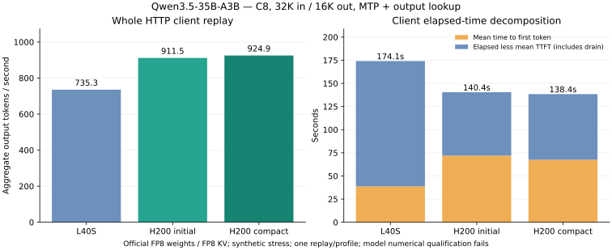

# H200 phase diagnosis and compact expert prefill

The [first H200 replay](qwen35-native-h200.md) improved whole-client C8
throughput only 24% over L40S. This follow-up profiles that port and tests an
opt-in compact expert schedule. **The engine remains numerically unqualified.**
Agreement with the previous prefill implementation is a separate, narrower gate.

## Completed replay

| C8, 32K input / 16K output, MTP + output lookup | Initial H200 | Compact prefill |
|---|---:|---:|
| Whole-client output throughput | 911.544 tok/s | **924.888 tok/s** |
| Completed / failed requests | 8 / 0 | 8 / 0 |
| Client elapsed time | 140.421 s | 138.395 s |
| Mean first-token time | 71.910 s | 67.441 s |
| Eight-active client decode window | 1,908.117 tok/s | 1,840.765 tok/s |
| Peak sampled GPU memory | 43,985 MiB | 43,987 MiB |

Both profiles generate 128,000 output tokens from 256,000 prompt tokens.
The compact replay improves the observed whole-client rate only **1.46%**;
first-token time improves by 6.2%, while the decode window is 3.5% slower in
this single observation. There is no repeated-run dispersion estimate, so the
small aggregate difference does not establish a stable improvement. This
result supports the diagnosis that launch compaction alone is insufficient.
All GPU jobs stopped after measurement.



## Why bandwidth did not translate into throughput

NVIDIA lists [H200 bandwidth at 4.8 TB/s](https://www.nvidia.com/en-us/data-center/h200/)
and [L40S bandwidth at 864 GB/s](https://www.nvidia.com/en-us/data-center/l40s/):
a 5.56-fold specification difference. The native run did not measure achieved
DRAM bandwidth, so those specifications cannot establish the runtime bottleneck.
The H200 build reused the L40S schedules, with ordinary pointer arguments and
warp MMA. TMA, WGMMA and warp specialization remain disabled in this compatible
`sm_90` profile.

The speculative eight-active client decode window improves from 1,089.8 to
1,908.1 tok/s, or 1.75-fold. Mean first-token time regresses from 38.7 to 71.9
seconds. The complete client rate consequently improves from 735.3 to 911.5
tok/s. Faster decoding is being offset by slower prompt processing.

A physical H200 diagnostic reuses the exact frozen artifacts and workload,
initializes all eight target prefixes to 32,000 tokens, and records per-operation
CUDA event intervals in uncaptured plans, three times per phase.

| Mean event intervals across all layers | First 512-token chunk | 512-token chunk at 32K prefix |
|---|---:|---:|
| Expert FP8 projections | 777.0 ms | 782.6 ms |
| Dense FP8 projections | 116.3 ms | 116.3 ms |
| Attention | 3.9 ms | 279.4 ms |
| GDN scan | 44.9 ms | 45.0 ms |
| All intervals | 984.4 ms | 1,265.5 ms |

Experts account for about 79% of the initial interval sum and 62% near 32K;
attention grows to about 22% near 32K. The eight-row verification diagnostic
also spends 14.47 ms of its 31.99 ms event sum on expert projections. Its inputs
repeat each slot's pending token and do not measure MTP or history acceptance.

These event-instrumented plans are diagnostics. Intervals can include waiting
for host dispatch and event overhead, especially for small kernels: the AR plan
sums about 24.3 ms while captured client decoding is much faster. They do not
replace graph or complete-client timings, or demonstrate achieved bandwidth.

## Compact tile scheduling

The original expert grid reserves `256 * ceil(rows / block_m)` positions per
output-column tile. At C8, chunk 512 and block M64, that is 16,384 positions.
Each token has eight routes. Therefore the number of nonempty row tiles obeys

```
sum_expert ceil(count / 64) <= ceil((4096 * 8) / 64) + 255 = 767
```

At least 95.3% of reserved positions have no rows. Gate/up/down projections have
8/8/32 output-column tiles respectively. Across 40 layers, this launches
31,457,280 blocks per chunk, although at most 1,472,640 can have expert rows.
The guarded projection loop skips computation for empty positions. The large
block count is concrete scheduling waste, but does not prove it dominates time.

The new `qwen35.kernels.compact_experts` component builds an expert/row-tile list
on the GPU after each routing operation. Compact projections launch over the
bounded list, with negative entries for padding. `qwen35.compact_prefill.install`
binds the list and captures the new plan; there is no CPU route readback or
variable launch-grid requirement. The projection body is shared with the
original kernel. The server enables this profile only with `--compact-experts`.

## Preserving numerical behavior

The first compact variant failed the whole-prefill comparison: 4.61% relative
logit RMS and 6.03% maximum recurrent-state RMS, with only 7/8 greedy tokens
matching. The control repeated with zero difference. That variant was rejected
before any throughput replay; its logs and exact factory source are retained.

Focused projection comparisons exposed FP32 rounding differences as small as
`2.98e-8`. Explicitly rounding the activation-scale product with `__fmul_rn`,
then accumulating the weight-scaled product with `__fmaf_rn`, restored bitwise
agreement in the focused tests. The failed bitwise assertions were preserved;
no threshold was relaxed.

Five physical H200 checks passed: empty/hot/balanced/tail tile packing, two
shuffled-route projection comparisons with and without routed inputs, and two
existing expert-oracle checks. Three compact checks also passed on L40S;
30 local harness/server tests passed.

With the fixed variant, complete 512-row prefill comparisons at initial and
32,000-token prefixes both measured **zero logit RMS difference, zero recurrent
state RMS difference, and 8/8 matching greedy tokens** against the original
control. They use lengths `[512,511,257,0,128,3,512,511]`, exercising inactive
slots and uneven tails. The 1e-5 comparison threshold remains unchanged.

This does not qualify the canonical model or cure the existing verification
versus serial-target failure. Both qualification flags remain false.

## Scope and next optimization

Target-only prompt processing measured 70.132 seconds in the initial diagnostic
and 64.322 seconds with compact scheduling: **8.3% less time**. These are separate
bounded runs, without a dispersion estimate. Reducing the launch count alone
therefore recovers only a modest part of H200's missing performance.

The active projections still need hardware-specific tile/pipeline measurements;
long-prefix attention also has substantial cost. Implementing and qualifying
Hopper tensor-core paths, along with resolving model numerical gates, remains
necessary before claiming a hardware peak or comparison with Netra.

## Reproduction and evidence

```bash
modal run benchmarks/qwen35/modal_profile.py --prepared-file build/qwen35-h200/prepared.json
modal run benchmarks/qwen35/modal_compact.py --prepared-file build/qwen35-h200/prepared.json
```

The profiler's GPU function is bounded to ten minutes. Compact artifact
preparation runs on CPU; primitive checks, same-state qualification and one
complete C8 replay share a 20-minute GPU bound. The replay runs only after the
comparison gates pass. The original checkpoint, FP8 KV, FP32 state, MTP/history
settings, eight distinct 32K prompts and forced 16K output lengths are retained.

[Initial profiles](data/qwen35-native-h200/profile-initial/),
[rejected compact variant](data/qwen35-native-h200/compact-rejected/) and
[selected compact evidence](data/qwen35-native-h200/compact-selected/) retain
raw reports, source identities, numerical checks, tests and exact source files.
The large per-kernel profile records are included; no failed variant is credited
with a throughput result.
