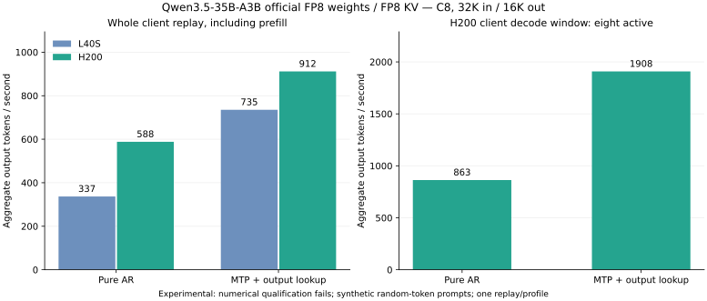

# First native Qwen3.5 C8 measurement on H200

This report records the first physical H200 port of the native Tensor Qwen3.5
engine, using the same frozen C8 stress workload as the
[L40S report](qwen35-native-l40s.md). **MTP plus output lookup measured 911.54
aggregate output tok/s over the complete replay**, with all eight requests
completed and no failures. Pure AR measured 588.22 tok/s. **Numerical
qualification failed**, so these remain experimental speed measurements.

The [phase diagnosis and compact expert follow-up](qwen35-h200-expert-scheduling.md)
profiles the poor hardware scaling and records an opt-in compact schedule at
924.9 tok/s, with unchanged qualification limits.

## Completed C8 results

| Measurement | Pure AR | MTP + output lookup |
|---|---:|---:|
| Whole-client output throughput | **588.222 tok/s** | **911.544 tok/s** |
| Completed / failed requests | 8 / 0 | 8 / 0 |
| Prompt / output tokens | 256,000 / 128,000 | 256,000 / 128,000 |
| Client elapsed time | 217.605 s | 140.421 s |
| Mean client TTFT | 69.016 s | 71.910 s |
| Mean TPOT, coalesced client arrivals | 9.275 ms | 4.184 ms |
| Eight-active client decode window | 863.269 tok/s | 1,908.117 tok/s |
| Peak sampled GPU memory | 40,459 MiB / 39.511 GiB | 43,985 MiB / 42.954 GiB |
| L40S historical whole-client control | 336.797 tok/s | 735.303 tok/s |



The speculative whole-replay rate is 24.0% above the retained L40S result.
That gain is far from demonstrating an H200 ceiling. Time to first token
occupies over half the speculative replay; the first compatible Hopper port
has not received a hardware-specific schedule search. The initial optimization
work should resolve verification/serial divergence and canonical quality, then
measure prefill and expert projection costs before selecting Hopper schedules.
TMA/WGMMA would require explicit target/runtime support rather than removing
the current compatibility settings without qualification. The GPU app stopped
after both replays, and its persistent volume retains the evidence.

## Workload and timing

One NVIDIA H200, eight distinct synthetic random-token prompts, exactly 32,000
input and 16,000 output tokens per request: 256,000 prompt tokens and 128,000
output tokens per replay. The official `Qwen/Qwen3.5-35B-A3B-FP8` checkpoint is
pinned to `9d1823d2dee688a6b25e77009dc727688c44936e`. Weights retain their
original FP8/BF16 formats; KV is FP8 E4M3 and recurrent state is FP32. There is
no weight/KV offload, prefix reuse or shared prompt. Generation is greedy with
forced output length, and the scheduler admits a fixed cohort of eight.

The common HTTP streaming harness measures dispatch through completion of every
request. Its throughput includes prefill, execution setup, fill and drain;
model loading precedes dispatch. There is one measured replay per profile and
no warmup. The eight-active decode window is derived separately from first
client token arrivals through the first request completion. Coalesced token
arrivals do not establish individual-token latency.

Pure AR and MTP plus verified output-history lookup run separately. The latter
uses the official embedded MTP head for fallback proposals, three fallback
proposals and an eight-row verifier; output lookup can provide seven proposals.
Repetitive synthetic outputs favor history lookup, so this profile does not
measure MTP alone or establish performance on document prompts.

## Hardware and compiler boundary

Modal allocated a physical `NVIDIA H200`, `sm_90`, 143,771 MiB reported GPU
memory, driver 580.95.05. The image uses CUDA/NVRTC 12.9, Python 3.12,
TileLang 0.1.14, apache-tvm-ffi 0.1.12 and numpy 1.26.4; pinned Torch 2.8.0 CPU
is installed for producer imports, while inference uses Tensor's native CUDA
runtime. The GPU function requests 16 CPU cores and 96 GiB host memory.

All six native bundles were rebuilt for `sm_90`. Tensor ABI 1.3 currently
accepts ordinary pointers/scalars and a single launch grid. Automatic TMA
lowering adds tensor-map arguments and WGMMA needs an accelerated architecture
target, so this first port disables TMA, WGMMA and warp specialization.
Those pass settings are recorded in artifact compiler identities. This is an
initial compatible Hopper profile, with no claim of H200 peak performance.

## Numerical qualification

Forty kernel and acceptance checks passed in the H200 environment: 25 checks
for dense/expert math, FP8 operations, state isolation and MTP, plus 15
speculative verification/repair checks. Seven local NVRTC/compiler checks also
passed, including GPU-free real `sm_90` GEMM compilation that verifies the
pointer ABI. The CPU harness/consumer checks passed 51 tests, with 13 skipped.

At the actual 32,000-token prefix, a two-row teacher-forced comparison between
batched verification and the same native serial target measured **8.146% relative
logit RMS error**, **14/16 greedy matches**, and finite logits. The gate requires
at most 3% error and all greedy tokens matching. It failed without relaxing the
threshold. Primitive checks therefore do not qualify the model, and the native
serial target itself still lacks canonical whole-model qualification.

All reports retain `model_throughput_qualified=false` and
`full_stress_target_reached=false`. Speed and exact request completion remain
measurable while numerical equivalence is unresolved.

## Netra comparison boundary

The [Netra article](https://netraruntime.com/blog/netra-runtime-is-up-to-4x-faster-than-vllm)
now names Qwen3.6-35B-A3B, one H200 and 32K/16K requests. Its published C8 value
is 2,444, with prose mixing words/sec and token throughput terminology. Our
Qwen3.5 checkpoint, synthetic finite cohort and unqualified numerical behavior
prevent an equivalent comparison. This run does not establish a win over
Netra. A matched model, workload, timing protocol and quality gate are still
required.

## Reproduction and retained evidence

```bash
modal run benchmarks/qwen35/modal_h200.py --out build/qwen35-h200
# Reuse previously prepared artifacts when source fingerprints still match:
modal run benchmarks/qwen35/modal_h200.py --out build/qwen35-h200-repeat --prepared-file build/qwen35-h200/prepared.json
# Download a finished run; the remote trailing slash selects directory contents:
modal volume get tensor-qwen35-h200 /runs/RUN_ID/ build/qwen35-h200-raw --force
```

The runner downloads the pinned checkpoint and builds bundles on CPU before
allocating one H200. CPU preparation is bounded to one hour; GPU checks and both
full replays share a 30-minute bound, with a 900-second request timeout.
The persistent Modal volume retains weights, bundles, raw reports and the
numerical sample NPZ. No baseline serving engine is started by this runner.

The checked-in [data directory](data/qwen35-native-h200/) retains the exact
workload, prepared bundle identities, executed compiler/benchmark sources,
source hashes, full client request traces, telemetry, server configurations,
quality report and test logs. `prepared.json` describes build-time sources;
`measurement-source-hashes.json` describes the executed compiler/runner files.
The retained runner predates the later default-workload path change and is
kept unchanged. The large numerical NPZ remains in the Modal volume and local
build output.
