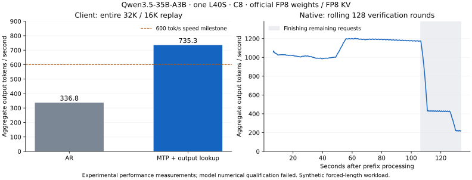

# Experimental native Qwen3.5 C8 execution on L40S

The native Tensor engine now measures **735.30 aggregate output tok/s at C8**
through the common streaming client on one NVIDIA L40S. All eight independent
Qwen3.5-35B-A3B requests completed exactly 32,000 input and 16,000 output tokens.
The denominator includes prefill, executor setup and finishing every request.
This crosses the numerical 600 tok/s milestone using the official FP8 weights,
FP8 KV, embedded MTP and verified output-history proposals.

**Model numerical qualification still fails.** A fresh two-row check of batched
verification against the native serial target at 32K context measured **8.78%
relative logit RMS error and 12/16 matching greedy tokens**. The 3% gate remains
unchanged; the earlier whole-model/FP8-KV checks also remain unqualified.
All retained reports keep `model_throughput_qualified=false` and
`full_stress_target_reached=false`. This is a measured performance milestone,
with numerical equivalence and the complete roadmap acceptance still open.

## Completed speculative replay

| Measurement | Result |
|---|---:|
| Streaming client output throughput, entire replay | **735.303 tok/s** |
| Completed / failed requests | 8 / 0 |
| Input / output tokens per request | 32,000 / 16,000 |
| Total prompt / output tokens | 256,000 / 128,000 |
| Client elapsed time | 174.078 s |
| Mean client TTFT | 38.736 s |
| Mean client TPOT, using coalesced arrival counts | 7.131 ms |
| Client peak sampled GPU allocation | 43,935 MiB / 42.905 GiB |
| Client decode window with all eight requests active | 1,089.776 tok/s |
| Separate native cohort, including prefix and setup | 738.244 tok/s |
| Native decode throughput, including finishing slower requests | 958.536 tok/s |
| Native decode window with all eight requests active | 1,107.587 tok/s |
| Native high-frequency peak allocation | 43.495 GiB |

The [client report](data/qwen35-native-l40s/completed-c8-mtp-lookup-client/report.json),
[compact summary and numerical check](data/qwen35-native-l40s/completed-c8-mtp-lookup-client/summary.json),
request outcomes and telemetry retain the HTTP measurement. The
[native eight-token verification report](data/qwen35-native-l40s/completed-c8-mtp-lookup-k7-native/report.json)
retains all round costs, exact output-ID hash, bundle/source hashes and NVML
samples. Both measurements use one finite cohort, one repetition and no warmup.
They are not a repeated acceptance sweep. Client chunks contain multiple
verified tokens; TPOT does not establish individual-token delivery latency.

The frozen workload uses synthetic random-token prompts and forces generation
past EOS to the requested length. Its outputs contain long repeated spans.
Bounded output lookup uses only already generated tokens, requires repeated
observations of a context, and verifies every proposed continuation with the
target. It supplied proposals for 87.84% of active request-rounds in the native
eight-token run. These results do not establish throughput on ordinary chat,
reasoning or Netra's undisclosed request contents. Pure MTP has separate retained
short diagnostics; the reported 735.30 tok/s uses the hybrid mode.

Verification shares projections and KV reads across up to eight input tokens.
Split-context FP8 attention avoids the low parallelism of prompt-prefill
attention at tiny decode lengths. Routed FP8 Split-K projections use measured
32-row expert tiles; dense projections and the vocabulary head share their
weights across the verification rows. FP32 GDN matrices and convolution
histories retain every possible committed boundary. Rejected suffixes select
the accepted snapshot independently for each slot, and private MTP KV is repaired
from verified target hidden states. Independent CUDA tests cover lengths 2/4/8,
inactive slots, partition-boundary causality, hot/sparse routes and all-row heads.
The failed whole-model serial comparison is retained separately from these
passing primitive checks.

The local serving mode admits arrivals during prefill and retains that cohort
through decode. It closes large prefix graphs before allocating verification
snapshots. Weights, KV and recurrent state remain on the GPU; expert weights
retain the official FP8 representation. General continuous admission during
speculative decode and the batch-1 regression gate remain open. The baseline
engines stayed stopped throughout this optimization.

The [tuning diagnostics](data/qwen35-native-l40s/speculative-tuning.json) retain
one-, three- and seven-proposal trials. At 32K context, the first unsplit
verification took about 96 ms; split-context attention reduced it to about
35 ms. A complete three-proposal hybrid replay reached
[599.394 tok/s](data/qwen35-native-l40s/completed-c8-mtp-lookup-k3-native/report.json).
Wider verification increased the completed-cohort score to 738.244 tok/s before
the streaming-client check. This is an observed gain; short draft agreement was
not multiplied into a throughput claim.

Reproduce the selected paths with `benchmarks.qwen35.spec_run` or the speculative
options on `benchmarks.qwen35.server`, documented in the
[package README](../../packages/tensor-llm/README.md). The retained client
[server manifest](data/qwen35-native-l40s/completed-c8-mtp-lookup-client/servers.json)
pins the model revision, precision, capacities, bundles and source hashes.

## Earlier completed autoregressive replay

| Measurement | Result |
|---|---:|
| Completed / failed requests | 8 / 0 |
| Concurrency and resident slots | 8 / 8 |
| Prompt / output tokens | 256,000 / 128,000 |
| Entire client measurement | 380.050 s |
| Aggregate output throughput, including prefill and fill/drain | 336.797 tok/s |
| Mean time to first token | 36.965 s |
| Mean time per output token after the first | 21.435 ms |
| Peak sampled GPU allocation | 40,385 MiB (39.439 GiB) |

This is one finite cohort and one repetition with no warmup requests. It is a
capacity and performance diagnostic, not the roadmap's repeated acceptance
sweep. Every request reached its requested output length. The server retained
all eight slots through decode; telemetry records no waiting requests,
256,000 processed prompt tokens and 15,999 eight-way decode steps. Prefix reuse,
speculation, cache eviction and CPU/RAM offloading were disabled.

The model is `Qwen/Qwen3.5-35B-A3B-FP8`, revision
`9d1823d2dee688a6b25e77009dc727688c44936e`. Text weights remain the original
block-128 FP8 and retained BF16 tensors, totaling 35,707,988,096 bytes. KV uses
E4M3 bytes with two FP32 block-128 scales per head/token; recurrent state is FP32.
The cache allocation at C8 and 48,000-token capacity is 4,055,040,000 bytes,
including scales, versus 7,864,320,000 bytes for BF16 KV. Token IDs are identical
to the retained synthetic stress workload, SHA256
`6e012fe014f8fc86d58d0065862c62e77e1374fccba612a7ab5d54c1679db44a`.
The standalone Rust tokenizer passed the harness's tokenizer probe.

The [client report](data/qwen35-native-l40s/completed-c8-fp8kv/report.json)
retains configuration, source hashes, qualification flags and latency summaries.
Its adjacent JSONL files retain all request outcomes and GPU/server telemetry.
The earlier vLLM/SGLang/llama.cpp measurements used BF16 KV and have no completed
C8 comparison, so this FP8 KV result is not a matched win over those engines.
The comparison engines remained stopped during native development.

## Implementation and measured tuning

The implementation extends `packages/tensor-llm`, sharing one checkpoint between
chunked prefill and native batched decode. Tensor artifacts implement all 40
layers: FP8 tensor-core projections, expert routing and packing, FP32 recurrent
GDN scans, causal/full-context attention, BF16 norms and GPU greedy selection.
Captured decode graphs retain the same private KV/GDN slots. The local serving
adapter implements fixed-slot admission and streaming token-ID responses.
Batch-1 tuning, paged allocation and general continuous scheduling remain open.

Vectorized FP8 cache loads and shared scale tiles reduced the captured full
attention work from about 8.2 ms to 3.9 ms per decode step. Complete-state C8
samples near 32K context improved from 323.6–324.0 to 391.2–391.4 output tok/s
across three repetitions. These samples exclude prefill and cannot replace the
completed-replay number. Four expert schedules were then measured on identical
states; the selected configuration reached 391.9–392.2 tok/s, a small gain.
Hot-cache projection search winners were not accepted merely on microtimings.
A vocabulary-head candidate exceeding the device's shared-memory limit was
rejected and the previous decoder graph was restored.

Larger 64-row prefill matrices, 512-token chunks and vectorized causal attention
with 128 query rows reduced the completed cohort's first-token time to about
37 seconds. Prefill and decode retain the checkpoint's original weight format.
Reproduction entry points are `benchmarks.qwen35.profile_producer`,
`benchmarks.qwen35.prefill_producer` and `benchmarks.qwen35.server`; see the
[package instructions](../../packages/tensor-llm/README.md#experimental-native-qwen-cuda-execution).

## Quality and constraints

Independent checks cover cache bytes/scales, inactive-slot preservation,
FP8 attention versus dequantized CPU references, dense projections, persistent
GDN state, causal chunk attention, shared/hot experts and tail rows. These pass.
They do not override full-model qualification.

The first cache calibration cyclically repeated eight short texts through 512
teacher-forced tokens per slot. It failed the logit gate, with growing divergence
on the repeated inputs. A second calibration used eight distinct repository
prefixes without repetition and measured 4,088 next-token losses. Mean loss
changed from 3.116335 (BF16 KV) to 3.117317 (FP8 KV), an approximately 0.098%
perplexity increase on this small calibration set. Logit RMS still exceeded 3%
at eight of nine sampled contexts, so its status remains **failed**. Neither
calibration is a held-out task-quality evaluation, and the existing full-model
CPU oracle discrepancy is still open. Retained reports:
[repeated text](data/qwen35-native-l40s/quality-repeated-text/report.json),
[document prefixes](data/qwen35-native-l40s/quality-document-prefixes/report.json).

Observed routing near 32K context selected 42.875 distinct experts per layer on
average, giving about 11.607 GB of logical reads per step. At the completed
48K endpoint, 41.15 distinct experts gave about 12.715 GB. This estimate counts
selected expert weights, common weights, recurrent read/write traffic and KV
reads once, excluding activation/scratch traffic and assuming ideal reuse.
At NVIDIA's [864 GB/s L40S specification](https://www.nvidia.com/en-us/data-center/l40s/),
these observed traffic mixes imply about 596 and 544 output tok/s respectively
at ideal bandwidth, before prefill and other costs. This is a conditional
bandwidth estimate for observed routes, not a universal ceiling for every
possible generation. These estimates count stored zero weights as reads;
lossless removal could reduce them. Sampling four experts in each of the forty
layers found about 1.01% removable zero neurons overall, concentrated in layer
zero, so this sample does not indicate a large general sparsity saving.
A smaller weight precision is a separate decision requiring quality checks
and explicit labeling. The user chose to retain the official FP8 weights.

## Hypothetical 4-bit expert capacity

This is allocation arithmetic, not an implemented or benchmarked profile.
The routed expert matrices contain 32,212,254,720 FP8 bytes. Packing only those
matrices into four bits would save 15 GiB, leaving a lower bound of 18.256 GiB
for text weights with existing tensors and scales retained. Additional
quantization metadata and any conversion buffers would increase that bound.
At 48,000-token capacity, FP8 KV including its scales plus FP32 recurrent and
convolution state uses 0.533409 GiB per resident request.

| Resident requests | Official FP8 weights + request state | Hypothetical 4-bit experts + request state |
|---|---:|---:|
| 8 | 37.52 GiB | 22.52 GiB |
| 16 | 41.79 GiB | 26.79 GiB |
| 32 | 50.32 GiB | 35.32 GiB |
| 40 | 54.59 GiB | 39.59 GiB |
| 48 | 58.86 GiB | 43.86 GiB |

The device exposes 44.988 GiB. These totals exclude workspaces, CUDA overhead,
and additional four-bit metadata. C32 therefore has plausible capacity with
four-bit experts and FP8 KV; C40 needs allocation validation, while C48 has
little remaining space. BF16 KV would raise the four-bit C32 lower bound to
49.52 GiB. The native runtime currently supports at most eight slots; larger
batches require extending and validating the kernels and scheduling path.
None of these estimates establishes throughput or four-bit model quality.

For a hypothetical C32 four-bit-expert/FP8-KV decoder, the same logical-traffic
model gives the following bandwidth-only ceilings. This extrapolation retains
the measured 2,474,682,496 common-weight bytes per step, scales FP32 recurrent
read/write traffic to 4,026,531,840 bytes, and reads FP8 KV plus its FP32 scales
once. Each distinct expert costs three packed four-bit matrices plus the
existing block-scale bytes. Additional four-bit metadata is excluded.

| Distinct experts per layer | 32K context | 40K context | 48K context |
|---|---:|---:|---:|
| 64 (strong reuse scenario) | 1,295 tok/s | 1,150 tok/s | 1,034 tok/s |
| 163.3 (expected under independent uniform top-8 routing) | 1,002 tok/s | 913 tok/s | 838 tok/s |
| 256 (all experts selected) | 827 tok/s | 765 tok/s | 712 tok/s |

For uniform routing, expected distinct experts are
`256 * (1 - (1 - 8/256)**32)`. These are hypothetical routing scenarios,
not C32 observations; the measured C8 routes do not establish the C32 union.
The 40K figure also approximates the decode-only ceiling averaged over growing
contexts from 32K to 48K, since logical traffic grows linearly with context.
All values assume NVIDIA's specified 864 GB/s and ideal reuse. Kernel compute,
unpacking, extra traffic and prefill lower complete-replay throughput; no C32
four-bit engine or corresponding quality/performance result has been measured.

## Native MTP drafting diagnostics

The embedded MTP branch is now executed natively inside `tensor-llm` with the
official FP8/BF16 tensors. Its single full-attention/MoE layer and BF16 input
fusion weights occupy 853,668,480 bytes (0.795 GiB). It shares the target's
embedding and output head; private FP8 KV and workspaces bring its separate
resident allocation at C8/48K to 1,277,962,368 bytes (1.190 GiB).
`Qwen35MTPPrefill` initializes its cache from shifted token IDs and the target's
final normalized hidden states during chunked prefill. No four-bit weights
were introduced. The official [model card](https://huggingface.co/Qwen/Qwen3.5-35B-A3B)
also documents MTP serving configurations.

| Native diagnostic | Result |
|---|---:|
| Isolated draft CPU reference, three supplied-state steps | 1.91–2.55% logit RMS; all 22 active greedy outputs match |
| Draft chunk initialization versus serial, seven active slots with unequal lengths | 0.674% logit RMS; 7/7 greedy outputs and positions match |
| 512-token document-prefix teacher-forced one-token agreement | 66.73% (2,728/4,088) |
| Subsequent 256 greedy steps, C8 | 83.50% (1,710/2,048); 2.03 ms per C8 draft |
| Actual 32,000-token stress prefix, 256 greedy steps, C8 | 91.80% (1,880/2,048); 2.35 ms per C8 draft |
| Target / extra MTP prefix initialization at 32K | 36.82 s / 1.57 s |
| Three-proposal chains after that long-prefix diagnostic | 2.484 accepted proposals per request on average; all three agree in 72.46% of chains |

The three-proposal sample contains 64 rounds across eight requests. Accepted
prefix lengths zero/one/two/three occurred 32/59/50/371 times. Counting a target
bonus/correction token gives a potential 3.484 output tokens per verification
per request for this observed sample. The two additional draft calls averaged
4.73 ms per C8 round; this excludes target verification and draft-cache
correction. Verification here uses serial target evaluation and corrects draft
KV from the resulting target states, so these measurements establish agreement
and draft costs, not a realized speculative speedup. Later context lengths and
different prompts may have different acceptance.

The [isolated CPU oracle](data/qwen35-native-l40s/mtp-oracle/report.json),
[chunk initialization check](data/qwen35-native-l40s/mtp-prefill-check/report.json),
[short-prefix calibration](data/qwen35-native-l40s/mtp-short-calibration/report.json),
[32K-prefix calibration](data/qwen35-native-l40s/mtp-long-calibration/report.json),
and [chain calibration](data/qwen35-native-l40s/mtp-chain-calibration/report.json)
retain their individual results. The isolated MTP checks pass the 3% gate;
the target's whole-model qualification remains open as described above.

The drafting diagnostics above preceded accelerated verification. The completed
speculative replay at the start of this report now implements batched target
verification, independent accepted-prefix selection and FP32 GDN/convolution
rollback. Its numerical equivalence check remains failed. Earlier bandwidth
ceilings assume one-token AR and do not apply directly when target verification
shares reads across several tokens.
