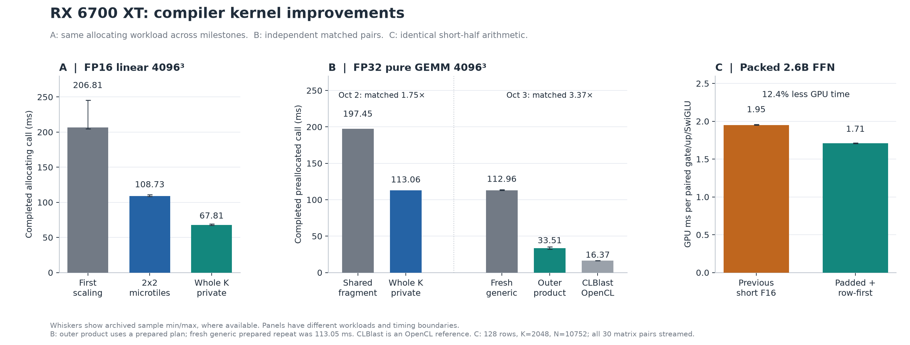
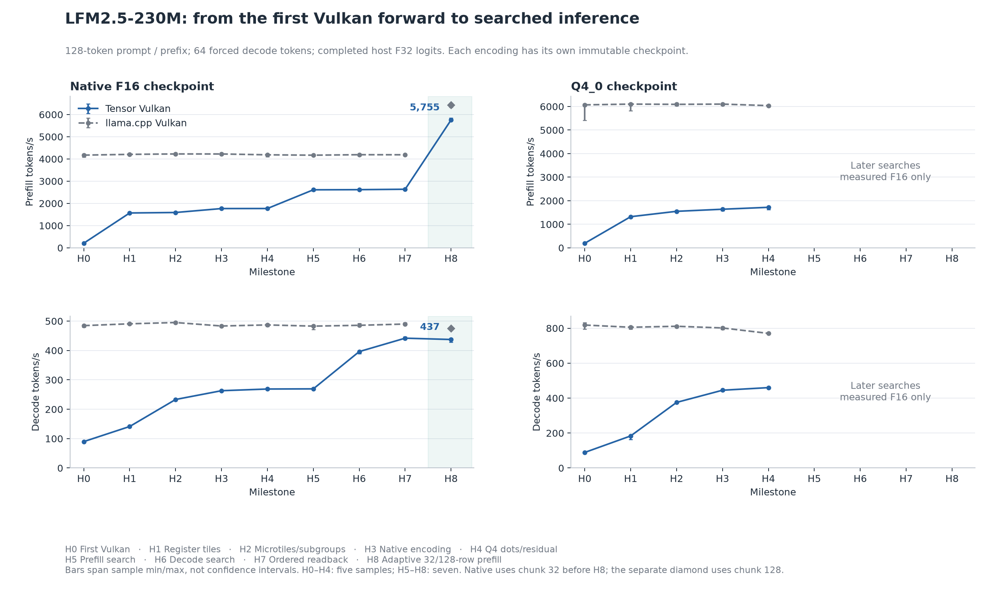
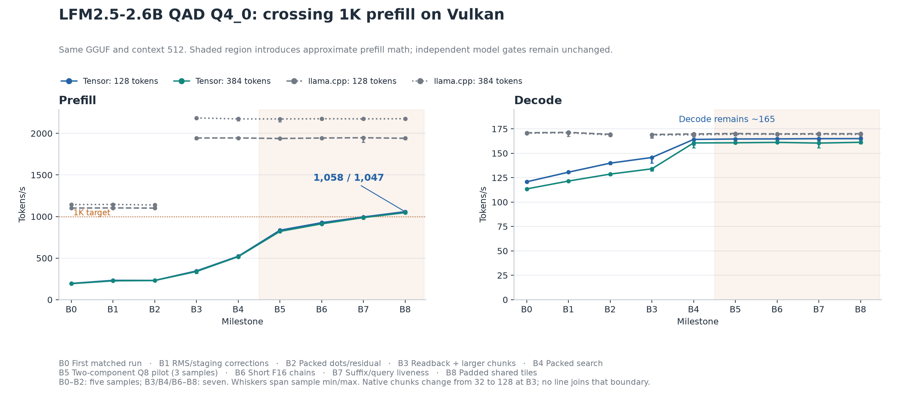

# RX 6700 XT Vulkan: a history of Tensor kernel and inference improvements

[Research index](README.md) · [Derived measurements and source hashes](data/rx6700xt-vulkan-history.json) ·
[Milestone CSV](data/rx6700xt-vulkan-history.csv) · [Plot/extraction script](../../scripts/plots/plot_rx6700xt_vulkan_history.py)

This follows the recorded campaign from the first physical-GPU validation on
October 1, 2026 through the 2.6B 1K-prefill result measured on October 3 and
committed as `d5ee508`. It brings the kernel, runtime and model experiments into
one history. The measurements are retained observations; this document does
not rerun historical revisions on a new driver.

At a 128-token prompt, native-F16 230M prefill moves from **208.5 to 5,754.9 tokens/s**;
decode moves from **89.9 to 437.4**.
The first archived 2.6B QAD Q4_0 matched run records **195.4 prefill / 120.8 decode**;
the final run records **1,058.4 / 165.0**.
These endpoint ratios describe the campaign, including runtime, chunking and
later arithmetic changes. Controlled gains come from the paired experiments
linked below.

## The archive timeline

| Archive time (Asia/Jakarta) | Retained snapshot | Evidence recorded |
|---|---|---|
| 2026-10-01 01:08 | `f2b056b` | [First hardware acceptance](webgpu-rx6700xt.md) and initial generic scaling |
| 2026-10-01 15:32 | `fa27a4e` | [230M initial implementation and optimizations](lfm2-230m-vulkan.md): H0–H3, F16 and Q4 |
| 2026-10-01 17:06 | `0289cd2` | [Generic microtile scaling repeat](latency-scaling.md#rx-6700-xt-repeat-after-compiler-optimization) |
| 2026-10-02 15:28 | `eeccfcf` | [Whole-loop accumulator lowering](webgpu-gemm-accumulation.md) |
| 2026-10-02 22:31 | `5bd34b9` | [First 2.6B snapshot](data/lfm2-2.6b-q4_0-initial-vulkan.json), recovered verbatim from Git: B0 |
| 2026-10-03 00:05 | `9c710e1` | [Corrected 2.6B matched run](lfm2-2.6b-q4_0-matched-run.md): B1 |
| 2026-10-03 05:15 | `63d6d6f` | [Packed decode/residual improvements](lfm2-webgpu-decode-push.md): H4 and B2 |
| 2026-10-03 16:03 | `0ce1ceb` | [Producer search and runtime transfer](lfm2-230m-runtime-search.md): H5–H7 |
| 2026-10-03 18:02 | `3be6cf9` | [Outer-product GEMM](webgpu-outer-product-gemm.md) and adaptive 230M prefill: H8 |
| 2026-10-03 23:54 | `d5ee508` | [2.6B revisit through 1K prefill](lfm2-2.6b-prefill-1k.md): B3–B8 |

These are the commits retaining the exact evidence snapshots used here, with
commit times converted to Asia/Jakarta. Several experiments landed together;
the dates are archive times, not reconstructed measurement times. The initial
2.6B file was added in `5bd34b9`; its corrected snapshot used for B1 landed in
`9c710e1` after the implementation correction in `002c2c7`. Both original and
corrected measurements are retained as separate stages, B0 and B1.

## The machine and the first attempt

All plotted Tensor GPU measurements use the physical **RX 6700 XT 12 GB**,
Ryzen 5 5600, Windows 11 26200, AMD Vulkan driver **26.6.2**
(Windows driver `32.0.21043.19003`), Python 3.12.13, NumPy 2.5.3 and
wgpu-py 0.29.0 / wgpu-native 27.0.2.0. The first hardware validation requested
`shader-f16`; later profiles also request subgroups. Generic schedules stay
within 32 KiB of workgroup storage. The 2.6B output matrix requires a 256 MiB
buffer-binding opt-in.

The [first hardware run](webgpu-rx6700xt.md) validates 33 inference/composition
checks on Vulkan. D3D12 completes six FP32 affine checks, then rejects FP16
because `shader-f16` is absent. Its partial result is not a Vulkan performance
point. The subsequent [two-host transfer](webgpu-rx6700xt-transfer.md) validates
compiler-free execution and source/artifact hashes across Linux and Windows.

The [first 230M forward](lfm2-230m-vulkan.md) works and passes independent
NumPy gates, but decode is about 5.3× slower than native for F16 and 9.1× for
Q4_0. Q4 saves weight memory without yet improving decoding. Packed field
extraction, tiled accumulation, attention masking and submission overhead
become the concrete optimization targets.

## Kernel evolution: retain outputs, then improve ownership and reuse



[Vector figure](data/rx6700xt-vulkan-history-kernels.svg).
The panels deliberately retain separate operations and timing boundaries.

**Generic FP16 linear, 4096³.** The first allocating-call scaling sweep records
**206.811 ms**. Default 2×2 private microtiles later record **108.726 ms**;
whole-K private accumulators record **67.811 ms**. Shapes, seeded inputs and
output hashes agree across these three archived points. The fresh causal
controls are **204.620 → 108.726 ms (1.88×)** for
[microtiles and runtime](latency-scaling.md#rx-6700-xt-repeat-after-compiler-optimization)
and **108.728 → 67.811 ms (1.60×)** for
[whole-loop accumulation](webgpu-gemm-accumulation.md). The initial-to-final
3.05× ratio is a historical comparison, not one interleaved experiment.

**FP32 pure GEMM, 4096³.** A preallocated matched whole-K ablation is
**197.451 → 113.056 ms (1.75×)**, with bitwise-identical outputs. A separate
[outer-product comparison](webgpu-outer-product-gemm.md) is
**112.956 → 33.515 ms (3.37×)**. The latter uses a prepared plan; its generic
prepared repeat is **113.051 ms**, isolating the schedule gain from binding
overhead. Stock **CLBlast 1.6.3 OpenCL** completes the same FP32 operation in
**16.373 ms**. Its remaining 2.05× lead supplies evidence of further compute
headroom. These FP32 bars are not appended to the FP16 linear curve.

**Packed 2.6B FFN.** The final same-arithmetic layout replay reduces GPU time
from **1.951 to 1.710 ms per paired gate/up/SwiGLU**: **12.4% less latency**.
It streams all 30 gate/up matrix pairs at rows 128, K=2048, N=10752. One packed
word of shared padding and row-first workgroup placement are selected; most
of the observed gain is padding. The schedule uses 6,240 bytes of shared
storage. This is a controlled kernel improvement after the short-F16 arithmetic
had already been introduced.

The useful compiler sequence is materialized per-tile fragments → register
microtiles → private lifetime across K → explicit outer-product ownership,
layout and unroll → packed F16/integer schedules with independent validation.
Whole-K lifetime does not alter every attention loop: attention consumes and
rescales intermediate results. Small-K regressions also prevent blanket use of
the private-accumulator transformation.

The broader [scaling repeat](latency-scaling.md#rx-6700-xt-repeat-after-compiler-optimization)
also records limits of the gain: noncausal/causal attention at S8192 improves
from 267.721/134.475 to 163.900/84.631 ms under microtiles, while the byte-identical
64M-element pointwise shader stays at 28.429 ms in both fresh controls.
The 512³ allocating linear case regresses from 1.333 to 1.832 ms in that repeat.
Whole-K lowering subsequently leaves streaming attention essentially unchanged,
because its intermediate rescaling prevents the transformation. The large-GEMM
plot therefore illustrates one workload family rather than a universal gain.

## 230M: make the model small enough to iterate quickly



[Vector figure](data/rx6700xt-vulkan-history-230m.svg).
Each column follows its own checkpoint; rates are completed tokens/s.

### Native F16 checkpoint

| Stage | Change | Prefill 128 | Prefill 384 | Decode at 128 | Native prefill / decode at 128 | Samples |
|---|---|---:|---:|---:|---:|---:|
| [H0](data/lfm2-230m-f16-vulkan.json) | First Vulkan | 208.5 | 170.9 | 89.9 | 4,173.1 / 484.6 | 5 |
| [H1](data/lfm2-230m-f16-optimized.json) | Register tiles | 1,569.7 | 1,515.8 | 141.3 | 4,207.0 / 490.9 | 5 |
| [H2](data/lfm2-230m-compiler-f16-after.json) | Microtiles + subgroups | 1,590.7 | 1,573.5 | 233.2 | 4,226.3 / 495.2 | 5 |
| [H3](data/lfm2-230m-native-f16-after.json) | Native encoding | 1,768.0 | 1,737.4 | 263.1 | 4,224.7 / 483.4 | 5 |
| [H4](data/lfm2-webgpu-decode-push.json) | Q4 dots / residual fusion | 1,770.2 | 1,744.9 | 268.8 | 4,186.9 / 487.0 | 5 |
| [H5](data/lfm2-prefill-search-throughput.json) | Prefill search | 2,612.2 | 2,548.9 | 269.4 | 4,170.3 / 482.9 | 7 |
| [H6](data/lfm2-230m-decode-search.json) | Decode search | 2,618.4 | 2,557.2 | 396.3 | 4,191.9 / 485.7 | 7 |
| [H7](data/lfm2-230m-runtime-search.json) | Ordered readback | 2,637.1 | 2,564.0 | 441.9 | 4,188.9 / 490.0 | 7 |
| [H8](data/lfm2-prefill-chase.json) | Adaptive prefill | 5,754.9 | 5,598.8 | 437.4 | 6,431.2 / 475.2 | 7 |

H1 puts projection accumulators in registers, reuses packed fields, masks
inactive attention positions and selects fusion by encoding. H2 adds generic
microtiles/tree reductions, subgroup decode, typed packed loads and prepared
binding reuse. H3 moves dispatch encoding into an optional C helper and adds
vector prefill dots.

H4 is principally a Q4 optimization. Its F16 decode before/after is
268.5 → 268.8 tokens/s, so the historical point is a repeat, not evidence of
a material F16 gain. H5 transfers searched 32-row FFN schedules into full
inference. H6 separately searches GEMV and attention and improves decode.
H7 changes ordered readback/submission with unchanged shaders. H8 adapts
prefill chunks to 32/128 rows and transfers shape-specific outer products.

The [tinygrad comparison](lfm2-tinygrad-comparison.md) motivates a producer-side
search layer over legal initial tile programs, checked by an independent NumPy
oracle. The [30-minute Tensor search](lfm2-tensor-search-comparison.md) considers
2,368 configurations and times 1,769 valid candidates; the projection winners
then become the H5 full-model schedules. The separate OpenCL tinygrad adapter
also improves prefill, but its decoding remains near 40 tokens/s. Its initially
FP32-expanded F16 storage was corrected before the accepted full-model comparison.
Faster isolated projections therefore do not directly imply faster decoding
or whole-model prefill; kernel transfer and runtime measurements are necessary.

The H7→H8 decode dip is preserved. The H8 same-session chunk-32 versus adaptive
comparison is 437.6 versus 437.4 tokens/s; it does not establish a regression
from the prefill schedules. Histories retain separate-session variation.

### Q4_0 checkpoint

| Stage | Change | Prefill 128 | Prefill 384 | Decode at 128 | Native prefill / decode at 128 | Samples |
|---|---|---:|---:|---:|---:|---:|
| [H0](data/lfm2-230m-q4_0-vulkan.json) | First Vulkan | 193.5 | 175.8 | 89.1 | 6,070.6 / 818.2 | 5 |
| [H1](data/lfm2-230m-q4_0-optimized.json) | Register tiles | 1,322.3 | 1,289.0 | 183.5 | 6,102.8 / 805.5 | 5 |
| [H2](data/lfm2-230m-compiler-q4_0-after.json) | Microtiles + subgroups | 1,550.6 | 1,538.8 | 375.4 | 6,091.9 / 811.1 | 5 |
| [H3](data/lfm2-230m-native-q4_0-after.json) | Native encoding | 1,639.0 | 1,623.0 | 445.1 | 6,102.8 / 801.5 | 5 |
| [H4](data/lfm2-webgpu-decode-push.json) | Q4 dots / residual fusion | 1,720.7 | 1,699.6 | 460.0 | 6,038.0 / 770.4 | 5 |

Q4 gains a real decode advantage once its packed fields/scales are reused and
gate/up projections are fused. The later prefill/decode searches above were
measured for native F16. The plot stops the Q4 trace at H4 instead of filling
later stages with assumed gains.

Both use context 512, identical forced token IDs within comparisons, F16 K/V
caches and 64 completed decode calls after each prefix. H0–H4 have five timed
samples after one warmup; H5–H8 have seven after three. Tensor prefill chunks
are 32 through H7 and adaptive 32/128 at H8. Native batch/ubatch also changes
from 32 to 128 at H8; the plot separates that native reference point.

## 2.6B: expose the bandwidth gain, then attack prefill compute



[Vector figure](data/rx6700xt-vulkan-history-2.6b.svg).
The shaded region changes prefill arithmetic. The 1K line is a measured target,
not an extrapolation from GEMM throughput.

| Stage | Change | Prefill 128 | Prefill 384 | Decode at 128 | Native prefill / decode at 128 | Samples |
|---|---|---:|---:|---:|---:|---:|
| [B0](data/lfm2-2.6b-q4_0-initial-vulkan.json) | First matched run | 195.4 | 192.9 | 120.8 | 1,101.9 / 171.0 | 5 |
| [B1](data/lfm2-2.6b-q4_0-matched-run.json) | RMS / staging corrections | 232.5 | 226.8 | 130.6 | 1,103.7 / 171.4 | 5 |
| [B2](data/lfm2-webgpu-decode-push.json) | Packed dots + residual | 231.8 | 231.0 | 139.9 | 1,101.5 / 169.5 | 5 |
| [B3](data/lfm2-2.6b-q4_0-revisit.json) | Readback + larger chunks | 345.8 | 339.0 | 145.7 | 1,944.5 / 169.2 | 7 |
| [B4](data/lfm2-2.6b-q4_0-parity.json) | Packed schedule search | 522.1 | 517.3 | 164.2 | 1,945.0 / 169.8 | 7 |
| [B5](data/lfm2-2.6b-prefill-1k.json) | Two-component Q8 pilot | 835.0 | 821.3 | 164.6 | 1,938.4 / 170.2 | 3 |
| [B6](data/lfm2-2.6b-prefill-1k.json) | Short F16 chains | 926.0 | 912.4 | 164.7 | 1,944.5 / 169.8 | 7 |
| [B7](data/lfm2-2.6b-prefill-1k.json) | Suffix + query liveness | 994.4 | 987.4 | 164.9 | 1,947.5 / 170.0 | 7 |
| [B8](data/lfm2-2.6b-prefill-1k.json) | Padded shared tiles | 1,058.4 | 1,046.9 | 165.0 | 1,940.9 / 170.0 | 7 |

B0 comes from the initial JSON committed in `5bd34b9`, recovered byte-for-byte
into [a separate snapshot](data/lfm2-2.6b-q4_0-initial-vulkan.json). The ordinary
matched-run JSON was later replaced by the corrected result, now B1. The first
completed-call medians are **195.4 prefill / 120.8 decode tokens/s** at 128.
B1 corrects RMS reduction width and staging-loop divisions/output tiles,
reaching **232.5 / 130.6**. Its instrumented decode profile separately records
**7.836 → 6.520 ms**; full-forward rates are taken directly from their samples,
not reconstructed from those GPU timestamps.

B2 uses packed floating dots and FFN-down residual fusion. B3 isolates a
readback improvement and reuses weights across larger chunks. B4 searches
Q4/Q6 projections and fused attention while retaining F32 decode arithmetic.
These bring decode near native, while prefill is still around 522 tokens/s.

B5 is an experimental three-sample pilot: two Q8 components approximate
F16-rounded activations with F32 scale/total accumulation. B6 adds short
even/odd F16 FMA chains for selected projections, contributing into F32 totals.
B7 preserves all final-attention K/V but executes only the required query and
convolution suffix and last FFN token; intermediate chunks skip unused logits.
B8 retains that arithmetic/liveness plan and adds the independently replayed
shared layout. Public chunk choices remain 1/32/128; the final suffix uses
eight internal rows. The two three-tap convolutions need a five-row receptive
field, and tests verify both final output and persistent histories.

All seven B8 prefill samples exceed 1K at 128 and 384 tokens. At prefix 128,
decode remains about 165 tokens/s against native 170; native prefill is about
1,941 against Tensor 1,058. Native remains faster. The final timestamp trace
puts linear plus FFN work at roughly 94% of instrumented GPU time: the next
prefill bottleneck is still projection compute.

## What the controlled experiments actually establish

| Experiment | Fresh control → selected result | Attribution |
|---|---|---|
| Initial 230M F16 optimization | Prefill 212.6 → 1,569.7; decode 89.7 → 141.3 tok/s | Combined kernel/plan changes, separate frozen before/after runs |
| 230M prefill search | 1,773.8 → 2,612.2 tok/s | Same 32-row chunks; decode shaders unchanged |
| 230M decode search | 271.2 → 396.3 tok/s | Separate GEMV/attention search; prefill nearly unchanged |
| 230M readback | 396.7 → 441.9 tok/s | Same shaders, bitwise-equal 19-fixture logits |
| 230M adaptive prefill | 5,314 → 5,788 tok/s at fixed rows 128 | Schedule gain 8.9%; most total gain comes from larger chunks |
| 2.6B readback | 138.7 → 145.7 tok/s | Same-shader runtime ablation; bitwise-equal logits |
| 2.6B packed prefill search | 345.2 → 522.1 tok/s | Same adaptive chunk sizes |
| 2.6B final mixed prefill | 525.6 → 1,058.4 tok/s | Mixed arithmetic, reduced suffix work and layout, measured together |

The history does not multiply every advertised stage gain. Fresh controls can
differ from the previous report's endpoint, and stages can combine changes.
Kernel GPU timestamps, allocating calls, completed preallocated calls,
full-logit forward rates and greedy generation remain separate measurements.

## Precision, rejected routes and the evidence boundary

Each plotted inference point passes **19 independent NumPy fixtures**, with
finite logits, relative RMS below 1%, cosine above 0.9999 and matching argmax.
Each checkpoint SHA is checked during extraction. Native-F16 and ordinary
230M Q4_0 are separate files; 2.6B uses the distinct **QAD Q4_0** file throughout.
Native b11310 is pinned to `f872b591121761ac7b2af18283bd99bdc092a63a`.

Before B5, prefill uses nearest-even F16 operands and F32 totals; decode uses
F32 arithmetic. B5–B8 are approximate prefill contracts. B8's maximum relative
RMS is 0.71023%; native ordinary Vulkan arithmetic is about 10.88% against
these fixtures, although both match every argmax. Passing the same model gate
does not make their arithmetic equivalent. Reset and bounded host/GPU greedy
checks are recorded in the original reports.

Rejected routes are part of the engineering history: F16 paired decode fusion
was initially slower than separate projections; a 230M prefill RMS reorder
failed the unchanged model gate; small generic GEMMs regressed under forced
whole-K accumulation; wider decode discovery and fused attention did not beat
the retained runtime profile; blanket prefill unrolling regressed throughput.
Later expanded caches, wider integer panels and direct F16 shared staging did
not justify transfer into the final packed runtime. The parallel RMS accepted
in the later 2.6B experiment does not retroactively validate the rejected 230M
case. A six-runner memory-pressure run that slowed native to roughly 13 tokens/s
is excluded from the accepted milestones, as its source report documents.

This is the first **retained** evidence, not a claim to enumerate unrecorded
prototype attempts. Stage order follows experiment dependencies, not uniform
elapsed time. Archived base Git SHAs sometimes predate dirty measured code;
source snapshots, implementation fingerprints and WGSL identify those kernels.
The derived JSON records each retained snapshot commit and its canonical Git
blob digest alongside the working-file digest; Git CRLF normalization can make
those byte digests differ without changing the JSON evidence.
The final implementation lands in `d5ee508`; the generic whole-K and outer-product
experiments precede it. Driver/compiler upgrades and longer contexts need new
measurements. No GPU performance ceiling or general model-quality claim follows
from this bounded record.

## Rebuild the historical document and figures

Run from the repository root with Git history through `d5ee508` available;
this reads evidence and restores the initial 2.6B snapshot without running a GPU:

```powershell
uv run --no-project --python 3.12 --with matplotlib==3.11.2 --with numpy==2.5.3 python scripts/plots/plot_rx6700xt_vulkan_history.py
```

The generator validates recorded medians against sample latencies, model/native
hashes, 19-fixture gates and matching generic scaling input/output hashes.
It writes this report, three PNG/SVG figures, a compact JSON extraction and CSV.
Each point retains its original source file and JSON pointer; source SHA256
digests make historical edits detectable. PNGs are for reading, SVGs for export.
Sample whiskers are min/max ranges, not confidence intervals. No later point is
backfilled for an unmeasured encoding and no result from a rejected variant is
substituted for an accepted milestone.
