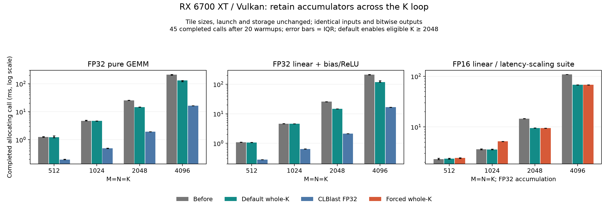

# WebGPU whole-loop GEMM accumulators on RX 6700 XT

[Research index](README.md) · [CLBlast comparison](clblast-rx6700xt.md) ·
[Latency scaling](latency-scaling.md) · [WebGPU guide](../guides/webgpu.md)

On 2026-10-02, moving generic GEMM accumulators into private storage across the
complete K loop improved large matrices by about **1.6×**, without changing tile
sizes, input precision, arithmetic order, launch geometry or workgroup storage.
The default is deliberately restricted to eligible loops covering K ≥ 2048:
forcing the transformation on shorter reductions caused repeatable regressions.
All Tensor outputs in the measured suites were bitwise identical to their controls.

## Final default: fresh measurements

Completed allocating kernel calls include submission and queue completion.
These are fresh same-machine controls, not ratios against historical timings.

| Workload | Before (ms) | Final default (ms) | Speedup | CLBlast FP32 (ms) |
|---|---:|---:|---:|---:|
| FP32 pure GEMM 2048³ | 25.592 | 14.657 | 1.75× | 1.931 |
| FP32 pure GEMM 4096³ | 212.377 | 130.359 | 1.63× | 16.289 |
| FP32 linear 2048³ | 25.643 | 14.758 | 1.74× | 2.128 |
| FP32 linear 4096³ | 213.143 | 118.646 | 1.80× | 16.645 |
| FP16 linear 2048³, scaling suite | 14.584 | 9.492 | 1.54× | — |
| FP16 linear 4096³, scaling suite | 108.728 | 67.811 | 1.60× | — |

The scaling suite's independent 4096 repeat measured 108.712 → 67.829 ms,
again 1.60×. That case now delivers 2.027 TFLOP/s of useful GEMM work, versus
1.264 TFLOP/s in the fresh control. Relative to the GPU's advertised 13.21
FP32 TFLOP/s, those are 15.34% and 9.57%; they are completed-call throughput
fractions, not measured occupancy or actual-clock utilization.

The remaining matched FP32 pure-4096 gap is approximately **8×** versus CLBlast.
OpenCL and Vulkan have different driver/compiler and buffer paths, so this
ablation does not assign the remaining gap to a single scheduling feature.



[SVG figure](data/webgpu-gemm-accumulation.svg).
[Full 32-profile final comparison](data/webgpu-gemm-accumulation-default-comparison.json).
[Complete 17-profile scaling comparison and repeats](data/webgpu-gemm-accumulation-scaling-comparison.json).

## Compiler transformation

`lower_simt_gemm` recognizes a serial K loop ending in one ordinary accumulating
`T.gemm`, with shared FP16/FP32 inputs and an FP32 fragment destination. It assigns
each thread stable output microtiles and allocates a private FP32 accumulator
array outside that loop. Initialization reads the existing fragment, preserving
seeded accumulation; each K tile updates the same private values; the fragment is
written once after the complete loop.

The previous path created a private microtile inside each tiled GEMM call,
reloading and storing the shared output fragment every K=16 iteration. The new
32×32 schedule keeps eight FP32 values per thread across K. Its 128 threads,
2×2 microtiles, K=16 staging, output tile sizes and 8 KiB FP32 workgroup allocation
remain unchanged. The shared output fragment still supports the final bias/ReLU
and copy. This experiment does not fuse that epilogue into the private store.

The pass rejects loops with intermediate destination reads or writes, other GEMMs
or reductions, per-tile clearing, destination indices depending on K, unsupported
thread bindings or an excessive private footprint. Guards for incomplete thread
ownership contain no workgroup barriers. Dynamic trip counts can opt in explicitly.
The numerical tests cover transpose A/B, FP16/FP32 inputs, odd tiles, M/N/K tails,
nonzero seeds, zero-trip loops and repeated launches.

Attention needs its scores for softmax and rescales its result between GEMMs;
those loops retain the original materialized lowering. All eight attention
shaders and five pointwise shaders in the scaling sweep were byte-for-byte
unchanged. Only the 2048 and 4096 linear shaders changed under the final default.
The specialized LFM2 register schedule already retains accumulators across K;
this report makes no additional whole-model speedup claim.

## Why shorter K is gated

The first ablation enabled private lifetime extension for every eligible loop.
All 32 numerical profiles passed and all output hashes matched, but performance
was shape dependent. FP32 1024 pure GEMM improved 4.714 → 3.248 ms, while other
shorter-K profiles regressed.

Three alternating old/new measurements on one device confirmed the FP32
512 pure-GEMM regression: before 1.261/1.461/1.340 ms versus forced register
1.951/2.176/2.033 ms. The one-row gate projection also regressed slightly in
all three alternating repeats. In the uninstrumented scaling protocol,
FP16 1024 linear repeated at 3.584/3.578/3.527 ms before versus
5.204/5.186/5.176 ms with forced register lifetime.

The final default restores the identical original shaders for these profiles.
Scaling 1024 therefore measured 3.621 → 3.595 ms in the final sweep. Changes in
the timing of an unchanged shader are not credited to this compiler optimization.
The K threshold is a conservative policy based on this machine's evidence, not
a universal optimal schedule or an exhaustive GPU tuner.

The function attribute controls selection:

| `tensor.webgpu.gemm_accumulation` | Behavior |
|---|---|
| `"auto"`, default | Extend eligible loops only when static loop extent × tile K ≥ 2048 |
| `"register"` | Extend any eligible loop, including dynamic or shorter K |
| `"shared"` | Retain the earlier per-tile materialized accumulation |

[Unrestricted ablation comparison](data/webgpu-gemm-accumulation-forced-comparison.json).
[Alternating small-profile rechecks](data/webgpu-gemm-accumulation-small-recheck.json).
[Scaling 1024 control rechecks](data/webgpu-gemm-accumulation-1024-before.json).
[Scaling 1024 forced-register rechecks](data/webgpu-gemm-accumulation-1024-forced.json).

## Method and correctness

Hardware is the same RX 6700 XT 12 GB, Ryzen 5 5600, Windows 11 26200 and AMD
Vulkan driver 32.0.21043.19003 used by the CLBlast report. The native consumer uses
Python 3.12.13, NumPy 2.5.3, wgpu 0.29.0 and CLBlast 1.6.3. Inputs are resident;
uploads, downloads, NumPy references, pipeline creation and compilation are outside
timings. Measurement runs use compiler-free installed wheels with compiler imports
blocked. The runtime and prepared-plan implementation were not changed.

The GEMM harness measures 20 warmups and 45 completed allocating calls, another
45 preallocated calls, and 20 timestamp intervals per profile. OpenCL intervals
span its complete routine and can include device idle during host submission;
they are not directly equivalent to WebGPU's single-dispatch timestamps. Every
matched FP32 CLBlast and Tensor profile passes the same 0.002 + 0.02×abs(reference)
gate. CLBlast HGEMM uses half accumulation and fails that gate in all 16 profiles;
its latencies remain excluded from precision-matched conclusions.

The full scaling sweep repeats the established 17 shapes plus tiny-pointwise and
4096-linear rechecks: 20 warmups, 45 allocating calls grouped as nine batches of
five, release outside the timer, and six OpenBLAS threads for CPU references.
All 19 output hashes match the controls. The final 32-profile GEMM sweep also
matches every control output hash. **74 WebGPU tests and nine comparison guard
tests passed.** Negative comparison tests reject changed inputs, outputs, backend,
shapes, sample counts, precision gates, tolerance and workgroup storage.

The baseline suites and initial unrestricted-lowering snapshot are retained.
Explicit `shared` and `register` controls rebuilt with the final compiler reproduce
all their respective measured WGSL hashes. The final default's 16 changed GEMM
shaders match the register controls; its other 16 match the shared controls.

[Source/artifact/evidence verification](data/webgpu-gemm-accumulation-verification.json).
[Representative generated 4096 WGSL](data/webgpu-gemm-accumulation-4096.wgsl).
[Initial ablation compiler snapshot](data/webgpu-gemm-accumulation-ablation-lowering.txt).

## Reproduce

Use fresh output directories. The existing compiler-free CLBlast consumer and
DLLs are prepared by the [CLBlast report](clblast-rx6700xt.md#reproduce-on-this-machine).
Rebuilding explicit controls is GPU-free; consuming them runs on the native GPU.

```powershell
.venv/Scripts/python.exe benchmarks/inference/webgpu_gemm_accumulation_build.py build/accum-shared --mode shared
.venv/Scripts/python.exe benchmarks/inference/webgpu_gemm_accumulation_build.py build/accum-register --mode register
.venv/Scripts/python.exe benchmarks/inference/webgpu_gemm_accumulation_build.py build/accum-auto --mode auto
$env:OPENBLAS_NUM_THREADS = '6'
build/clblast-consumer/Scripts/python.exe -I benchmarks/inference/clblast_comparison.py --consume build/accum-shared --library build/clblast-build/Release/clblast.dll --probe build/clblast-probe-build/Release/tensor_clblast_probe.dll --tuning build/clblast-comparison-tuning.json --timestamp-period-ns 10 --out build/accum-before.json
build/clblast-consumer/Scripts/python.exe -I benchmarks/inference/clblast_comparison.py --consume build/accum-auto --library build/clblast-build/Release/clblast.dll --probe build/clblast-probe-build/Release/tensor_clblast_probe.dll --tuning build/clblast-comparison-tuning.json --timestamp-period-ns 10 --out build/accum-after.json
build/clblast-consumer/Scripts/python.exe -I benchmarks/inference/webgpu_gemm_accumulation_comparison.py build/accum-before.json build/accum-after.json build/accum-shared/suite.json build/accum-auto/suite.json --out build/accum-comparison.json
.venv/Scripts/python.exe benchmarks/inference/webgpu_scaling_benchmark.py --build build/accum-scaling
build/clblast-consumer/Scripts/python.exe -I benchmarks/inference/webgpu_scaling_benchmark.py --consume build/accum-scaling --repeat-case pointwise-129 --repeat-case gemm-4096-4096-4096 --out build/accum-scaling-after.json
```

Larger output/K tiles, shared layouts, vectorized loads, epilogue fusion and
device/shape-aware bounded tuning remain separate follow-up experiments. This
pass establishes accumulator lifetime independently before those changes are
combined; it preserves FP32 accumulation for both storage precisions.
